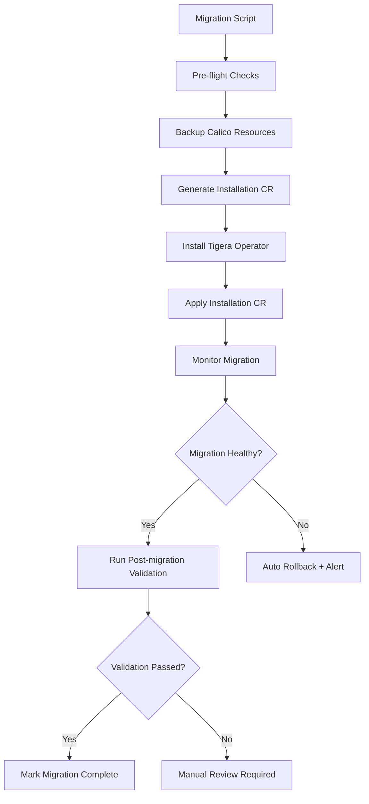

# How to Automate Calico Operator Migration

Author: [nawazdhandala](https://github.com/nawazdhandala)

Tags: Calico, Kubernetes, Networking, Operator, Migration, Automation

Description: Automate the Calico manifest-to-operator migration process using scripts and pipelines to safely migrate multiple clusters consistently.

---

## Introduction

When migrating multiple Kubernetes clusters from manifest-based Calico to the Tigera Operator, manual execution of migration steps across each cluster is error-prone and time-consuming. Automation ensures each cluster follows identical migration steps, capture pre-migration state, and validate success consistently.

The migration automation workflow needs to handle: pre-migration configuration extraction, Installation resource generation from existing config, migration execution with health monitoring, post-migration validation, and rollback capability if validation fails. Scripting each of these phases makes the process repeatable and auditable.

## Prerequisites

- `kubectl`, `calicoctl`, and `jq` installed
- Access to all target clusters
- Calico v3.15+ on target clusters

## Automation Architecture



## Complete Migration Script

```bash
#!/bin/bash
# migrate-calico-to-operator.sh
set -euo pipefail

CALICO_VERSION="${CALICO_VERSION:-v3.27.0}"
BACKUP_DIR="calico-migration-backup-$(date +%Y%m%d-%H%M%S)"
TIMEOUT="${TIMEOUT:-600}"  # 10 minutes

log() { echo "[$(date +%H:%M:%S)] $*"; }
fail() { log "ERROR: $*"; exit 1; }

# Pre-flight checks
preflight() {
  log "Running pre-flight checks..."

  # Check Calico is installed via manifests
  if kubectl get ns calico-system > /dev/null 2>&1; then
    fail "calico-system namespace exists. Operator may already be installed."
  fi

  if ! kubectl get ds calico-node -n kube-system > /dev/null 2>&1; then
    fail "calico-node DaemonSet not found in kube-system. Not a manifest install?"
  fi

  log "Pre-flight checks passed."
}

# Backup existing configuration
backup() {
  log "Backing up Calico configuration to ${BACKUP_DIR}..."
  mkdir -p "${BACKUP_DIR}"

  calicoctl get ippools -o yaml > "${BACKUP_DIR}/ippools.yaml"
  calicoctl get felixconfiguration -o yaml > "${BACKUP_DIR}/felixconfig.yaml"
  calicoctl get globalnetworkpolicies -o yaml > "${BACKUP_DIR}/gnps.yaml"
  calicoctl get networkpolicies --all-namespaces -o yaml > "${BACKUP_DIR}/netpols.yaml"
  kubectl get ds calico-node -n kube-system -o yaml > "${BACKUP_DIR}/calico-node-ds.yaml"

  log "Backup complete: ${BACKUP_DIR}"
}

# Generate Installation CR from existing config
generate_installation() {
  log "Generating Installation CR from existing configuration..."

  CIDR=$(calicoctl get ippool default-ipv4-ippool \
    -o jsonpath='{.spec.cidr}' 2>/dev/null || echo "192.168.0.0/16")

  IPIP_MODE=$(calicoctl get ippool default-ipv4-ippool \
    -o jsonpath='{.spec.ipipMode}' 2>/dev/null || echo "Never")

  VXLAN_MODE=$(calicoctl get ippool default-ipv4-ippool \
    -o jsonpath='{.spec.vxlanMode}' 2>/dev/null || echo "Never")

  # Determine encapsulation
  if [[ "${IPIP_MODE}" == "Always" ]]; then
    ENCAP="IPIP"
  elif [[ "${VXLAN_MODE}" == "Always" ]]; then
    ENCAP="VXLAN"
  elif [[ "${IPIP_MODE}" == "CrossSubnet" ]]; then
    ENCAP="IPIPCrossSubnet"
  else
    ENCAP="None"
  fi

  cat > "${BACKUP_DIR}/installation.yaml" <<EOF
apiVersion: operator.tigera.io/v1
kind: Installation
metadata:
  name: default
spec:
  calicoNetwork:
    ipPools:
      - cidr: ${CIDR}
        encapsulation: ${ENCAP}
        natOutgoing: Enabled
        nodeSelector: "all()"
  variant: Calico
EOF

  log "Installation CR generated: ${BACKUP_DIR}/installation.yaml"
  cat "${BACKUP_DIR}/installation.yaml"
}

# Execute migration
migrate() {
  log "Installing Tigera Operator ${CALICO_VERSION}..."
  kubectl create -f "https://raw.githubusercontent.com/projectcalico/calico/${CALICO_VERSION}/manifests/tigera-operator.yaml"

  log "Waiting for operator to be ready..."
  kubectl rollout status deploy/tigera-operator -n tigera-operator --timeout="${TIMEOUT}s"

  log "Applying Installation CR..."
  kubectl apply -f "${BACKUP_DIR}/installation.yaml"

  log "Monitoring migration..."
  DEADLINE=$(($(date +%s) + TIMEOUT))
  while [[ $(date +%s) -lt ${DEADLINE} ]]; do
    status=$(kubectl get tigerastatus calico \
      -o jsonpath='{.status.conditions[?(@.type=="Available")].status}' 2>/dev/null || echo "Unknown")
    if [[ "${status}" == "True" ]]; then
      log "Migration successful - Calico is Available"
      return 0
    fi
    log "Waiting for Calico to become available... (status: ${status})"
    sleep 10
  done

  fail "Migration timed out after ${TIMEOUT}s"
}

# Post-migration validation
validate() {
  log "Running post-migration validation..."

  # Check all calico-system pods are running
  not_running=$(kubectl get pods -n calico-system \
    --no-headers | grep -v Running | wc -l)

  if [[ "${not_running}" -gt 0 ]]; then
    fail "${not_running} pods not in Running state after migration"
  fi

  # Verify IP pools are intact
  pool_count=$(calicoctl get ippools --no-headers | wc -l)
  backup_count=$(grep "^- " "${BACKUP_DIR}/ippools.yaml" | wc -l)

  log "IP Pools: found ${pool_count}, backed up ${backup_count}"
  log "Post-migration validation passed."
}

# Main
preflight
backup
generate_installation
migrate
validate
log "Migration complete!"
```

## Conclusion

Automating the Calico operator migration ensures consistent execution across multiple clusters and eliminates the risk of manual errors during a time-sensitive maintenance window. The script handles pre-flight checks, automatic configuration extraction, Installation resource generation, migration execution with timeout monitoring, and post-migration validation. Pair this automation with a communication plan for stakeholders and a clear rollback procedure based on the backup files created at the start of each migration.
