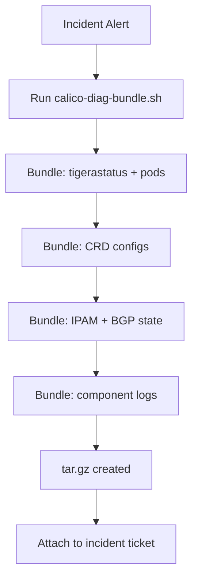

# How to Automate Calico Troubleshooting Commands

Author: [nawazdhandala](https://github.com/nawazdhandala)

Tags: Calico, Kubernetes, Networking, Troubleshooting, Automation

Description: Automate Calico diagnostic command execution with scripts that collect BGP state, IPAM usage, Felix status, and policy counts across all cluster nodes for rapid incident triage.

---

## Introduction

Running individual Calico troubleshooting commands manually during an incident is slow and error-prone. Automating the collection of standard diagnostics — BGP peer states, IPAM block usage, Felix error counts, and TigeraStatus — into a single script reduces incident triage from minutes to seconds and ensures consistent data collection regardless of which engineer is on-call.

## Automated Calico Diagnostic Bundle

```bash
#!/bin/bash
# calico-diag-bundle.sh
set -euo pipefail
BUNDLE="calico-diag-$(date +%Y%m%d-%H%M%S)"
mkdir -p "${BUNDLE}"

echo "Collecting Calico diagnostics..."

# Operator health
kubectl get tigerastatus -o yaml > "${BUNDLE}/tigerastatus.yaml"

# Pod state
kubectl get pods -n calico-system -o wide > "${BUNDLE}/pods.txt"

# Configuration CRDs
calicoctl get installation -o yaml > "${BUNDLE}/installation.yaml" 2>/dev/null || true
calicoctl get felixconfiguration -o yaml > "${BUNDLE}/felixconfiguration.yaml" 2>/dev/null || true
calicoctl get bgpconfiguration -o yaml > "${BUNDLE}/bgpconfiguration.yaml" 2>/dev/null || true

# BGP peers
calicoctl get bgppeer -o yaml > "${BUNDLE}/bgppeers.yaml" 2>/dev/null || true

# IPAM state
calicoctl ipam show --show-blocks > "${BUNDLE}/ipam-blocks.txt" 2>/dev/null || true
calicoctl ipam show --show-borrowed > "${BUNDLE}/ipam-borrowed.txt" 2>/dev/null || true

# Network policies
calicoctl get globalnetworkpolicy -o yaml > "${BUNDLE}/gnp.yaml" 2>/dev/null || true

# Component logs (last 500 lines each)
kubectl logs -n calico-system -l k8s-app=calico-node \
  -c calico-node --tail=500 --prefix=true > "${BUNDLE}/calico-node.log" 2>/dev/null || true
kubectl logs -n calico-system -l k8s-app=calico-typha \
  --tail=200 --prefix=true > "${BUNDLE}/calico-typha.log" 2>/dev/null || true

tar -czf "${BUNDLE}.tar.gz" "${BUNDLE}/"
echo "Diagnostic bundle: ${BUNDLE}.tar.gz"
```

## Automated BGP Status Check

```bash
#!/bin/bash
# check-bgp-peers.sh
# Returns 0 if all BGP peers are Established, non-zero otherwise
FAILURES=0

for pod in $(kubectl get pods -n calico-system -l k8s-app=calico-node \
  -o jsonpath='{.items[*].metadata.name}'); do
  STATUS=$(kubectl exec -n calico-system "${pod}" -c calico-node -- \
    calicoctl node status 2>/dev/null | grep -c "Established" || echo 0)
  PEERS=$(kubectl exec -n calico-system "${pod}" -c calico-node -- \
    calicoctl node status 2>/dev/null | grep -c "peer" || echo 0)

  if [ "${STATUS}" -lt "${PEERS}" ]; then
    echo "FAIL: ${pod} has ${STATUS}/${PEERS} peers Established"
    FAILURES=$((FAILURES + 1))
  fi
done

exit ${FAILURES}
```

## Automation Architecture



## CronJob: Periodic State Snapshot

```yaml
apiVersion: batch/v1
kind: CronJob
metadata:
  name: calico-state-snapshot
  namespace: calico-system
spec:
  schedule: "0 */6 * * *"  # Every 6 hours
  jobTemplate:
    spec:
      template:
        spec:
          serviceAccountName: calico-diagnostics
          containers:
            - name: snapshot
              image: bitnami/kubectl:latest
              command:
                - /bin/sh
                - -c
                - |
                  kubectl get tigerastatus -o yaml > /snapshots/tigerastatus-$(date +%Y%m%d%H).yaml
          volumes:
            - name: snapshots
              persistentVolumeClaim:
                claimName: calico-snapshots
          restartPolicy: OnFailure
```

## Conclusion

The diagnostic bundle script provides a one-command way to collect all necessary Calico state during an incident. The automated BGP peer check can be integrated into a CronJob to detect BGP peer failures before they escalate to application outages. Run the bundle script as the first step in any Calico incident and attach it to the ticket before beginning root cause analysis — this prevents the common mistake of diagnosing in isolation without the full context.
