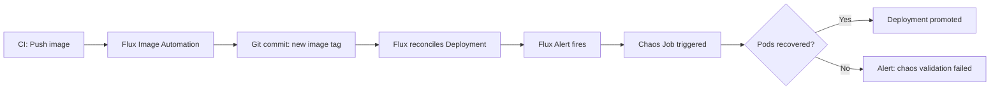

# How to Automate Chaos Testing in GitOps Pipeline with Flux CD

Author: [nawazdhandala](https://github.com/nawazdhandala)

Tags: Flux CD, Kubernetes, GitOps, Chaos Engineering, CI/CD, Automation

Description: Incorporate automated chaos testing into the Flux CD GitOps pipeline by triggering experiments on deployment events and validating results programmatically.

---

## Introduction

Chaos testing is most valuable when it runs automatically - triggered by deployments, scheduled on a cadence, and integrated with your alerting and promotion workflows. Without automation, chaos experiments are run infrequently and only by specialists who remember to run them. With automation, every new deployment is systematically tested for resilience before reaching production.

Flux CD provides the reconciliation engine that keeps your cluster in sync with Git. By combining Flux's event-driven model with Chaos Mesh experiments and Kubernetes Jobs, you can build a fully automated chaos testing pipeline where deployments automatically trigger resilience validation, results are reported, and rollbacks happen without human intervention.

This guide covers building an automated chaos testing pipeline using Flux CD image automation, Chaos Mesh, and Kubernetes Jobs for result validation.

## Prerequisites

- Flux CD bootstrapped with image automation enabled
- Chaos Mesh deployed via Flux HelmRelease
- A CI/CD system (GitHub Actions or similar) that pushes container images
- Prometheus and Alertmanager for metrics and alerting

## Step 1: Structure the GitOps Repository for Automation

Organize your repository so chaos experiments live alongside application definitions and are applied in dependency order.

```plaintext
clusters/
  my-cluster/
    apps/
      myapp/
        deployment.yaml
        service.yaml
        imagepolicy.yaml     # Flux image automation
    chaos/
      experiments/
        post-deploy-pod-kill.yaml
        post-deploy-network-latency.yaml
      kustomization.yaml
    flux-system/
      kustomization.yaml
```

## Step 2: Configure Flux Image Automation

```yaml
# clusters/my-cluster/apps/myapp/imagepolicy.yaml
apiVersion: image.toolkit.fluxcd.io/v1
kind: ImagePolicy
metadata:
  name: myapp
  namespace: flux-system
spec:
  imageRepositoryRef:
    name: myapp
  policy:
    semver:
      # Automatically track patch releases
      range: ">=1.0.0"
```

```yaml
# clusters/my-cluster/apps/myapp/imageupdateautomation.yaml
apiVersion: image.toolkit.fluxcd.io/v1
kind: ImageUpdateAutomation
metadata:
  name: myapp
  namespace: flux-system
spec:
  interval: 5m
  sourceRef:
    kind: GitRepository
    name: flux-system
  git:
    commit:
      author:
        email: fluxbot@example.com
        name: FluxBot
      messageTemplate: "chore: update myapp image to {{ .Updated.Images | toString }}"
  update:
    path: ./clusters/my-cluster/apps/myapp
    strategy: Setters
```

## Step 3: Create a Post-Deployment Chaos Job

Use a Kubernetes Job triggered by a Flux notification receiver to run chaos experiments automatically after a deployment.

```yaml
# clusters/my-cluster/chaos/experiments/post-deploy-chaos-job.yaml
apiVersion: batch/v1
kind: Job
metadata:
  name: post-deploy-chaos-validator
  namespace: chaos-mesh
  labels:
    app: chaos-validator
spec:
  ttlSecondsAfterFinished: 7200
  template:
    spec:
      serviceAccountName: chaos-validator
      restartPolicy: Never
      containers:
        - name: chaos-runner
          image: bitnami/kubectl:latest
          command:
            - sh
            - -c
            - |
              echo "Applying pod kill chaos experiment..."
              kubectl apply -f /experiments/pod-kill.yaml

              echo "Waiting 60 seconds for experiment to complete..."
              sleep 60

              echo "Checking if target pods recovered..."
              READY=$(kubectl get deployment myapp -n default \
                -o jsonpath='{.status.readyReplicas}')
              DESIRED=$(kubectl get deployment myapp -n default \
                -o jsonpath='{.spec.replicas}')

              if [ "$READY" = "$DESIRED" ]; then
                echo "SUCCESS: All pods recovered after chaos experiment."
                exit 0
              else
                echo "FAILURE: Only $READY/$DESIRED pods ready after chaos."
                exit 1
              fi
          volumeMounts:
            - name: experiments
              mountPath: /experiments
      volumes:
        - name: experiments
          configMap:
            name: chaos-experiment-configs
```

## Step 4: Create a Flux Alert for Deployment Events

```yaml
# clusters/my-cluster/chaos/flux-alert.yaml
apiVersion: notification.toolkit.fluxcd.io/v1
kind: Alert
metadata:
  name: myapp-deployment-chaos-trigger
  namespace: flux-system
spec:
  providerRef:
    name: chaos-webhook-provider
  # Trigger when myapp Kustomization finishes successfully
  eventSources:
    - kind: Kustomization
      name: myapp
  eventSeverity: info
  inclusionList:
    - ".*ReconciliationSucceeded.*"
```

```yaml
# clusters/my-cluster/chaos/flux-provider.yaml
apiVersion: notification.toolkit.fluxcd.io/v1
kind: Provider
metadata:
  name: chaos-webhook-provider
  namespace: flux-system
spec:
  type: webhook
  # Endpoint that creates the post-deploy chaos Job
  address: http://chaos-gate.chaos-mesh.svc.cluster.local/trigger
```

## Step 5: Build the Chaos Pipeline Kustomization

```yaml
# clusters/my-cluster/chaos/kustomization.yaml
apiVersion: kustomize.toolkit.fluxcd.io/v1
kind: Kustomization
metadata:
  name: chaos-pipeline
  namespace: flux-system
spec:
  interval: 5m
  path: ./clusters/my-cluster/chaos
  prune: true
  sourceRef:
    kind: GitRepository
    name: flux-system
  # Chaos pipeline depends on both the app and chaos mesh being ready
  dependsOn:
    - name: chaos-mesh
    - name: myapp
```

## Step 6: Visualize the Pipeline



## Best Practices

- Use `ttlSecondsAfterFinished` on chaos Jobs so they clean up automatically and do not accumulate.
- Emit structured logs from chaos validation Jobs so results can be collected by your log aggregation system.
- Set a timeout on the chaos Job (`activeDeadlineSeconds`) so a hung experiment does not block the pipeline indefinitely.
- Use Flux alerts to notify Slack or PagerDuty when chaos validation fails so the team can investigate before the release progresses.
- Version experiment ConfigMaps alongside deployment manifests so the chaos test always matches the application version it is testing.

## Conclusion

Automating chaos testing within a Flux CD GitOps pipeline closes the loop between deployment and resilience validation. By triggering experiments automatically after every deployment and reporting results through Flux's notification system, you transform chaos engineering from a manual gate into a continuous, self-enforcing quality check that improves system reliability with every release.
