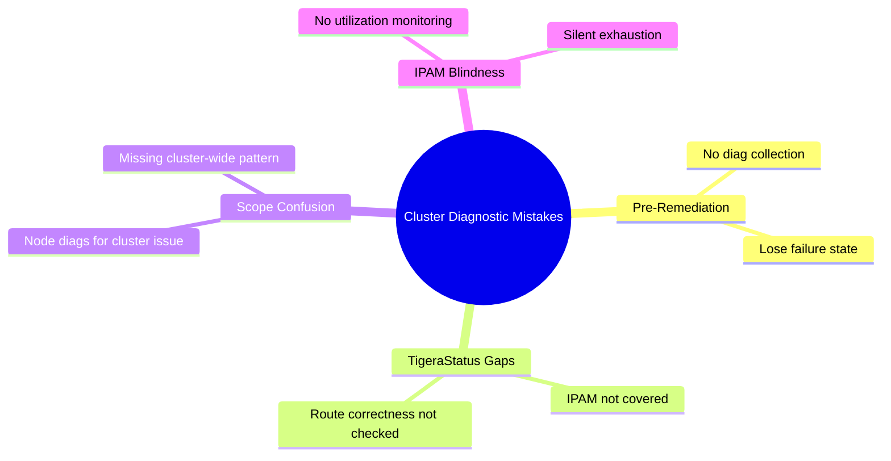

# Common Mistakes to Avoid with Calico Cluster Diagnostics

Author: [nawazdhandala](https://github.com/nawazdhandala)

Tags: Calico, Kubernetes, Networking, Diagnostics

Description: Avoid common mistakes in Calico cluster diagnostics including skipping calicoctl cluster diags before remediation, misreading TigeraStatus, ignoring IPAM utilization trends, and treating all...

---

## Introduction

Cluster-level Calico diagnostic mistakes are more damaging than node-level mistakes because they affect all workloads simultaneously. The most common mistakes are starting remediation before collecting diagnostic state, misunderstanding TigeraStatus as the complete picture of cluster health, and failing to detect IPAM exhaustion before it causes widespread pod scheduling failures.

## Mistake 1: Remediating Before Collecting Diagnostics

```bash
# WRONG: Immediately restarting components when TigeraStatus is degraded
kubectl rollout restart deployment/calico-typha -n calico-system
# This destroys the pre-failure state needed for root cause analysis

# CORRECT: Collect first
./collect-calico-cluster-diags.sh
# Then remediate
kubectl rollout restart deployment/calico-typha -n calico-system
```

## Mistake 2: Assuming TigeraStatus = Complete Health Picture

```bash
# TigeraStatus shows operator component health
# It does NOT show:
# - IPAM utilization
# - Policy enforcement gaps
# - BGP route propagation correctness

# WRONG: "TigeraStatus shows Available, cluster is healthy"
kubectl get tigerastatus  # All Available
# Meanwhile: calicoctl ipam show shows 97% utilization

# CORRECT: Always pair TigeraStatus with IPAM check
kubectl get tigerastatus
calicoctl ipam show
calicoctl ipam check
```

## Mistake 3: Treating Cluster Issues as Node Issues

```bash
# WRONG: Running per-node diagnostics when all nodes are affected
# (wastes time on the wrong scope)

# SYMPTOM: All pods on ALL nodes can't connect to services
# FIRST CHECK: kubectl get tigerastatus
# If kube-controllers is degraded: this is a cluster-level issue
# → Fix: restart kube-controllers, NOT individual calico-node pods

# CORRECT scope identification:
ALL_NODES_AFFECTED=true  # Based on symptom scope
# → Investigate: kube-controllers, typha, operator, IPAM
SINGLE_NODE_AFFECTED=true
# → Investigate: that node's calico-node pod, BGP state, iptables
```

## Mistake 4: Not Monitoring IPAM Utilization

```bash
# IPAM exhaustion is silent until new pods fail to schedule
# By the time you notice, the cluster may be at 100%

# WRONG: No IPAM monitoring
# CORRECT: Alert when >85%

# Add to your monitoring stack:
# Alert: (calico_ipam_used_ips / calico_ipam_total_ips) > 0.85

# Check current state
calicoctl ipam show
```

## Common Mistakes Summary



## Mistake 5: Not Running calicoctl ipam check Regularly

```bash
# IPAM inconsistencies accumulate silently
# Leaked IPs reduce effective capacity without any alert

# WRONG: Never running ipam check
# CORRECT: Weekly ipam check
calicoctl ipam check
# "IPAM is consistent" = no leaked allocations
# "Found N inconsistencies" = leaked IPs, action required
```

## Conclusion

Cluster-level Calico diagnostic mistakes are preventable with three habits: always collect `calicoctl cluster diags` before any remediation action, pair TigeraStatus checks with IPAM checks as a routine, and monitor IPAM utilization with alerts at 85% and 95% thresholds. The IPAM blind spot is the most dangerous - it's the only major Calico failure mode that doesn't appear in TigeraStatus and is entirely avoidable with a simple weekly check.
