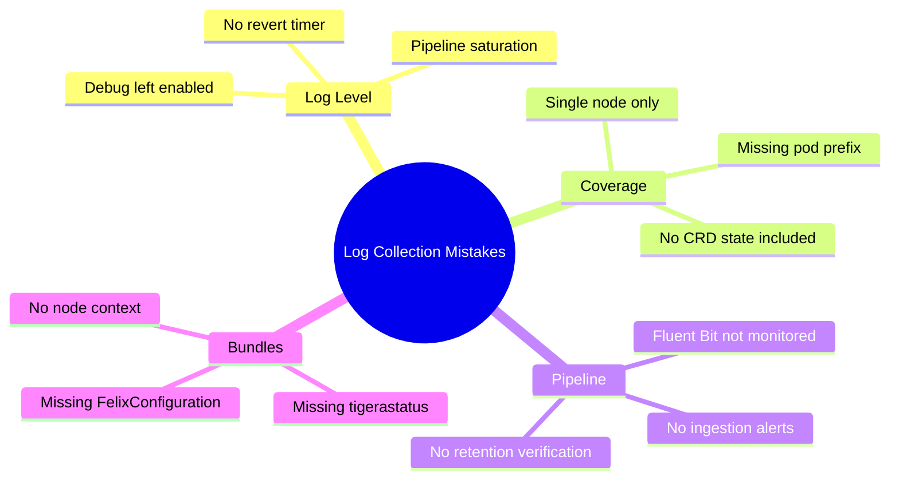

# Common Mistakes to Avoid in Calico Component Log Collection

Author: [nawazdhandala](https://github.com/nawazdhandala)

Tags: Calico, Kubernetes, Networking, Logging

Description: Avoid the most common mistakes in Calico log collection including leaving Debug logging enabled, collecting logs from only one node, ignoring log rotation limits, and not including CRD state...

---

## Introduction

Calico log collection mistakes typically manifest during incidents, when you discover that the logs you need either don't exist, are incomplete, or have saturated your log pipeline. The most impactful mistakes are architectural (not collecting from all nodes) and operational (leaving Debug logging enabled). Identifying these patterns before they affect an incident saves significant recovery time.

## Mistake 1: Leaving Debug Logging Enabled

```bash
# WRONG: Enabling debug logging without a plan to revert
kubectl patch felixconfiguration default \
  --type=merge -p '{"spec":{"logSeverityScreen":"Debug"}}'
# Then forgetting about it for hours or days

# CORRECT: Enable with a timer and always revert
kubectl patch felixconfiguration default \
  --type=merge -p '{"spec":{"logSeverityScreen":"Debug"}}'
sleep 600  # 10 minutes
kubectl patch felixconfiguration default \
  --type=merge -p '{"spec":{"logSeverityScreen":"Info"}}'

# Debug can generate 10-100x more log volume than Info
# On a 100-node cluster: could be GBs per hour per component
```

## Mistake 2: Collecting Logs from Only One Node

```bash
# WRONG: Only collecting logs from one calico-node pod
kubectl logs -n calico-system calico-node-abc123 -c calico-node

# A pod connectivity issue may only appear in the logs of the
# calico-node pod running on the SOURCE or DESTINATION node

# CORRECT: Collect from all calico-node pods with prefix
kubectl logs -n calico-system -l k8s-app=calico-node \
  -c calico-node --tail=500 --prefix=true > all-calico-node.log
# The --prefix=true flag identifies which pod each line came from
```

## Mistake 3: Not Including CRD State with Logs

```bash
# WRONG: Collecting only logs for a support ticket
kubectl logs -n calico-system -l k8s-app=calico-node -c calico-node > logs.txt
# Submitting this to Tigera support without CRD state

# CORRECT: Always collect CRD state alongside logs
kubectl logs -n calico-system -l k8s-app=calico-node -c calico-node > calico-node.log
kubectl get tigerastatus -o yaml > tigerastatus.yaml
kubectl get felixconfiguration -o yaml > felixconfiguration.yaml
kubectl get installation -o yaml > installation.yaml
# Logs without CRD state are much harder to analyze
```

## Mistake 4: Not Monitoring the Log Collection Pipeline

```bash
# WRONG: Assuming Fluent Bit is working just because it's Running
kubectl get pods -n logging -l app=fluent-bit
# Status: Running - but it may be dropping messages silently

# CORRECT: Monitor Fluent Bit output metrics
kubectl exec -n logging <fluent-bit-pod> -- \
  curl -s http://localhost:2020/api/v1/metrics | \
  python3 -m json.tool | grep -A5 "output"
# Check: output.errors should be 0 or very low
```

## Common Mistakes Summary



## Mistake 5: Using kubectl logs --previous Instead of Checking Archives

```bash
# kubectl logs --previous only shows the PREVIOUS container run
# If the pod has restarted multiple times, earlier logs are lost

# CORRECT: Use your log aggregation system to query historical logs
# Or set up log archival before incidents happen (not after)
logcli query '{namespace="calico-system", container="calico-node"}' \
  --since=2h --output=jsonl
```

## Conclusion

The most operationally damaging log collection mistake is leaving Debug logging enabled - it silently saturates log pipelines and can cause log shippers to drop messages from other critical systems. The most diagnostically damaging mistake is collecting logs from only one node when a multi-node interaction is causing the issue. Build the `--prefix=true` flag and multi-pod collection into all standard log collection procedures, and treat Debug logging as a short-duration diagnostic tool with a mandatory revert step.
