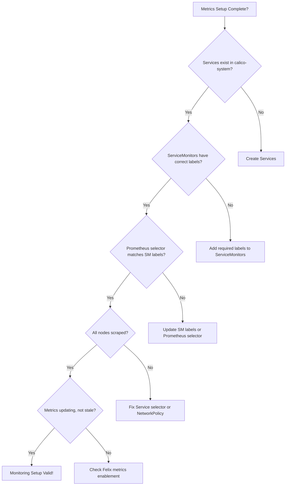

# How to Avoid Common Mistakes with Calico Component Metrics Monitoring

Author: [nawazdhandala](https://github.com/nawazdhandala)

Tags: Calico, Kubernetes, Networking, Metrics, Prometheus, Best Practices

Description: Avoid the most common pitfalls when setting up and maintaining Calico Prometheus metrics monitoring, from ServiceMonitor misconfigurations to alert fatigue patterns.

---

## Introduction

Calico metrics monitoring has several common configuration mistakes that result in partial or incorrect observability. The most dangerous is false assurance — believing you have complete coverage when actually only some nodes or components are being monitored. This section catalogs the top mistakes with concrete examples.

## Mistake 1: ServiceMonitor Selector Not Matching Service Labels

```yaml
# WRONG - selector looks for labels that Services don't have
apiVersion: monitoring.coreos.com/v1
kind: ServiceMonitor
spec:
  selector:
    matchLabels:
      app: calico-felix  # Service doesn't have this label!

# Check what labels Services actually have
kubectl get svc -n calico-system --show-labels

# CORRECT - use the actual labels from the Service
spec:
  selector:
    matchLabels:
      k8s-app: calico-node  # This is what the actual Service uses
```

## Mistake 2: Not Verifying Full Node Coverage

```promql
# WRONG assumption: "I have calico targets in Prometheus" = "I have all nodes"
# Partial coverage is a common silent failure

# CORRECT check: count monitored nodes vs total nodes
count(up{job="calico-felix-metrics"} == 1)
# vs
count(kube_node_info)
# These MUST be equal

# In kubectl:
TOTAL=$(kubectl get nodes --no-headers | wc -l)
SCRAPED=$(curl -s 'http://localhost:9090/api/v1/query?query=count(up{job="calico-felix-metrics"}=1)' | \
  jq '.data.result[0].value[1]' -r)
echo "Scraped: ${SCRAPED}/${TOTAL}"
```

## Mistake 3: Setting Scrape Interval Too Low

```yaml
# WRONG - Felix generates many metrics, scraping too often causes overhead
spec:
  endpoints:
    - port: http-metrics
      interval: 5s  # Too frequent for Felix! Causes CPU spikes

# CORRECT - Felix metrics update slowly, 15-30s is appropriate
spec:
  endpoints:
    - port: http-metrics
      interval: 15s  # Reasonable default
```

## Mistake 4: Forgetting to Create Services Before ServiceMonitors

```bash
# WRONG - creating ServiceMonitor before the Service it targets
kubectl apply -f felix-servicemonitor.yaml  # Prometheus will find no endpoints!
# ...later...
kubectl apply -f felix-metrics-service.yaml

# Prometheus won't automatically discover the new Service for existing ServiceMonitors
# You may need to wait for the next reconcile cycle

# CORRECT - apply in order
kubectl apply -f felix-metrics-service.yaml  # Service first
kubectl apply -f felix-servicemonitor.yaml    # ServiceMonitor second
```

## Mistake 5: Ignoring Prometheus Selector Configuration

```yaml
# Prometheus only discovers ServiceMonitors matching its selector
# If your ServiceMonitor doesn't have the right label, it's silently ignored

# Check your Prometheus configuration
kubectl get prometheus -n monitoring \
  -o jsonpath='{.items[0].spec.serviceMonitorSelector}' | jq .
# Example: {"matchLabels":{"app":"kube-prometheus-stack"}}

# Make sure your ServiceMonitors have this label
apiVersion: monitoring.coreos.com/v1
kind: ServiceMonitor
metadata:
  labels:
    app: kube-prometheus-stack  # Required to be picked up by Prometheus!
```

## Quick Validation Checklist



## Conclusion

The most common Calico metrics monitoring mistakes are silent failures: ServiceMonitor label mismatches, partial node coverage, and Prometheus selector configuration mismatches. None of these produce obvious errors — Prometheus just doesn't collect data from the missing components. Always validate coverage quantitatively after setup by comparing scraped node count to total node count. Build the coverage check into your automated validation pipeline so it runs after every deployment.
