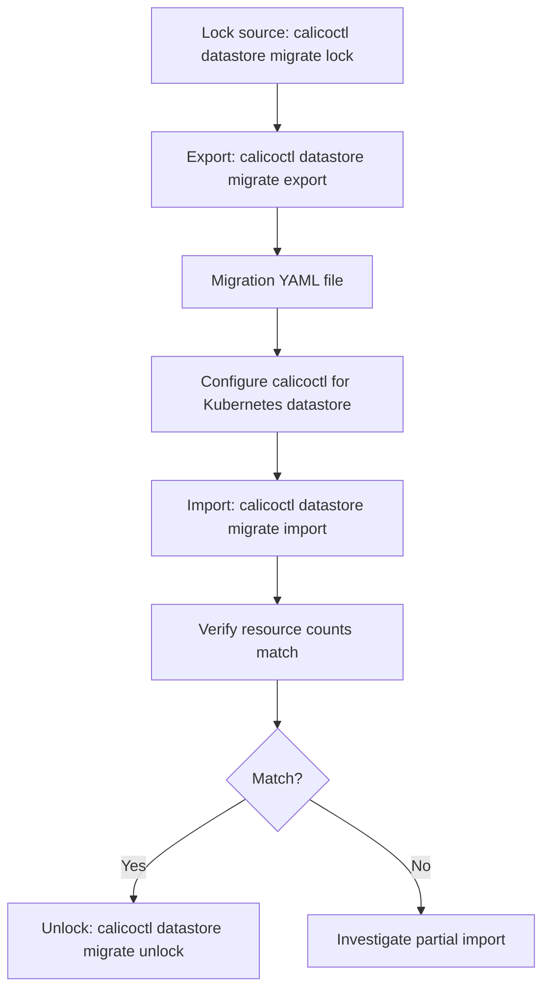

# Common Mistakes to Avoid with Calico Datastore Export and Import

Author: [nawazdhandala](https://github.com/nawazdhandala)

Tags: Calico, Kubernetes, Networking, Operation

Description: Avoid common mistakes in Calico datastore operations including importing to the wrong cluster, not locking the source during migration, and importing without verifying resource compatibility.

---

## Introduction

Datastore migration export and import mistakes can put Calico resources in the wrong Kubernetes datastore or cause migration failures (not locking the source causes drift between export time and cutover). Both are avoidable with careful pre-operation verification.

## Key Commands

```bash
# Lock source etcdv3 datastore before migration
calicoctl datastore migrate lock

# Export Calico etcdv3 datastore for migration
MIGRATION_FILE="calico-migration-$(date +%Y%m%d).yaml"
calicoctl datastore migrate export > "${MIGRATION_FILE}"

# Verify export content
echo "Resources in export: $(grep -c '^kind:' "${MIGRATION_FILE}")"
grep "^kind:" "${MIGRATION_FILE}" | sort | uniq -c

# Configure calicoctl for the destination Kubernetes datastore, then import
calicoctl datastore migrate import -f "${MIGRATION_FILE}"

# Verify import
calicoctl get felixconfiguration
calicoctl get globalnetworkpolicy | wc -l

# Unlock datastore after successful migration verification
calicoctl datastore migrate unlock
```

## Operation Flow



## Operational Checklist

```markdown
Before export:
[ ] Confirm source datastore connectivity
[ ] Confirm source etcd credentials
[ ] Lock the source etcdv3 datastore for migration
[ ] Verify sufficient disk space for export file
[ ] Note current resource counts for post-export verification

After import:
[ ] Compare resource counts: source vs destination
[ ] Verify Calico components are operational
[ ] Test pod connectivity (cross-namespace, cross-node)
[ ] Verify network policies are being enforced
[ ] Unlock the datastore after successful verification
```

## Conclusion

Calico etcdv3-to-Kubernetes datastore migration operations require careful verification at both ends: confirm resource counts before and after, verify connectivity and policy enforcement after import, and store migration exports encrypted in access-controlled storage. Regular migration rehearsals ensure that the process is not just theoretically possible but practically verified.
