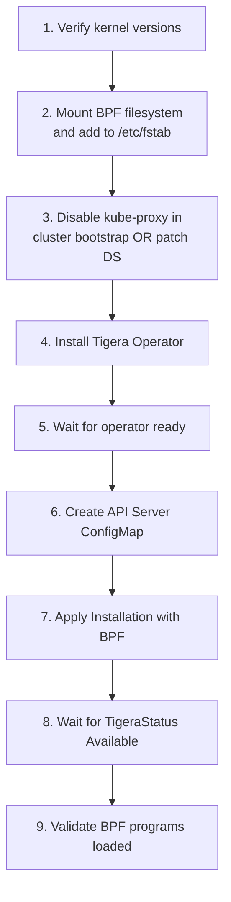

# How to Avoid Common Mistakes with Calico eBPF Installation

Author: [nawazdhandala](https://github.com/nawazdhandala)

Tags: Calico, Kubernetes, Networking, eBPF, Installation, Best Practices

Description: Avoid the most common mistakes when installing Calico with eBPF, including installation order issues, prerequisite oversights, and configuration pitfalls unique to fresh deployments.

---

## Introduction

Fresh Calico eBPF installations have their own set of common mistakes that differ from migration-related issues. The biggest pitfalls involve installation order (BPF filesystem, kube-proxy, operator, Installation resource), missing prerequisites on some but not all nodes, and subtle configuration errors that only manifest under load.

## Mistake 1: Installing Calico Before Setting Up BPF Prerequisites

```bash
# WRONG - installing operator before BPF filesystem is mounted
kubectl create -f tigera-operator.yaml  # Too early!
# calico-node starts and can't load BPF programs, falls back to iptables

# CORRECT - prepare ALL nodes first
for node in $(kubectl get nodes -o jsonpath='{.items[*].metadata.name}'); do
  # Ensure BPF filesystem is mounted
  kubectl debug node/${node} --image=ubuntu:22.04 -it -- \
    bash -c 'mount | grep -q bpffs || mount -t bpf bpffs /sys/fs/bpf' 2>/dev/null
done

# THEN install operator
kubectl create -f tigera-operator.yaml
```

## Mistake 2: Not Waiting for Operator Before Applying Installation

```bash
# WRONG - race condition
kubectl create -f tigera-operator.yaml
kubectl apply -f installation.yaml  # Operator not ready yet, may miss the Installation

# CORRECT - wait for operator first
kubectl create -f tigera-operator.yaml
kubectl rollout status deploy/tigera-operator -n tigera-operator --timeout=120s
kubectl apply -f installation.yaml  # Now safe to apply
```

## Mistake 3: Using Helm Without Disabling kube-proxy

```bash
# WRONG - default Helm install includes kube-proxy
helm install calico projectcalico/calico --namespace calico-system

# CORRECT - pass eBPF values to Helm
helm install calico projectcalico/calico \
  --namespace calico-system \
  --set installation.calicoNetwork.linuxDataplane=BPF \
  --set installation.calicoNetwork.hostPorts=Disabled \
  --set kubeProxy.enabled=false
```

## Mistake 4: Not Persisting BPF Filesystem Mount

```bash
# WRONG - mounting BPF filesystem only once (not persistent)
mount -t bpf bpffs /sys/fs/bpf
# After node reboot, BPF filesystem is unmounted again!
# calico-node can't load BPF programs on restart

# CORRECT - add to /etc/fstab for persistence
echo 'bpffs /sys/fs/bpf bpf defaults 0 0' >> /etc/fstab
mount -t bpf bpffs /sys/fs/bpf
echo "BPF filesystem mounted and persisted"
```

## Mistake 5: Installing Without Checking Network Policy Support

```bash
# eBPF mode requires specific kernel features for network policy
# Check that the kernel has the required BPF socket options

kubectl debug node/<node> --image=ubuntu:22.04 -it -- \
  bash -c 'grep -E "CONFIG_BPF_SYSCALL|CONFIG_NET_CLS_BPF|CONFIG_CGROUP_BPF" /boot/config-$(uname -r)'

# Required:
# CONFIG_BPF_SYSCALL=y
# CONFIG_NET_CLS_BPF=y or m
# CONFIG_CGROUP_BPF=y

# If any are missing, eBPF network policy won't work
# (Calico may fall back to iptables for policy enforcement)
```

## Installation Order Checklist



## Conclusion

Fresh Calico eBPF installation mistakes are almost entirely about order of operations and prerequisites. Always prepare nodes (BPF filesystem persistent mount, kernel verification) before installing the operator, disable kube-proxy before enabling eBPF mode, and wait for the operator to be ready before applying the Installation resource. By following the installation order checklist in this guide, you avoid the race conditions and missing prerequisites that cause most eBPF installation failures.
