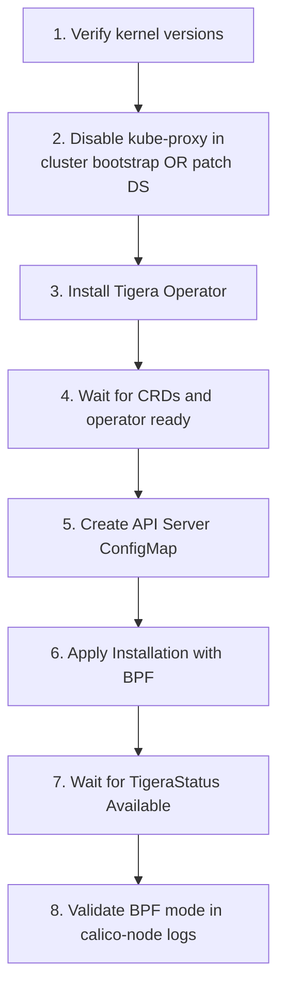

# How to Avoid Common Mistakes with Calico eBPF Installation

Author: [nawazdhandala](https://github.com/nawazdhandala)

Tags: Calico, Kubernetes, Networking, eBPF, Installation, Best Practice

Description: Avoid the most common mistakes when installing Calico with eBPF, including installation order issues, prerequisite oversights, and configuration pitfalls unique to fresh deployments.

---

## Introduction

Fresh Calico eBPF installations have their own set of common mistakes that differ from migration-related issues. The biggest pitfalls involve installation order (kernel prerequisites, kube-proxy, API server endpoint ConfigMap, operator, Installation resource), missing prerequisites on some but not all nodes, and subtle configuration errors that only manifest under load.

## Mistake 1: Installing Calico Before Setting Up BPF Prerequisites

```bash
# WRONG - installing operator before verifying node kernel support

kubectl create -f tigera-operator.yaml  # Too early!
# calico-node may later report that BPF mode is not supported by the kernel

# CORRECT - prepare ALL nodes first
for node in $(kubectl get nodes -o jsonpath='{.items[*].metadata.name}'); do
  # Calico Open Source eBPF requires Linux kernel v5.10+,
  # or RHEL 8.4 kernel v4.18.0-305+ with backported features.
  kubectl debug node/${node} --image=ubuntu:22.04 --profile=sysadmin -it -- \
    chroot /host uname -r
done

# THEN install operator
kubectl create -f tigera-operator.yaml
```

## Mistake 2: Not Waiting for Operator Before Applying Installation

```bash
# WRONG - race condition
kubectl create -f tigera-operator.yaml
kubectl apply -f installation.yaml  # May fail if the Installation CRD is not established yet

# CORRECT - wait for the operator CRD first
kubectl create -f tigera-operator.yaml
kubectl wait --for=condition=Established crd/installations.operator.tigera.io --timeout=120s
kubectl rollout status deploy/tigera-operator -n tigera-operator --timeout=120s
kubectl apply -f installation.yaml  # Now safe to apply
```

## Mistake 3: Using Helm Without Disabling kube-proxy

```bash
# WRONG - installing Calico without disabling kube-proxy for eBPF mode
helm install calico projectcalico/tigera-operator \
  --namespace tigera-operator

# CORRECT - disable kube-proxy when creating the cluster, then install Calico
kubeadm init --skip-phases=addon/kube-proxy
kubectl create namespace tigera-operator

cat > values.yaml <<EOF
installation:
  enabled: true
  calicoNetwork:
    linuxDataplane: BPF
EOF

helm install calico projectcalico/tigera-operator \
  --namespace tigera-operator \
  -f values.yaml
```

## Mistake 4: Not Creating the API Server Endpoint ConfigMap

```bash
# WRONG - relying on the Kubernetes service ClusterIP after kube-proxy is disabled
kubectl create -f custom-resources.yaml

# CORRECT - create the real API server endpoint ConfigMap first
kubectl apply -f - <<EOF
kind: ConfigMap
apiVersion: v1
metadata:
  name: kubernetes-services-endpoint
  namespace: tigera-operator
data:
  KUBERNETES_SERVICE_HOST: "<API server host>"
  KUBERNETES_SERVICE_PORT: "<API server port>"
EOF

kubectl create -f custom-resources.yaml
```

## Mistake 5: Installing Without Checking Network Policy Support

```bash
# eBPF mode requires a supported Linux kernel on every node
# Check the running host kernel version

kubectl debug node/<node> --image=ubuntu:22.04 --profile=sysadmin -it -- \
  chroot /host uname -r

# Required:
# Linux kernel v5.10 or above
# RHEL 8.4 kernel v4.18.0-305 or above is also supported

# If the kernel is not supported, Calico logs that BPF mode is not supported
# and disables BPF mode.
```

## Installation Order Checklist


```mermaid
flowchart TD
    A[1. Verify kernel versions] --> B[2. Disable kube-proxy in\ncluster bootstrap OR patch DS]
    B --> C[3. Install Tigera Operator]
    C --> D[4. Wait for CRDs and operator ready]
    D --> E[5. Create API Server ConfigMap]
    E --> F[6. Apply Installation with BPF]
    F --> G[7. Wait for TigeraStatus Available]
    G --> H[8. Validate BPF mode in calico-node logs]
```

## Conclusion

Fresh Calico eBPF installation mistakes are almost entirely about order of operations and prerequisites. Always prepare nodes (kernel verification) before installing the operator, disable kube-proxy before enabling eBPF mode, create the API server endpoint ConfigMap, and wait for the operator CRDs to be ready before applying the Installation resource. By following the installation order checklist in this guide, you avoid the race conditions and missing prerequisites that cause most eBPF installation failures.
