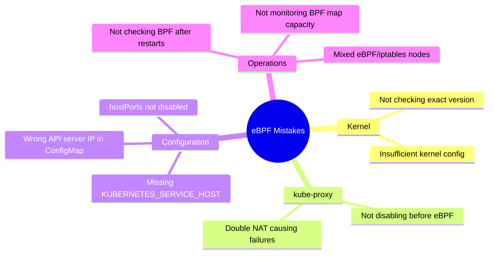

# How to Avoid Common Mistakes with Calico eBPF Mode

Author: [nawazdhandala](https://github.com/nawazdhandala)

Tags: Calico, Kubernetes, Networking, eBPF, Best Practices

Description: Identify and avoid the most common mistakes when enabling and operating Calico in eBPF mode, from kernel version confusion to kube-proxy conflicts and BPF map exhaustion.

---

## Introduction

Calico eBPF mode has a well-documented set of common mistakes that operators encounter when enabling or operating it. Many of these mistakes result in silent degradation - the cluster continues to work, but in iptables mode rather than eBPF mode - defeating the purpose of enabling eBPF. Others result in service connectivity failures that are difficult to diagnose without understanding the eBPF architecture.

This guide catalogs the most common eBPF mistakes with concrete examples and corrective actions.

## Prerequisites

- Basic familiarity with Calico eBPF concepts
- Calico with eBPF mode configured or being planned

## Mistake 1: Assuming Kernel Version is Sufficient Without Checking

Different eBPF features require different kernel minimum versions:

```bash
# Just checking major.minor is not enough
# Some cloud providers backport security fixes but not all features

# WRONG - only checking major version
kernel_major=$(uname -r | cut -d. -f1)
[[ "${kernel_major}" -ge 5 ]] && echo "OK"  # This passes on 5.0 which is too old!

# CORRECT - check for minimum 5.3, and understand 5.10+ gives better performance
check_kernel() {
  local major minor
  major=$(uname -r | cut -d. -f1)
  minor=$(uname -r | cut -d. -f2)

  if [[ "${major}" -gt 5 ]] || \
     ([[ "${major}" -eq 5 ]] && [[ "${minor}" -ge 10 ]]); then
    echo "OK: Kernel $(uname -r) - full eBPF support"
  elif [[ "${major}" -eq 5 ]] && [[ "${minor}" -ge 3 ]]; then
    echo "WARN: Kernel $(uname -r) - basic eBPF support (upgrade to 5.10+ recommended)"
  else
    echo "FAIL: Kernel $(uname -r) too old for Calico eBPF"
  fi
}
```

## Mistake 2: Leaving kube-proxy Running

```bash
# WRONG - enabling eBPF without disabling kube-proxy
kubectl patch installation default --type=merge \
  -p '{"spec":{"calicoNetwork":{"linuxDataplane":"BPF"}}}'
# kube-proxy is still running! This causes double NAT for services
# Symptoms: services may work but with higher latency or failures
# under load due to conntrack conflicts

# CORRECT - disable kube-proxy BEFORE or SIMULTANEOUSLY with eBPF enablement
kubectl patch ds kube-proxy -n kube-system \
  -p '{"spec":{"template":{"spec":{"nodeSelector":{"non-calico-ebpf":"true"}}}}}'

# THEN enable eBPF
kubectl patch installation default --type=merge \
  -p '{"spec":{"calicoNetwork":{"linuxDataplane":"BPF"}}}'
```

## Mistake 3: Wrong API Server IP in ConfigMap

```yaml
# WRONG - using the Kubernetes service ClusterIP (10.96.0.1)
apiVersion: v1
kind: ConfigMap
metadata:
  name: kubernetes-services-endpoint
  namespace: tigera-operator
data:
  KUBERNETES_SERVICE_HOST: "10.96.0.1"   # This is the virtual service IP!
  KUBERNETES_SERVICE_PORT: "443"

# Why this fails: When kube-proxy is disabled, the VIP 10.96.0.1 doesn't
# work because kube-proxy was creating the NAT rule for it.
# Felix needs the REAL control plane node IP.

# CORRECT - use the real endpoint IP
# kubectl get endpoints kubernetes -n default
data:
  KUBERNETES_SERVICE_HOST: "192.168.1.100"   # Real control plane node IP
  KUBERNETES_SERVICE_PORT: "6443"
```

## Mistake 4: Enabling eBPF with hostPorts Enabled

```yaml
# WRONG - hostPorts are not supported in eBPF mode
spec:
  calicoNetwork:
    linuxDataplane: BPF
    hostPorts: Enabled  # Will cause errors or silent fallback

# CORRECT
spec:
  calicoNetwork:
    linuxDataplane: BPF
    hostPorts: Disabled  # Required for eBPF mode
```

## Mistake 5: Not Checking BPF Programs After Node Restart

```bash
# WRONG - assuming eBPF persists across reboots without checking
# BPF programs are loaded into kernel memory and do NOT persist across reboots
# calico-node re-loads them on startup, but if startup fails, iptables is used

# CORRECT - add post-reboot health check
# Add to node bootstrap script or monitoring:
check_ebpf_after_reboot() {
  # Wait for calico-node to be ready
  until kubectl get pods -n calico-system -l k8s-app=calico-node \
    --field-selector=spec.nodeName=$(hostname) \
    -o jsonpath='{.items[0].status.phase}' | grep -q Running; do
    sleep 5
  done

  # Verify BPF programs were loaded
  programs=$(bpftool prog list 2>/dev/null | grep -c calico || echo 0)
  if [[ "${programs}" -lt 5 ]]; then
    echo "WARNING: eBPF programs not loaded after reboot!"
    systemctl status kubelet
  fi
}
```

## Common Mistakes Quick Reference



## Conclusion

The most impactful Calico eBPF mistakes are operational: failing to disable kube-proxy (causing double NAT), using the wrong API server IP in the ConfigMap (causing service routing failures when kube-proxy is disabled), and not verifying BPF programs are actually loaded after node restarts. Check `felix_bpf_enabled` in Prometheus continuously to detect any node that has fallen back to iptables mode. A mixed-mode cluster (some nodes eBPF, some iptables) is particularly dangerous because the inconsistency can cause intermittent connectivity issues that are very hard to debug.
