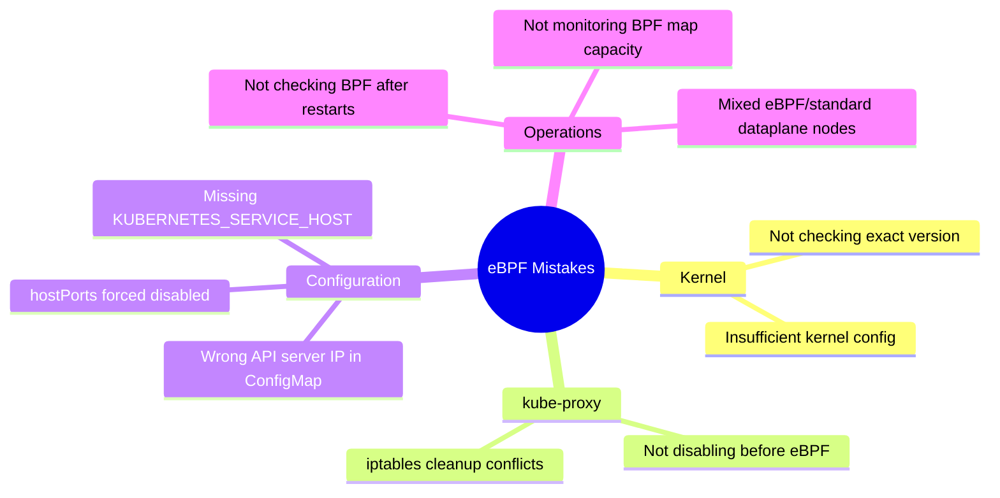

# How to Avoid Common Mistakes with Calico eBPF Mode

Author: [nawazdhandala](https://github.com/nawazdhandala)

Tags: Calico, Kubernetes, Networking, eBPF, Best Practice

Description: Identify and avoid the most common mistakes when enabling and operating Calico in eBPF mode, from kernel version confusion to kube-proxy conflicts and BPF map exhaustion.

---

## Introduction

Calico eBPF mode has a well-documented set of common mistakes that operators encounter when enabling or operating it. Many of these mistakes result in silent degradation - the cluster continues to work, but in the standard dataplane rather than eBPF mode - defeating the purpose of enabling eBPF. Others result in service connectivity failures that are difficult to diagnose without understanding the eBPF architecture.

This guide catalogs the most common eBPF mistakes with concrete examples and corrective actions.

## Prerequisites

- Basic familiarity with Calico eBPF concepts
- Calico with eBPF mode configured or being planned

## Mistake 1: Assuming Kernel Version is Sufficient Without Checking

Different eBPF features require different kernel minimum versions:

```bash
# Just checking major.minor is not enough

# Some cloud providers backport security fixes but not all features

# WRONG - only checking major version
kernel_major=$(uname -r | cut -d. -f1)
[[ "${kernel_major}" -ge 5 ]] && echo "OK"  # This passes on 5.0 which is too old!

# CORRECT - check for minimum 5.10 for current Calico Open Source releases
check_kernel() {
  local major minor
  major=$(uname -r | cut -d. -f1)
  minor=$(uname -r | cut -d. -f2)

  if [[ "${major}" -gt 6 ]] || \
     ([[ "${major}" -eq 6 ]] && [[ "${minor}" -ge 6 ]]); then
    echo "OK: Kernel $(uname -r) - base eBPF support with newer feature support"
  elif [[ "${major}" -gt 5 ]] || \
       ([[ "${major}" -eq 5 ]] && [[ "${minor}" -ge 10 ]]); then
    echo "OK: Kernel $(uname -r) - base eBPF support"
  else
    echo "FAIL: Kernel $(uname -r) too old for current Calico eBPF requirements"
  fi
}
```

## Mistake 2: Leaving kube-proxy Running

```bash
# WRONG - enabling eBPF without disabling kube-proxy or enabling operator management
kubectl patch installation.operator.tigera.io default --type merge \
  -p '{"spec":{"calicoNetwork":{"linuxDataplane":"BPF"}}}'
# kube-proxy is still running! This can cause confusion over which
# component is handling services and conflicts with Calico's cleanup of
# kube-proxy iptables rules.

# CORRECT - for compatible self-managed clusters, let the operator bootstrap
# API server access and manage kube-proxy while enabling eBPF
kubectl patch installation.operator.tigera.io default --type merge \
  -p '{"spec":{"calicoNetwork":{"linuxDataplane":"BPF","bpfNetworkBootstrap":"Enabled","kubeProxyManagement":"Enabled"}}}'

# Or disable kube-proxy manually before or while enabling eBPF
kubectl patch ds kube-proxy -n kube-system \
  -p '{"spec":{"template":{"spec":{"nodeSelector":{"non-calico-ebpf":"true"}}}}}'

# THEN enable eBPF
kubectl patch installation.operator.tigera.io default --type merge \
  -p '{"spec":{"calicoNetwork":{"linuxDataplane":"BPF"}}}'
```

## Mistake 3: Wrong API Server IP in ConfigMap

```yaml
# WRONG - using the Kubernetes service ClusterIP (10.96.0.1)
apiVersion: v1
kind: ConfigMap
metadata:
  name: kubernetes-services-endpoint
  namespace: tigera-operator
data:
  KUBERNETES_SERVICE_HOST: "10.96.0.1"   # This is the virtual service IP!
  KUBERNETES_SERVICE_PORT: "443"

# Why this fails: When kube-proxy is disabled, the VIP 10.96.0.1 doesn't
# work because kube-proxy was creating the NAT rule for it.
# Felix needs a stable real API server address.

# CORRECT - use a stable real API server address, such as the control plane
# node address for a single-node control plane or the load balancer address
# for a highly available control plane
# kubectl get endpoints kubernetes -n default
data:
  KUBERNETES_SERVICE_HOST: "192.168.1.100"   # Stable real API server address
  KUBERNETES_SERVICE_PORT: "6443"
```

## Mistake 4: Forcing hostPorts Disabled

```yaml
# WRONG - older examples often disabled hostPorts unnecessarily
spec:
  calicoNetwork:
    linuxDataplane: BPF
    hostPorts: Disabled

# CORRECT - follow the current eBPF switch-over guidance and unset hostPorts,
# or omit the field when creating the Installation resource
spec:
  calicoNetwork:
    linuxDataplane: BPF
    hostPorts: null
```

## Mistake 5: Not Checking BPF Programs After Node Restart

```bash
# WRONG - assuming eBPF persists across reboots without checking
# BPF programs are loaded into kernel memory and do NOT persist across reboots
# calico-node re-loads them on startup, but if eBPF mode is not functioning
# and kube-proxy is disabled, Kubernetes service connectivity can fail

# CORRECT - add post-reboot health check
# Add to node bootstrap script or monitoring:
check_ebpf_after_reboot() {
  # Wait for calico-node to be ready
  until kubectl get pods -n calico-system -l k8s-app=calico-node \
    --field-selector=spec.nodeName=$(hostname) \
    -o jsonpath='{.items[0].status.phase}' | grep -q Running; do
    sleep 5
  done

  # Verify BPF programs were loaded
  programs=$(bpftool prog list 2>/dev/null | grep -c calico || true)
  if [[ "${programs}" -lt 5 ]]; then
    echo "WARNING: eBPF programs not loaded after reboot!"
    systemctl status kubelet
  fi
}
```

## Common Mistakes Quick Reference


```mermaid
mindmap
  root((eBPF Mistakes))
    Kernel
      Not checking exact version
      Insufficient kernel config
    kube-proxy
      Not disabling before eBPF
      iptables cleanup conflicts
    Configuration
      Wrong API server IP in ConfigMap
      hostPorts forced disabled
      Missing KUBERNETES_SERVICE_HOST
    Operations
      Not checking BPF after restarts
      Not monitoring BPF map capacity
      Mixed eBPF/standard dataplane nodes
```

## Conclusion

The most impactful Calico eBPF mistakes are operational: failing to disable kube-proxy or let the operator manage it, using the wrong API server IP in the ConfigMap (causing service routing failures when kube-proxy is disabled), and not verifying BPF programs are actually loaded after node restarts. Check Felix logs and metrics continuously to detect any node that has fallen back to the standard dataplane. A mixed-mode cluster (some nodes eBPF, some standard dataplane and/or Windows nodes) is not supported and can cause intermittent connectivity issues that are very hard to debug.
