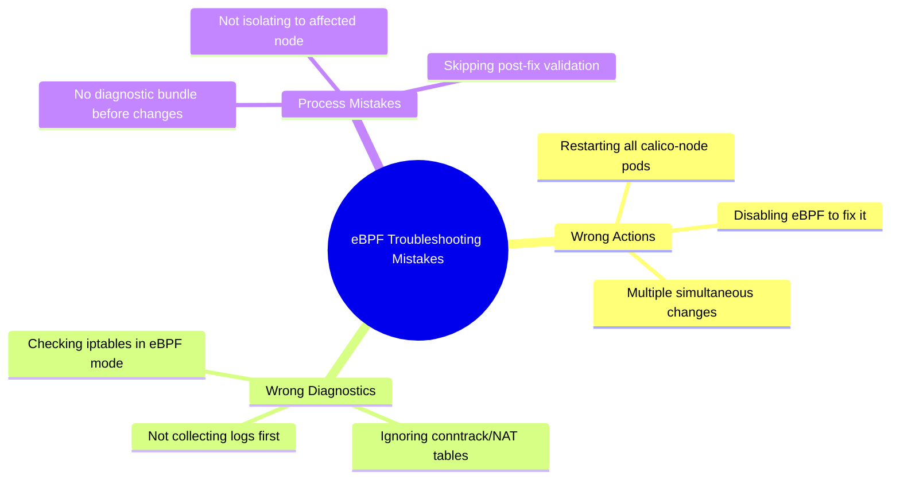

# How to Avoid Common Mistakes with Calico eBPF Troubleshooting

Author: [nawazdhandala](https://github.com/nawazdhandala)

Tags: Calico, Kubernetes, Networking, EBPF, Troubleshooting, Best Practices

Description: Avoid the most common mistakes when troubleshooting Calico eBPF issues, including misdiagnosis patterns, incorrect fixes, and changes that make problems worse.

---

## Introduction

eBPF troubleshooting mistakes often make problems worse. The most dangerous is the "quick fix" that inadvertently disables eBPF mode entirely (falling back to iptables) thinking the issue is resolved, when actually the underlying problem is now masked. Understanding what actions are safe to take during troubleshooting versus those that can cause additional disruption is critical.

## Mistake 1: Restarting calico-node to Fix eBPF Issues

```bash
# WRONG - blindly restarting all calico-node pods
# This causes rolling network disruption across ALL nodes
kubectl rollout restart ds/calico-node -n calico-system
# Don't do this unless you understand the consequence on all nodes!

# CORRECT - restart only the specific affected pod
AFFECTED_NODE="node-xyz"
AFFECTED_POD=$(kubectl get pod -n calico-system -l k8s-app=calico-node \
  --field-selector=spec.nodeName=${AFFECTED_NODE} \
  -o jsonpath='{.items[0].metadata.name}')
kubectl delete pod -n calico-system "${AFFECTED_POD}"
# This causes disruption on ONE node only
```

## Mistake 2: Disabling eBPF Mode to "Fix" the Issue

```bash
# WRONG - switching to iptables to "resolve" an eBPF issue
kubectl patch installation default --type=merge \
  -p '{"spec":{"calicoNetwork":{"linuxDataplane":"Iptables"}}}'
# This is not a fix! This causes rolling restarts on ALL nodes
# AND you lose all eBPF performance benefits

# CORRECT - diagnose and fix the actual root cause
# 1. Collect diagnostic bundle first
./collect-calico-ebpf-diagnostics.sh

# 2. Check the specific error
kubectl logs -n calico-system ds/calico-node -c calico-node | \
  grep -E "ERROR|FATAL|bpf" | tail -20

# 3. Fix the specific issue, not the symptom
```

## Mistake 3: Checking iptables Instead of BPF State

```bash
# WRONG diagnostic approach - checking iptables in eBPF mode
iptables -L -n  # Will show no calico rules in eBPF mode (this is CORRECT behavior!)
# New engineer may think "no calico rules = calico broken" but this is wrong!

# CORRECT diagnostic approach for eBPF mode
# Check BPF programs (these replace iptables rules)
kubectl exec -n calico-system ds/calico-node -c calico-node -- \
  bpftool prog list | grep calico | wc -l
# Expected: 15-30+ programs

# Check Felix status via BPF mode indicator
kubectl exec -n calico-system ds/calico-node -c calico-node -- \
  calico-node -bpf-list-progs 2>/dev/null | head -5
```

## Mistake 4: Making Configuration Changes During Active Troubleshooting

```bash
# WRONG - changing multiple configs while diagnosing
kubectl patch installation default --type=merge -p '{"spec":{"calicoNetwork":{"linuxDataplane":"BPF"}}}'
kubectl patch felixconfiguration default --type=merge -p '{"spec":{"logSeverityScreen":"Debug"}}'
kubectl delete configmap kubernetes-services-endpoint -n tigera-operator
# Multiple simultaneous changes make it impossible to know what "fixed" it

# CORRECT - change ONE thing at a time, observe, then proceed
# 1. Enable debug logging (safe, read-only effect)
kubectl patch felixconfiguration default --type=merge -p '{"spec":{"logSeverityScreen":"Debug"}}'
# 2. Observe logs for a few minutes
# 3. Only then make the targeted fix based on what you saw
```

## Mistake 5: Not Checking the Conntrack Table During Connectivity Issues

```bash
# WRONG - checking network routes when pods can't connect
kubectl exec -n calico-system ds/calico-node -c calico-node -- \
  ip route show  # Routes look fine, still not helping

# CORRECT - for connectivity issues in eBPF mode, check conntrack
kubectl exec -n calico-system ds/calico-node -c calico-node -- \
  calico-node -bpf-conntrack-dump 2>/dev/null | \
  grep "${PROBLEM_POD_IP}" | head -10

# Also check NAT table for service issues
kubectl exec -n calico-system ds/calico-node -c calico-node -- \
  calico-node -bpf-nat-dump 2>/dev/null | \
  grep "${SERVICE_IP}" | head -10
```

## Troubleshooting Mistakes Summary



## Conclusion

The most dangerous eBPF troubleshooting mistakes are those that cause additional disruption: restarting all calico-node pods unnecessarily, disabling eBPF mode as a "quick fix," or making multiple simultaneous configuration changes. Always collect a diagnostic bundle before making any changes, isolate your investigation to the affected node(s), and remember that in eBPF mode the absence of iptables rules is correct behavior - not a sign of problems. When a change needs to be made, make exactly one change and observe the effect before proceeding.
