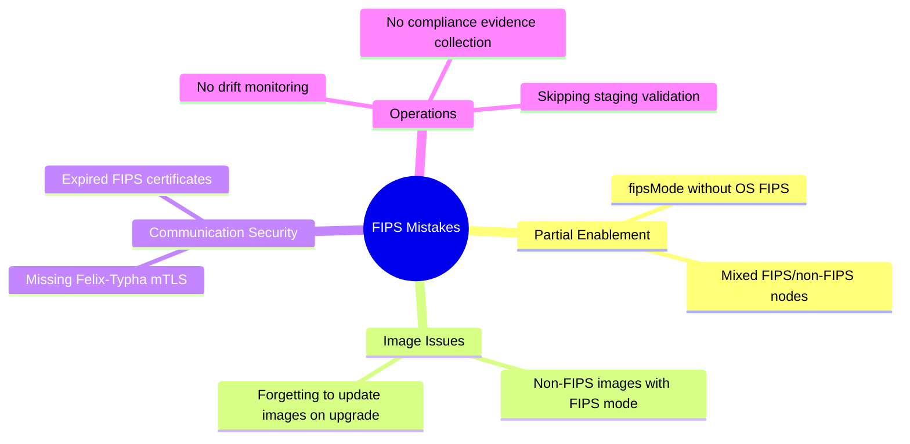

# How to Avoid Common Mistakes with Calico FIPS Mode

Author: [nawazdhandala](https://github.com/nawazdhandala)

Tags: Calico, Kubernetes, Networking, FIPS, Best Practices, Compliance

Description: Identify and avoid common pitfalls when deploying Calico in FIPS mode, including partial enablement, image confusion, certificate pitfalls, and configuration drift.

---

## Introduction

FIPS mode in Calico has several common failure patterns that leave organizations believing they are FIPS-compliant when they are not. The most dangerous mistakes involve partial enablement - some components or nodes are FIPS-enabled while others are not - creating a false compliance posture that can fail audits or leave security gaps.

Understanding these mistakes is particularly important because FIPS-related failures can be silent: the cluster continues to function normally even when non-FIPS algorithms are being used. A comprehensive understanding of what each FIPS configuration element controls helps you avoid gaps in your compliance posture.

## Prerequisites

- Calico deployed or being deployed with FIPS mode
- Basic understanding of FIPS 140-2 requirements

## Mistake 1: Setting fipsMode Without Enabling OS FIPS

The most common mistake is setting `fipsMode: Enabled` in the Calico Installation without enabling FIPS at the OS level:

```bash
# WRONG: Only setting Calico operator fipsMode
kubectl patch installation default --type=merge \
  -p '{"spec":{"fipsMode":"Enabled"}}'
# Calico uses FIPS-mode code paths but the OS kernel
# may allow non-FIPS operations in the underlying system!

# CORRECT: Enable OS FIPS first
# On each node:
fips-mode-setup --enable && reboot
# Then verify:
cat /proc/sys/crypto/fips_enabled  # Must return 1

# THEN set Calico fipsMode
kubectl patch installation default --type=merge \
  -p '{"spec":{"fipsMode":"Enabled"}}'
```

## Mistake 2: Using Non-FIPS Calico Images

Standard Calico images are not compiled with BoringCrypto. Using them with `fipsMode: Enabled` results in a configuration mismatch:

```bash
# Check if your current images are FIPS-enabled
kubectl get pods -n calico-system ds/calico-node \
  -o jsonpath='{.spec.containers[0].image}'

# FIPS images typically have indicators like:
# - "-fips" suffix in the tag
# - A specific FIPS digest listed in Calico release notes
# - Different quay.io/tigera path vs quay.io/calico

# Verify image is FIPS-compiled by checking Go build info
kubectl exec -n calico-system ds/calico-node -c calico-node -- \
  /usr/bin/calico-node -version 2>/dev/null | grep -i fips
```

## Mistake 3: Mixed Nodes with Different FIPS States

In autoscaled clusters, new nodes may launch without FIPS enabled if the launch template is not properly configured:

```bash
# Check FIPS status across all nodes - they should all show 1
for node in $(kubectl get nodes -o jsonpath='{.items[*].metadata.name}'); do
  fips=$(kubectl debug node/${node} --image=alpine -it --quiet -- \
    cat /proc/sys/crypto/fips_enabled 2>/dev/null | tr -d '\r\n')
  echo "${node}: ${fips}"
done

# If any node shows 0, the ASG launch template needs updating
# and the node needs to be replaced, not just configured in-place
```

## Mistake 4: Not Updating the ImageSet When Upgrading

When upgrading Calico, many operators update the Installation version but forget to update the ImageSet to the FIPS-enabled variant of the new version:

```bash
# After upgrading Calico version, verify the ImageSet uses FIPS images
kubectl get imageset calico-v3.28.0 -o yaml

# If ImageSet references non-FIPS images, update it
# The naming convention for FIPS images may differ per Calico release
# Always check the release notes for FIPS image digests
```

## Mistake 5: Forgetting Felix-Typha mTLS

FIPS mode restricts cipher suites for Felix-Typha communication. If Felix-Typha mTLS is not configured, they communicate in plaintext which is a separate compliance gap:

```bash
# Verify Felix-Typha mTLS is enabled
kubectl get installation default -o jsonpath='{.spec.typhaAffinity}' | jq .

# Check if Felix is connecting to Typha with TLS
kubectl exec -n calico-system ds/calico-node -c calico-node -- \
  ss -tnp | grep 5473  # Typha port

# If not using mTLS, configure it:
kubectl patch installation default --type=merge -p '{
  "spec": {
    "typhaAffinity": {
      "nodeAffinity": {
        "requiredDuringSchedulingIgnoredDuringExecution": {
          "nodeSelectorTerms": [{}]
        }
      }
    }
  }
}'
```

## Common Mistakes Summary



## Conclusion

Calico FIPS mode failures typically stem from partial enablement rather than complete misconfiguration. Always enable FIPS at the OS level before setting `fipsMode: Enabled`, use FIPS-specific container images, ensure all nodes in autoscaling groups have FIPS-enabled launch templates, and configure Felix-Typha mTLS alongside FIPS mode. Establish a regular compliance validation cadence to catch drift before it becomes an audit finding.
