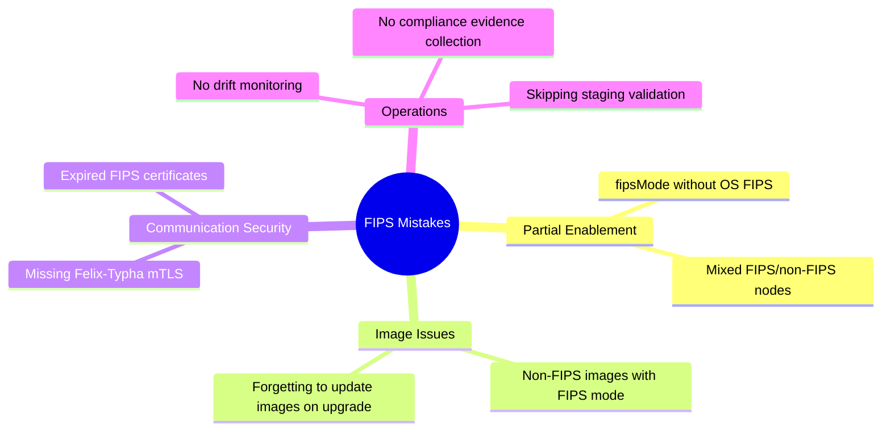

# How to Avoid Common Mistakes with Calico FIPS Mode

Author: [nawazdhandala](https://github.com/nawazdhandala)

Tags: Calico, Kubernetes, Networking, FIPS, Best Practice, Compliance

Description: Identify and avoid common pitfalls when deploying Calico in FIPS mode, including partial enablement, image confusion, certificate pitfalls, and configuration drift.

---

## Introduction

FIPS mode in Calico has several common failure patterns that leave organizations believing they are FIPS-compliant when they are not. The most dangerous mistakes involve partial enablement - some components or nodes are FIPS-enabled while others are not - creating a false compliance posture that can fail audits or leave security gaps.

Understanding these mistakes is particularly important because FIPS-related failures can be silent: the cluster continues to function normally even when non-FIPS algorithms are being used. A comprehensive understanding of what each FIPS configuration element controls helps you avoid gaps in your compliance posture.

## Prerequisites

- Calico deployed or being deployed with FIPS mode
- Basic understanding of FIPS 140-2 requirements
- Awareness that Calico FIPS mode is deprecated in current Calico documentation and will be removed in a future release

## Mistake 1: Setting fipsMode Without Enabling OS FIPS

The most common mistake is setting `fipsMode: Enabled` in the Calico Installation without enabling FIPS at the OS level:

```bash
# WRONG: Only setting Calico operator fipsMode

kubectl patch installation default --type=merge \
  -p '{"spec":{"fipsMode":"Enabled"}}'
# Calico uses FIPS-mode code paths but the OS kernel
# may allow non-FIPS operations in the underlying system!

# CORRECT: Enable OS FIPS first
# On each node:
fips-mode-setup --enable && reboot
# Then verify:
cat /proc/sys/crypto/fips_enabled  # Must return 1

# THEN set Calico fipsMode
kubectl patch installation default --type=merge \
  -p '{"spec":{"fipsMode":"Enabled"}}'
```

## Mistake 2: Overriding the Operator-Selected FIPS Images

Calico `fipsMode: Enabled` uses images and features backed by FIPS 140-2 validated cryptographic modules. Problems usually happen when custom registries, image paths, image prefixes, or ImageSets accidentally override the operator-selected FIPS images with the wrong image digests:

```bash
# Check the calico-node image currently rendered by the operator
kubectl get ds calico-node -n calico-system \
  -o jsonpath='{.spec.template.spec.containers[?(@.name=="calico-node")].image}{"\n"}'

# Check whether the Installation spec and status reflect FIPS mode
kubectl get installation default \
  -o jsonpath='{.spec.fipsMode}{"\n"}{.status.imageSet}{"\n"}'

# If you use ImageSet digests, compare them with the digests approved
# for the Calico version you are deploying.
kubectl get imageset "$(kubectl get installation default \
  -o jsonpath='{.status.imageSet}')" -o yaml
```

## Mistake 3: Mixed Nodes with Different FIPS States

In autoscaled clusters, new nodes may launch without FIPS enabled if the launch template is not properly configured:

```bash
# Check FIPS status across all nodes - they should all show 1
for node in $(kubectl get nodes -o jsonpath='{.items[*].metadata.name}'); do
  fips=$(kubectl debug node/${node} --image=alpine -it --quiet -- \
    cat /host/proc/sys/crypto/fips_enabled 2>/dev/null | tr -d '\r\n')
  echo "${node}: ${fips}"
done

# If any node shows 0, the ASG launch template needs updating
# and the node needs to be replaced, not just configured in-place
```

## Mistake 4: Not Updating the ImageSet When Upgrading

When upgrading Calico in clusters that use ImageSets, many operators update the Installation version but forget to create an ImageSet with approved image digests for the new version:

```bash
# After upgrading Calico version, verify the ImageSet uses FIPS images
kubectl get imageset calico-v3.28.0 -o yaml

# If ImageSet references unapproved images, create an ImageSet for
# the new Calico version before upgrading the cluster.
# Always check the release notes or approved image digest list.
```

## Mistake 5: Forgetting Felix-Typha mTLS

FIPS mode restricts cipher suites for Calico component communication. Operator-based Calico installations automatically configure mutual TLS for Felix-to-Typha connections, but manifest-based or heavily customized deployments should still verify that the Typha and Felix TLS settings are present:

```bash
# Operator installs should have FIPS mode enabled in the Installation
kubectl get installation default -o jsonpath='{.spec.fipsMode}{"\n"}'

# In manifest-based installs, verify the Typha TLS server settings
kubectl get deployment calico-typha -n calico-system -o yaml | \
  grep -E 'TYPHA_(CAFILE|SERVERCERTFILE|SERVERKEYFILE|CLIENTCN|CLIENTURISAN)'

# Verify the Felix client-side Typha TLS settings
kubectl get ds calico-node -n calico-system -o yaml | \
  grep -E 'FELIX_TYPHA(CAFILE|CERTFILE|KEYFILE|CN|URISAN)'
```

## Common Mistakes Summary


```mermaid
mindmap
  root((FIPS Mistakes))
    Partial Enablement
      fipsMode without OS FIPS
      Mixed FIPS/non-FIPS nodes
    Image Issues
      Non-FIPS images with FIPS mode
      Forgetting to update images on upgrade
    Communication Security
      Missing Felix-Typha mTLS
      Expired FIPS certificates
    Operations
      No drift monitoring
      No compliance evidence collection
      Skipping staging validation
```

## Conclusion

Calico FIPS mode failures typically stem from partial enablement rather than complete misconfiguration. Always enable FIPS at the OS level before setting `fipsMode: Enabled`, avoid overriding the operator-selected FIPS images with unapproved image digests, ensure all nodes in autoscaling groups have FIPS-enabled launch templates, and verify Felix-Typha mTLS alongside FIPS mode. Establish a regular compliance validation cadence to catch drift before it becomes an audit finding.
