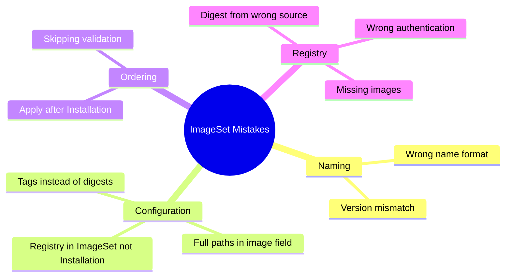

# How to Avoid Common Mistakes with Calico ImageSet Management

Author: [nawazdhandala](https://github.com/nawazdhandala)

Tags: Calico, Kubernetes, Networking, ImageSet, Best Practices

Description: Identify and avoid the most common mistakes when managing Calico ImageSets, from incorrect digest formats to registry naming pitfalls and version mismatch issues.

---

## Introduction

Calico ImageSet management has several sharp edges that catch even experienced Kubernetes operators. The most dangerous mistakes are silent failures — the operator appears to accept your ImageSet without errors, but continues using the old images or falls back to public registry pulls. Understanding why these failures happen silently and how to avoid them saves hours of debugging during critical upgrade windows.

The common mistakes fall into three categories: incorrect resource configuration (wrong naming, missing fields, format errors), registry setup problems (authentication, network access, image path mismatches), and operational process errors (applying ImageSet without verifying operator pickup, skipping validation). This guide covers each category with concrete examples of wrong vs. correct approaches.

## Prerequisites

- Basic familiarity with Calico ImageSet resources
- Calico installed via the Tigera Operator

## Mistake 1: Wrong ImageSet Name

The Tigera Operator selects ImageSets by a specific naming convention. Getting this wrong is the most common cause of ImageSet being ignored.

```yaml
# WRONG - operator will not select this
metadata:
  name: my-calico-images
  name: custom-imageset
  name: calico-images-prod

# CORRECT - must follow: calico-<version>
metadata:
  name: calico-v3.27.0
```

```bash
# Verify the name format the operator expects
kubectl get installation default -o jsonpath='{.status.calicoVersion}'
# Output: v3.27.0
# Correct ImageSet name: calico-v3.27.0
```

## Mistake 2: Using Tags Instead of Digests

```yaml
# WRONG - mutable tag, operator may not use digest-based pull
spec:
  images:
    - image: "calico/node"
      # Missing digest field entirely

# ALSO WRONG - tag is not a valid field
spec:
  images:
    - image: "calico/node"
      tag: "v3.27.0"  # Not a valid field

# CORRECT
spec:
  images:
    - image: "calico/node"
      digest: "sha256:a1b2c3d4..."
```

## Mistake 3: Missing the Registry Path in Installation

The ImageSet only specifies digests. The registry base URL must be in the Installation resource:

```yaml
# WRONG - ImageSet has full image path (not supported)
spec:
  images:
    - image: "registry.internal.example.com/calico/node"
      digest: "sha256:..."

# CORRECT - image is just the short name, registry goes in Installation
# ImageSet:
spec:
  images:
    - image: "calico/node"
      digest: "sha256:..."

# Installation:
spec:
  registry: "registry.internal.example.com/calico"
```

## Mistake 4: Applying ImageSet After Installation

The order of operations matters. If you apply Installation first without an ImageSet, the operator uses default public images. Always apply the ImageSet before or simultaneously with the Installation:

```bash
# WRONG order
kubectl apply -f installation.yaml
kubectl apply -f calico-imageset.yaml  # Too late - operator already started

# CORRECT order
kubectl apply -f calico-imageset.yaml
kubectl apply -f installation.yaml

# Or simultaneously
kubectl apply -f calico-imageset.yaml -f installation.yaml
```

## Mistake 5: Digest From Wrong Registry

If you mirror an image and calculate the digest from the source registry (e.g., docker.io), the digest may not match what's actually in your private registry after the mirror operation:

```bash
# WRONG - getting digest from source before mirroring
src_digest=$(crane digest docker.io/calico/node:v3.27.0)
# Then mirroring...
crane copy docker.io/calico/node:v3.27.0 registry.internal.example.com/calico/node:v3.27.0
# The digest may differ due to registry recompression!

# CORRECT - get digest from destination AFTER mirroring
crane copy docker.io/calico/node:v3.27.0 registry.internal.example.com/calico/node:v3.27.0
actual_digest=$(crane digest registry.internal.example.com/calico/node:v3.27.0)
```

## Mistake 6: Not Covering All Images

If any required image is missing from the ImageSet, the operator falls back to the default registry for that image:

```bash
# Check what images are required for your Calico version
kubectl get installation default -o jsonpath='{.status.computedConfig}' | jq .

# Required images typically include:
# calico/cni, calico/node, calico/kube-controllers,
# calico/typha, calico/pod2daemon-flexvol, calico/apiserver,
# tigera/operator
```

## Common Mistakes Summary



## Conclusion

The most impactful mistakes in Calico ImageSet management are naming errors (operator silently ignores misnamed ImageSets), using tags instead of digests (defeating the purpose of pinning), and calculating digests before mirroring (leading to digest mismatches). Always verify that the operator has recognized your ImageSet by checking `kubectl get installation default -o jsonpath='{.status.imageSet}'` after applying. Make digest verification and pod image validation part of your standard upgrade checklist to catch these errors early.
