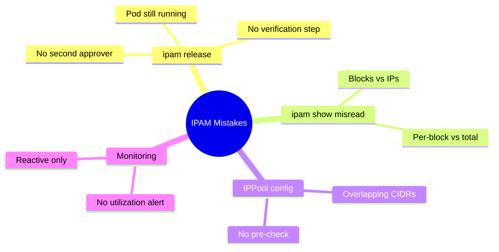

# Common Mistakes to Avoid with Calico IPAM Checks

Author: [nawazdhandala](https://github.com/nawazdhandala)

Tags: Calico, Kubernetes, Networking, IPAM

Description: Avoid common Calico IPAM mistakes including releasing IPs for running pods, misinterpreting ipam show output, adding overlapping IPPools, and ignoring IPAM utilization until exhaustion.

---

## Introduction

Calico IPAM mistakes can cause immediate outages (duplicate IP assignment from premature ipam release), future scheduling failures (exhausted pools from ignoring utilization), or silent routing failures (overlapping IPPools). Understanding these failure modes and the specific commands that trigger them prevents the most costly IPAM errors.

## Mistake 1: Running ipam release Without Verifying the Pod is Gone

```bash
# WRONG: Releasing an IP without verifying no pod uses it
calicoctl ipam release --ip=192.168.1.42
# If a running pod has this IP, the IPAM database now has
# a "free" IP that a running pod is using → duplicate assignment on next allocation

# CORRECT: Always verify first
kubectl get pod --all-namespaces -o wide | grep "192.168.1.42"
# Output must be empty before running ipam release
# If a pod shows up: investigate why IPAM thinks it's leaked - don't release
```

## Mistake 2: Misreading ipam show Output (Blocks vs IPs)

```bash
# ipam show reports BLOCK allocation, not individual IPs
calicoctl ipam show --show-blocks
# Output: "10% used" on a block might mean:
# Block has 256 IPs, 25 are allocated
# But 200 IPs are "reserved" for the node and won't be used by pods from other nodes

# CORRECT interpretation:
calicoctl ipam show  # Total pool utilization
# Use this for capacity planning, not per-block percentages
```

## Mistake 3: Adding Overlapping IPPools

```bash
# WRONG: Adding a new IPPool that overlaps with an existing network
calicoctl apply -f - << YAML
apiVersion: projectcalico.org/v3
kind: IPPool
metadata:
  name: new-pool
spec:
  cidr: 10.0.0.0/8  # This might overlap with node CIDRs or service CIDRs
YAML

# CORRECT: Check existing CIDRs before adding
kubectl get nodes -o jsonpath='{.items[*].spec.podCIDR}'
kubectl get svc -n kube-system kubernetes -o jsonpath='{.spec.clusterIP}'
calicoctl get ippool -o yaml | grep cidr:
# Ensure no overlap with any of these
```

## Mistake 4: Not Monitoring IPAM Utilization Until Exhaustion

```bash
# WRONG: No IPAM monitoring, discover exhaustion when pods fail
kubectl describe pod <new-pod> | grep Events
# "Failed to allocate IP: no more free CIDR blocks available"
# At this point: cluster at 100%, pods are failing NOW

# CORRECT: Monitor and alert at 85%
# Add PrometheusRule with CalicoIPAMUtilizationHigh alert at 85%
# This gives 2-4 weeks warning in most clusters
```

## Common IPAM Mistakes Summary



## Mistake 5: Deleting an Active IPPool

```bash
# WRONG: Deleting a pool that pods are actively using
calicoctl delete ippool my-pool
# Pods using IPs from this pool lose their networking
# New pods can't get IPs from this range

# CORRECT: Disable the pool first, migrate pods, then delete
calicoctl patch ippool my-pool \
  -p '{"spec":{"disabled":true}}'
# Wait for all pods to be rescheduled onto other pools
# Verify pool has 0 IPs in use
calicoctl ipam show | grep my-pool
# Only then: calicoctl delete ippool my-pool
```

## Conclusion

The two most dangerous IPAM mistakes are `calicoctl ipam release` on an IP still in use (causes duplicate assignment and immediate networking corruption) and deleting an active IPPool (immediately breaks pods using those IPs). Both require verification steps before execution. The most operationally damaging passive mistake is failing to monitor IPAM utilization until pods start failing to schedule. Build the 85% alert from day one and treat it as a pre-emptive capacity signal rather than an emergency.
