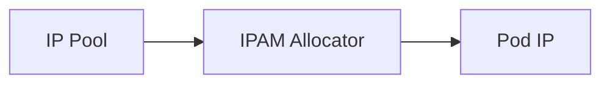

# How to Avoid Common Mistakes with Calico IPPool Design

Author: [nawazdhandala](https://github.com/nawazdhandala)

Tags: Calico, Kubernetes, IPAM, IPPool, Networking

Description: Avoid common Calico IPPool design mistakes like undersized pools, overlapping ranges, and missing node selectors.

---

## Introduction

Calico IPPool Design is a key part of Calico's IP address management capabilities. Understanding and properly configuring this feature ensures reliable, scalable pod networking in your Kubernetes cluster.

## Prerequisites

- Calico v3.20+ installed
- kubectl and calicoctl configured
- Cluster-admin access

## Configuration

```bash
calicoctl get ippools -o yaml
calicoctl ipam show --show-blocks
```

## Example

```yaml
apiVersion: projectcalico.org/v3
kind: IPPool
metadata:
  name: example-pool
spec:
  cidr: 10.48.0.0/16
  blockSize: 26
  natOutgoing: true
```

## Verification

```bash
calicoctl ipam check --output=report
kubectl get pods -A -o wide
```

## Architecture



## Conclusion

How to Avoid Common Mistakes with Calico IPPool Design in Calico provides important IP address management capabilities. Use the configuration and verification steps above to ensure correct behavior in your environment.
