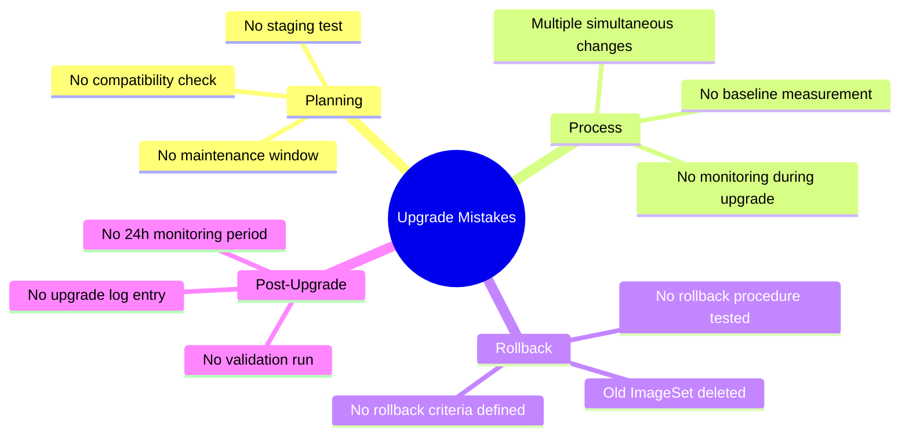

# How to Avoid Common Mistakes with Calico on Kubernetes Upgrades

Author: [nawazdhandala](https://github.com/nawazdhandala)

Tags: Calico, Kubernetes, Networking, Upgrades, Best Practices

Description: Avoid the most common Calico upgrade mistakes including skipping version compatibility checks, upgrading without staging validation, and not having rollback plans ready.

---

## Introduction

Calico upgrade mistakes range from minor (causing longer-than-expected maintenance windows) to critical (network outages affecting the entire cluster). Understanding these failure patterns helps you build an upgrade process that avoids them systematically.

## Mistake 1: Skipping the Compatibility Matrix

```bash
# WRONG - assuming any Calico version works with any Kubernetes version
kubectl patch installation default --type=merge \
  -p '{"spec":{"version":"v3.28.0"}}'
# v3.28.0 may require Kubernetes >= 1.27
# If your cluster is on 1.26, calico-node may fail to start!

# CORRECT - always check compatibility first
# https://docs.tigera.io/calico/latest/getting-started/kubernetes/requirements
# Verify before every upgrade:
K8S_MINOR=$(kubectl version -o json | jq -r '.serverVersion.minor' | tr -d '+')
echo "Kubernetes minor version: ${K8S_MINOR}"
echo "Check if Calico v3.28 supports k8s 1.${K8S_MINOR}"
```

## Mistake 2: Upgrading Multiple Kubernetes Versions Simultaneously

```bash
# WRONG - upgrading Kubernetes and Calico at the same time
# Double change = double failure modes = hard to diagnose

# CORRECT - upgrade one thing at a time
# Step 1: Upgrade Kubernetes first
# Step 2: Validate Kubernetes is healthy
# Step 3: Upgrade Calico
# Step 4: Validate everything

echo "Never change two major components simultaneously"
```

## Mistake 3: Not Keeping Previous ImageSet

```bash
# WRONG - deleting old ImageSet before upgrade is validated
kubectl delete imageset calico-v3.27.0  # Gone! Now rollback requires re-mirroring images

# CORRECT - keep at least one previous ImageSet
# Delete old ImageSets only after the new version has been running for 2+ weeks
kubectl get imageset  # Keep at least 2 versions

# Safe cleanup (only after 2+ weeks of stable new version)
KEEP_VERSIONS=2
kubectl get imageset -o jsonpath='{.items[*].metadata.name}' | \
  tr ' ' '\n' | sort -V | head -n -${KEEP_VERSIONS} | \
  xargs -r kubectl delete imageset
```

## Mistake 4: Upgrading Without Staging Test

```bash
# WRONG - deploying directly to production
git commit -m "Upgrade Calico to v3.28.0"
git push origin main
# Flux deploys to production immediately!

# CORRECT - use GitOps branch strategy
# Feature branch → staging cluster (auto-deploy)
# Staging validates for 24h → promote to main → production

# Branch strategy:
# main → production
# staging → staging cluster
# feature/* → dev

# Upgrade flow:
git checkout -b upgrade/calico-v3.28.0
# Make changes to ImageSet
git push origin upgrade/calico-v3.28.0
# Flux deploys to dev cluster
# After validation, PR to staging branch
# After 24h staging validation, PR to main
```

## Mistake 5: No Network Connectivity Baseline

```bash
# WRONG - just watching pod states during upgrade
# You might miss network performance degradation

# CORRECT - run connectivity test throughout upgrade
# Start BEFORE upgrade begins
kubectl run baseline-test --image=alpine --restart=Never -- \
  sh -c 'while true; do
    START=$(date +%s%N)
    wget -qO/dev/null http://kubernetes.default.svc --timeout=1
    END=$(date +%s%N)
    echo "$(date): $((($END-$START)/1000000))ms"
    sleep 5
  done'

# Monitor during upgrade - spikes during node updates are normal
# Latency should return to baseline within 60s of each node updating
kubectl logs -f baseline-test
```

## Quick Upgrade Mistakes Checklist



## Conclusion

The most impactful Calico upgrade mistakes are preparatory failures: not checking the compatibility matrix, not testing in staging, and not keeping the previous ImageSet for rollback. These are easy to avoid with a checklist and slightly more planning time before each upgrade. Build a pre-upgrade checklist into your change management template so these checks happen automatically before every upgrade is approved.
