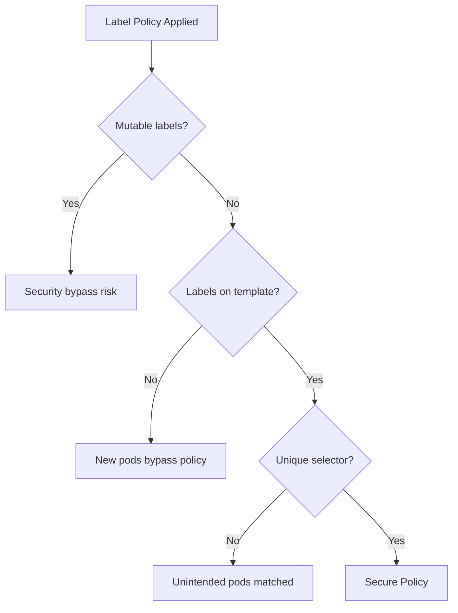

# Common Mistakes to Avoid with Calico Label-Based Network Policies

Author: [nawazdhandala](https://github.com/nawazdhandala)

Tags: Calico, Kubernetes, Network Policy, Labels, Best Practices

Description: Avoid the most common mistakes when using Calico labels for network policy selectors that lead to security gaps or unexpected traffic blocks.

---

## Introduction

Label-based Calico network policies look simple on the surface but hide a number of subtle failure modes. The most dangerous mistakes are those that create a false sense of security: you think your policy is enforcing access control, but unlabeled pods are quietly bypassing it. Other mistakes cause outages: a label typo means a pod is denied traffic it needs to function.

Learning from common mistakes is faster than discovering them in production. This guide covers the mistakes that appear most frequently in Calico label policy implementations and gives you concrete techniques to avoid each one.

## Prerequisites

- Kubernetes cluster with Calico v3.26+
- `calicoctl` and `kubectl` installed
- Established label taxonomy

## Mistake 1: Using Mutable Labels as Security Boundaries

Labels can be changed by anyone with `kubectl patch` access. If your zero trust policy relies on `role=admin` to grant elevated access, a user who can patch pods can bypass it.

```bash
# Dangerous - easily manipulated
selector: role == 'admin'

# Safer - use immutable metadata like service accounts
# (covered in Service Account Policies section)
```

## Mistake 2: Forgetting That Selectors Are Case-Sensitive

```yaml
# These are DIFFERENT selectors:
selector: tier == 'Web'   # Will match pods with tier=Web
selector: tier == 'web'   # Will match pods with tier=web
```

```bash
# Audit all tier label values to find inconsistencies
kubectl get pods --all-namespaces -o jsonpath='{range .items[*]}{.metadata.labels.tier}{"\n"}{end}' | sort | uniq -c
```

## Mistake 3: Applying Policy But Not Labels to New Deployments

A common pattern: you label existing pods correctly, write a policy, it works. Then a new deployment is created without the required labels and silently bypasses your policy.

```yaml
# Always add labels to the Deployment TEMPLATE spec, not just metadata
apiVersion: apps/v1
kind: Deployment
spec:
  template:
    metadata:
      labels:
        tier: web      # This is what matters for new pods
        app: frontend
```

## Mistake 4: Using app Label Alone as Identity

The `app` label is commonly set to the same value for multiple unrelated deployments. Use compound selectors:

```yaml
# Weak - app label may not be unique
selector: app == 'backend'

# Stronger - require multiple labels
selector: app == 'backend' && tier == 'api' && environment == 'production'
```

## Mistake 5: Not Testing After Rolling Update

Labels on pod templates apply to new pods created by the rolling update. Old pods keep their previous labels. During a rolling update, you briefly have a mixed label state.

```bash
# During rolling update, check both old and new pods
kubectl get pods -n production --show-labels | grep -E "backend|api"
```

## Mistake 6: Over-Broad Selectors That Match Unintended Pods

```yaml
# Too broad - matches any pod in any namespace with app label
selector: has(app)

# More precise
selector: app == 'payment-service' && environment == 'production'
```

## Common Mistakes Summary



## Conclusion

Label-based Calico policies fail most often due to inconsistent label application, mutable label security assumptions, case sensitivity errors, and selectors that are either too broad or too narrow. Build label consistency into your Helm charts and deployment templates, use compound selectors for precision, and regularly audit label coverage to ensure no workloads are missing the labels your policies depend on.
