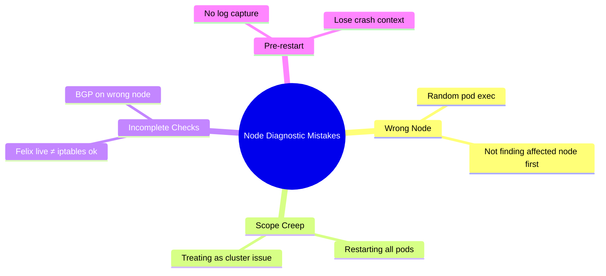

# Common Mistakes to Avoid with Calico Node Diagnostics

Author: [nawazdhandala](https://github.com/nawazdhandala)

Tags: Calico, Kubernetes, Networking, Diagnostics

Description: Avoid common mistakes in Calico node diagnostics including diagnosing from the wrong node, restarting all calico-node pods instead of the affected one, and missing iptables programming failures.

---

## Introduction

Calico node diagnostic mistakes most often come from scope confusion: running diagnostics on the wrong node, treating a single-node issue as a cluster problem, or restarting all calico-node pods when only one is affected. Understanding the scope of each diagnostic tool prevents these errors.

## Mistake 1: Diagnosing from the Wrong Node

```bash
# WRONG: Running BGP diagnostics on a random node
RANDOM_POD=$(kubectl get pods -n calico-system -l k8s-app=calico-node \
  -o jsonpath='{.items[0].metadata.name}')
kubectl exec -n calico-system "${RANDOM_POD}" -c calico-node -- \
  calicoctl node status
# This shows BGP state from node-0, but the problem is on node-5

# CORRECT: Always run diagnostics on the node where the problem occurs
PROBLEM_POD_NODE=$(kubectl get pod <failing-pod> -n <ns> \
  -o jsonpath='{.spec.nodeName}')
AFFECTED_CALICO_POD=$(kubectl get pods -n calico-system \
  -l k8s-app=calico-node \
  --field-selector="spec.nodeName=${PROBLEM_POD_NODE}" \
  -o jsonpath='{.items[0].metadata.name}')
kubectl exec -n calico-system "${AFFECTED_CALICO_POD}" -c calico-node -- \
  calicoctl node status
```

## Mistake 2: Restarting All calico-node Pods

```bash
# WRONG: Restarting all calico-node pods when only one is broken
kubectl rollout restart daemonset/calico-node -n calico-system
# This disrupts networking on ALL nodes during the rollout

# CORRECT: Restart only the affected node's pod
kubectl delete pod -n calico-system "${AFFECTED_CALICO_POD}"
# DaemonSet will recreate only that pod
```

## Mistake 3: Missing iptables as a Failure Signal

```bash
# WRONG: Assuming Felix liveness means iptables rules are correct
kubectl exec -n calico-system "${CALICO_POD}" -c calico-node -- \
  calico-node -felix-live  # Returns "Calico is live"
# But iptables rules may still be incomplete

# CORRECT: Verify iptables rules directly
kubectl debug node/"${NODE}" --image=alpine -it -- \
  nsenter -t 1 -n -- iptables-save | grep -c "^-A cali-"
# Should have hundreds of cali- rules on a healthy node
# Zero rules = Felix live but not programming dataplane
```

## Mistake 4: Not Collecting Diagnostics Before Restart

```bash
# WRONG: Restarting immediately without capturing state
kubectl delete pod -n calico-system "${AFFECTED_CALICO_POD}"
# Loses crash logs, iptables state at time of failure

# CORRECT: Collect diagnostics first
kubectl logs -n calico-system "${AFFECTED_CALICO_POD}" \
  -c calico-node > pre-restart-logs.txt
kubectl exec -n calico-system "${AFFECTED_CALICO_POD}" -c calico-node -- \
  calicoctl node status > pre-restart-bgp.txt 2>/dev/null || true
# Then restart
kubectl delete pod -n calico-system "${AFFECTED_CALICO_POD}"
```

## Common Mistakes Summary



## Conclusion

The most damaging node diagnostic mistake is restarting the entire calico-node DaemonSet when only one pod is affected — this causes a rolling network disruption across all nodes. Always scope the restart to the single affected pod. The most common diagnostic mistake is running `calicoctl node status` from the wrong node and concluding BGP is healthy when the affected node's BGP peers are actually down. Always start by finding the correct node, then running all diagnostics from that node's calico-node pod.
