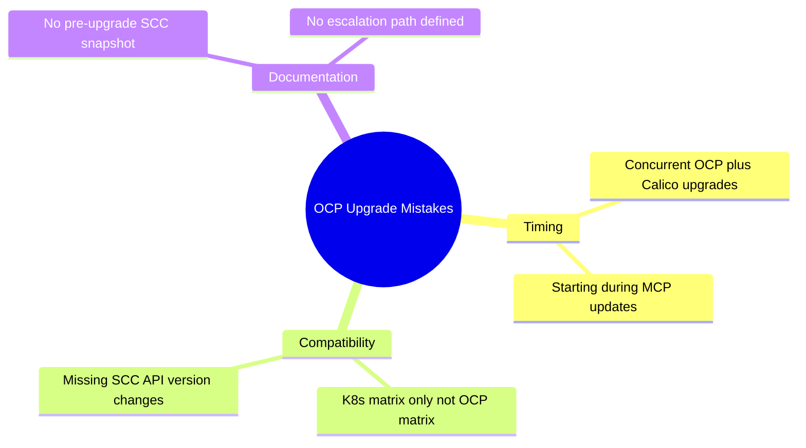

# How to Avoid Common Mistakes with Calico on OpenShift Upgrades

Author: [nawazdhandala](https://github.com/nawazdhandala)

Tags: Calico, OpenShift, Kubernetes, Networking, Upgrade, Best Practices

Description: Avoid OpenShift-specific Calico upgrade mistakes including SCC breakage, concurrent MCP/Calico upgrades, and missing OCP compatibility requirements.

---

## Introduction

OpenShift-specific Calico upgrade mistakes often stem from treating OCP like vanilla Kubernetes and skipping the OCP-specific checks. The most impactful mistakes are: concurrent Calico and OCP infrastructure upgrades, SCC permission changes that block calico-node, and missing the OCP-Calico compatibility matrix check.

## Mistake 1: Concurrent OCP and Calico Upgrades

```bash
# WRONG - initiating Calico upgrade while OCP is also updating
# Check if OCP is currently upgrading before starting Calico upgrade
oc get clusterversion -o jsonpath='{.items[0].status.conditions[?(@.type=="Progressing")].status}'
# If "True" - OCP upgrade in progress. STOP - do not start Calico upgrade.

# CORRECT - verify OCP is completely stable first
# All of these should be clean before starting Calico upgrade:
oc get clusterversion
# Progressing=False, Available=True

oc get mcp
# UPDATED=True, UPDATING=False on ALL MCPs
```

## Mistake 2: Not Checking OCP-Specific Compatibility

```bash
# WRONG - only checking generic Calico-Kubernetes compatibility matrix
# Calico Enterprise has OCP-specific requirements beyond K8s support

# CORRECT - always check:
# https://docs.tigera.io/calico-enterprise/latest/getting-started/openshift/requirements

# Also verify your SCC API versions haven't changed
oc get scc --show-api-group
```

## Mistake 3: Not Capturing Pre-Upgrade SCC State

```bash
# WRONG - no baseline of current SCC state
# CORRECT - capture before every upgrade
oc get scc -o yaml > "pre-upgrade-sccs-$(date +%Y%m%d).yaml"

# After upgrade, compare to detect any privilege changes
diff <(oc get scc calico-node -o yaml) \
     <(grep -A100 "name: calico-node" pre-upgrade-sccs-$(date +%Y%m%d).yaml)
```

## Common Mistakes Summary



## Conclusion

OpenShift-specific Calico upgrade mistakes are primarily timing and compatibility issues. Always wait for OCP upgrades and MCP updates to fully complete before starting Calico upgrades. Use the OCP-specific compatibility documentation, not just the generic Kubernetes matrix. Capture SCC state before each upgrade and compare afterward to detect unexpected privilege changes.
