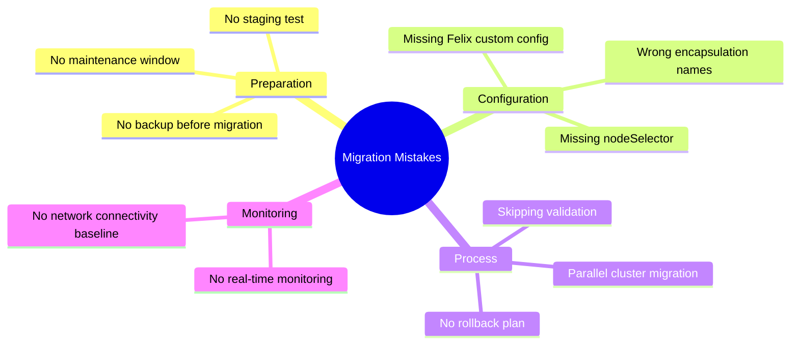

# How to Avoid Common Mistakes with Calico Operator Migration

Author: [nawazdhandala](https://github.com/nawazdhandala)

Tags: Calico, Kubernetes, Networking, Operator, Migration, Best Practices

Description: Avoid the most common pitfalls when migrating Calico from manifest to operator installation, including configuration mismatches, skipped backups, and network disruption traps.

---

## Introduction

The Calico operator migration has several well-known failure patterns that operators encounter repeatedly. Most of these mistakes are avoidable with proper preparation and understanding of how the Tigera Operator's migration logic works. The most dangerous mistake is assuming that because the migration completed without errors, the configuration was preserved correctly - without validation, subtle mismatches can go unnoticed until they cause a production incident.

This guide catalogs the most common mistakes with concrete examples of what goes wrong and how to avoid each pitfall.

## Prerequisites

- Calico migration being planned or in progress
- Understanding of basic Calico concepts (IP pools, network policies)

## Mistake 1: Skipping the Pre-Migration Backup

The most critical mistake is starting the migration without capturing the current state:

```bash
# WRONG - starting migration immediately
kubectl create -f tigera-operator.yaml
kubectl apply -f installation.yaml
# If something goes wrong, you have no reference for what the config was

# CORRECT - always backup first
calicoctl get ippools -o yaml > ippools-backup.yaml
calicoctl get felixconfiguration -o yaml > felixconfig-backup.yaml
calicoctl get globalnetworkpolicies -o yaml > gnps-backup.yaml
kubectl get ds calico-node -n kube-system -o yaml > calico-node-ds-backup.yaml
echo "Backup complete - now safe to proceed"
```

## Mistake 2: Wrong Encapsulation Mode in Installation CR

The Installation CR encapsulation names differ from the calicoctl/manifest names:

```yaml
# WRONG - using manifest-style IPIP mode names
spec:
  calicoNetwork:
    ipPools:
      - cidr: 192.168.0.0/16
        encapsulation: IPIP   # Actually correct
        ipipMode: CrossSubnet  # WRONG - this is not an Installation field

# CORRECT - use operator encapsulation values
spec:
  calicoNetwork:
    ipPools:
      - cidr: 192.168.0.0/16
        encapsulation: IPIPCrossSubnet   # For cross-subnet IPIP
        # OR: encapsulation: VXLAN
        # OR: encapsulation: VXLANCrossSubnet
        # OR: encapsulation: None
        natOutgoing: Enabled
```

## Mistake 3: Migrating Without Maintenance Window

The migration restarts calico-node on each node, causing a brief network interruption per node. Some operators attempt this during business hours without a maintenance window:

```bash
# WRONG - migration during peak traffic
# Each node will have ~10-30 seconds of network interruption as
# calico-node restarts. With 20 nodes this means 200-600 seconds
# of rolling interruptions.

# CORRECT - schedule a maintenance window
# Calculate estimated duration: <node_count> * 30 seconds + 10 minutes buffer
# Example: 20 nodes * 30s = 10 minutes + 10 buffer = 20 minute window minimum
echo "Estimated migration time: $(( $(kubectl get nodes --no-headers | wc -l) * 30 / 60 )) minutes"
```

## Mistake 4: Not Specifying nodeSelector in IP Pool

```yaml
# WRONG - missing nodeSelector causes operator to create new default pools
spec:
  calicoNetwork:
    ipPools:
      - cidr: 192.168.0.0/16
        encapsulation: VXLAN
        # Missing: nodeSelector

# CORRECT - include nodeSelector to match all nodes
spec:
  calicoNetwork:
    ipPools:
      - cidr: 192.168.0.0/16
        encapsulation: VXLAN
        natOutgoing: Enabled
        nodeSelector: "all()"  # Required!
```

## Mistake 5: Migrating Multiple Clusters Simultaneously

```bash
# WRONG - migrating all clusters in parallel
for cluster in cluster1 cluster2 cluster3; do
  kubectl config use-context "${cluster}"
  ./migrate-calico-to-operator.sh &  # Running in parallel is dangerous!
done
wait

# CORRECT - migrate one cluster at a time, validate before proceeding
for cluster in cluster1 cluster2 cluster3; do
  echo "Migrating ${cluster}..."
  kubectl config use-context "${cluster}"
  ./migrate-calico-to-operator.sh

  echo "Validating ${cluster}..."
  ./validate-migration.sh || {
    echo "Validation failed for ${cluster}. Stopping migration wave."
    exit 1
  }
  echo "${cluster} migration complete. Waiting 30 minutes before next cluster..."
  sleep 1800
done
```

## Mistake 6: Ignoring Felix Configuration Custom Settings

```bash
# Check if you have non-default Felix configuration
calicoctl get felixconfiguration default -o yaml | \
  grep -v "creationTimestamp\|uid\|resourceVersion\|generation"

# Common non-default settings that MUST be migrated:
# - routeRefreshInterval
# - iptablesMarkMask
# - logSeverityScreen
# - prometheusMetricsEnabled
# - chainInsertMode

# These are NOT automatically migrated by the operator
# You must apply them via FelixConfiguration after migration
```

## Common Mistakes Summary



## Conclusion

The most impactful mistakes in Calico operator migration are the preparatory ones: skipping backups, not testing in staging, and not scheduling a maintenance window. Configuration mistakes like wrong encapsulation names and missing `nodeSelector` cause the operator to behave unexpectedly but are easy to avoid with the correct Installation CR format. Always use a wave-based migration approach, validate each cluster before proceeding to the next, and keep your backup files until you have high confidence in the migrated state.
