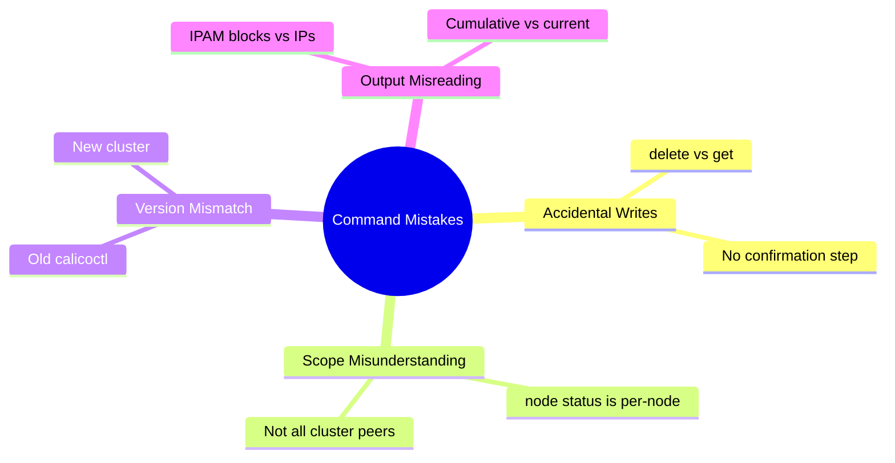

# Common Mistakes to Avoid with Calico Troubleshooting Commands

Author: [nawazdhandala](https://github.com/nawazdhandala)

Tags: Calico, Kubernetes, Networking, Troubleshooting

Description: Avoid common mistakes when using Calico troubleshooting commands including running write commands accidentally, misreading calicoctl node status output, and using outdated calicoctl versions...

---

## Introduction

Calico troubleshooting commands have subtle failure modes that lead engineers to wrong conclusions or accidentally modify cluster state. The most dangerous mistakes involve running write commands (calicoctl delete, ipam release) when read commands were intended, or misinterpreting `calicoctl node status` output as showing all cluster nodes when it only shows the local node's peers.

## Mistake 1: Running calicoctl delete Instead of calicoctl get

```bash
# WRONG: Accidentally deleting instead of reading
calicoctl delete bgppeer my-peer   # DESTRUCTIVE - removes BGP peer

# CORRECT: Read first, then decide
calicoctl get bgppeer my-peer -o yaml  # Read the resource
# Only delete after reviewing and confirming intent

# Best practice: alias for safer operations
alias calicoctl-safe='calicoctl get'
# Use calicoctl-safe for diagnostics, unaliased calicoctl for writes
```

## Mistake 2: Misreading calicoctl node status Scope

```bash
# WRONG INTERPRETATION:
# "calicoctl node status shows all BGP peers in the cluster"
# ACTUAL: It only shows peers from the calico-node pod you exec into

# If you exec into node-A's pod:
kubectl exec -n calico-system calico-node-abc -c calico-node -- calicoctl node status
# Result: shows BGP peers seen FROM node-A only

# CORRECT approach: run on multiple nodes
for pod in $(kubectl get pods -n calico-system -l k8s-app=calico-node \
  -o jsonpath='{.items[*].metadata.name}'); do
  echo "=== ${pod} ==="
  kubectl exec -n calico-system "${pod}" -c calico-node -- calicoctl node status
done
```

## Mistake 3: Using Mismatched calicoctl Version

```bash
# WRONG: Using calicoctl v3.25 against a Calico v3.27 cluster
calicoctl version
# Client Version: v3.25.0
# Cluster Calico Version: v3.27.0
# This can cause parsing errors or missing fields

# CORRECT: Always match versions
CLUSTER_VERSION=$(kubectl get pods -n calico-system \
  -l k8s-app=calico-node \
  -o jsonpath='{.items[0].spec.containers[0].image}' | cut -d: -f2)
echo "Cluster version: ${CLUSTER_VERSION}"
# Download matching calicoctl
```

## Mistake 4: Reading ipam show Without Understanding Blocks

```bash
# ipam show output shows BLOCK allocations, not individual IPs
calicoctl ipam show --show-blocks

# A block can be allocated to a node but have no IPs in use
# This is NORMAL - blocks are pre-allocated to nodes
# Only worry when block count is very high relative to pods

# CORRECT: Use ipam check to detect actual inconsistencies
calicoctl ipam check  # Shows actual leaks and inconsistencies
```

## Common Mistakes Summary



## Conclusion

The highest-risk mistake is running `calicoctl delete` or `calicoctl ipam release` when a read command was intended - these are irreversible without a backup. Always default to `calicoctl get` for diagnostics, and require a second person to approve any write operation during an incident. The second most impactful mistake is treating `calicoctl node status` as cluster-wide when it only reflects one node's perspective. Run it on multiple nodes before concluding that BGP is globally healthy.
