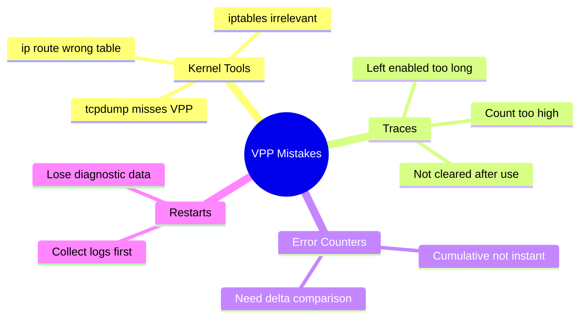

# Common Mistakes to Avoid When Troubleshooting Calico VPP

Author: [nawazdhandala](https://github.com/nawazdhandala)

Tags: Calico, VPP, Kubernetes, Networking, Troubleshooting

Description: Avoid the most common mistakes when troubleshooting Calico VPP, including using Linux kernel tools that don't see VPP traffic, misinterpreting error counters, and leaving packet traces enabled in...

---

## Introduction

Calico VPP troubleshooting has unique failure modes that don't exist in standard Calico deployments. The most costly mistakes come from applying standard Linux networking diagnostic approaches to a user-space networking stack that bypasses the kernel entirely. Understanding what not to do is as important as knowing the correct VPP-native tools.

## Mistake 1: Using Kernel Tools That Miss VPP Traffic

```bash
# WRONG: tcpdump on a host interface will NOT see VPP-encapsulated traffic
tcpdump -i eth0 -n host <pod-ip>  # Misses all VPP-forwarded packets

# WRONG: iptables rules don't apply to VPP traffic
iptables -L FORWARD -n  # Not relevant for VPP-mode Calico

# WRONG: 'ip route' shows kernel routes, not VPP FIB
ip route show  # Does not show VPP routing table

# CORRECT: Use VPP-native tools
kubectl exec -n calico-vpp-dataplane "${VPP_POD}" -c vpp -- \
  vppctl show ip fib
```

## Mistake 2: Leaving Packet Traces Enabled in Production

```bash
# WRONG: Enabling traces and forgetting to disable them
kubectl exec -n calico-vpp-dataplane "${VPP_POD}" -c vpp -- \
  vppctl trace add virtio-input 1000  # Captures 1000 packets and impacts performance

# CORRECT: Set a low capture count and clear after diagnosis
kubectl exec -n calico-vpp-dataplane "${VPP_POD}" -c vpp -- \
  vppctl trace add virtio-input 50  # Low count

# Always clear traces when done
kubectl exec -n calico-vpp-dataplane "${VPP_POD}" -c vpp -- \
  vppctl clear trace
```

## Mistake 3: Misreading Error Counter Scope

```bash
# Error counters are CUMULATIVE since VPP started
# A counter of 5000 doesn't mean there's an active problem

# CORRECT: Compare counters over time to detect active drops
kubectl exec -n calico-vpp-dataplane "${VPP_POD}" -c vpp -- \
  vppctl show error | grep -v " 0 " > /tmp/errors-before.txt
sleep 30
kubectl exec -n calico-vpp-dataplane "${VPP_POD}" -c vpp -- \
  vppctl show error | grep -v " 0 " > /tmp/errors-after.txt
# If the same counters grew, there's an active problem
diff /tmp/errors-before.txt /tmp/errors-after.txt
```

## Mistake 4: Restarting VPP Without Collecting Diagnostics

```bash
# WRONG: Immediately deleting the VPP pod destroys diagnostic data
kubectl delete pod -n calico-vpp-dataplane "${VPP_POD}"  # Loses logs and state

# CORRECT: Collect diagnostics first
kubectl logs -n calico-vpp-dataplane "${VPP_POD}" -c vpp > vpp-logs.txt
kubectl exec -n calico-vpp-dataplane "${VPP_POD}" -c vpp -- \
  vppctl show error > vpp-errors.txt
# Then restart if needed
```

## Common Mistakes Summary



## Conclusion

The single most common Calico VPP troubleshooting mistake is reaching for familiar Linux kernel tools - tcpdump, iptables, ip route - that simply do not see VPP-forwarded traffic. Build the habit of always starting with `vppctl show interface` and `vppctl show error` before any other diagnostic. Avoid leaving packet traces running in production, always compare error counters over time rather than reading them in isolation, and collect VPP logs before restarting pods.
