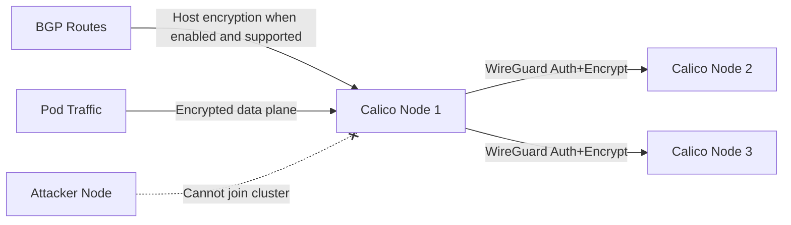

# Common Mistakes to Avoid with Crypto Authentication for Calico Node Traffic

Author: [nawazdhandala](https://github.com/nawazdhandala)

Tags: Calico, Kubernetes, Network Policy, Encryption, WireGuard, Node Security

Description: Avoid Mistakes WireGuard-based crypto authentication for Calico node traffic to secure inter-node communication.

---

## Introduction

Crypto authentication for Calico node traffic uses WireGuard to authenticate and encrypt communication between Calico nodes. This protects inter-node pod traffic from interception and spoofing, even on untrusted networks. Host-network traffic, such as BGP, requires Calico's host-to-host WireGuard encryption support and is not enabled by `wireguardEnabled` alone.

Calico's `projectcalico.org/v3` FelixConfiguration resource controls WireGuard settings, enabling you to turn on node-level pod traffic encryption with a single configuration change. Node-to-node authentication ensures that only legitimate Calico nodes can forward encrypted pod traffic.

This guide covers avoid mistakes crypto authentication for Calico node traffic, including data plane encryption and the separate host-network setting needed for supported control plane traffic.

## Prerequisites

- Kubernetes cluster with Calico v3.26+
- Linux kernel 5.6+ or WireGuard installed on all nodes participating in encryption
- `calicoctl` and `kubectl` installed

## Enable Crypto Authentication

```yaml
apiVersion: projectcalico.org/v3
kind: FelixConfiguration
metadata:
  name: default
spec:
  wireguardEnabled: true
  wireguardMTU: 1440
  wireguardListeningPort: 51820
  # Enable only on supported deployments when host-network traffic also needs encryption.
  # wireguardHostEncryptionEnabled: true
```

```bash
# Apply configuration

calicoctl apply -f wireguard-config.yaml

# Verify on each node
calicoctl get node <NODE-NAME> -o yaml
```

## Verify Node Authentication

```bash
# Check WireGuard peers (all encrypted Calico peers should be listed)
kubectl exec -n kube-system <calico-node-pod> -- wg show

# Verify peer connections
kubectl exec -n kube-system <calico-node-pod> -- wg show wireguard.cali peers

# Check that traffic between nodes is encrypted
kubectl debug node/node1 -it --image=nicolaka/netshoot -- tcpdump -i eth0 -n udp port 51820 -c 10
```

## Architecture



## Conclusion

Crypto authentication for Calico node traffic provides mutual authentication and encryption for inter-node pod traffic. Enable WireGuard in FelixConfiguration to protect the data plane (pod traffic) from interception and injection, and enable host-to-host WireGuard encryption only on supported deployments when host-network control plane traffic such as BGP also needs encryption. Monitor WireGuard peer connections and transfer statistics to ensure encryption is active across all nodes and detect any nodes that have lost their crypto authentication.
