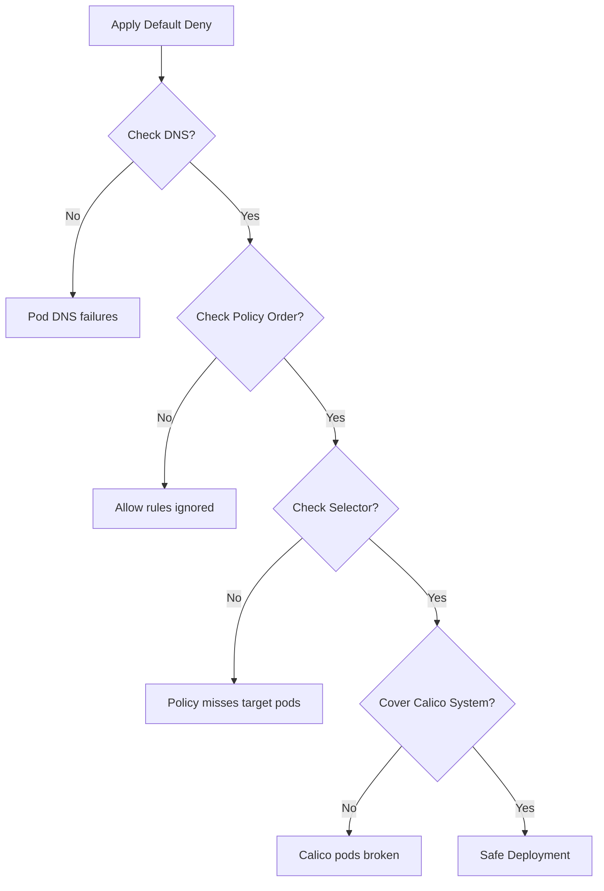

# Common Mistakes to Avoid with Calico Default Deny Policies

Author: [nawazdhandala](https://github.com/nawazdhandala)

Tags: Calico, Kubernetes, Network Policy, Security, Best Practices

Description: Avoid the most common pitfalls when implementing Calico default deny network policies that can cause outages or security gaps.

---

## Introduction

Default deny policies are powerful but unforgiving. A single misconfiguration can bring down an entire application tier or, worse, leave a security gap you thought was closed. The most dangerous mistakes are the ones that look correct on paper but fail silently in production.

Having seen many Calico policy implementations, certain mistakes appear repeatedly: forgetting DNS egress, miscounting policy order, applying selectors that match too broadly or too narrowly, and neglecting host endpoint traffic. Each of these can cause hard-to-diagnose failures or unexpected security exposures.

This guide catalogs the most common mistakes engineers make when implementing Calico default deny policies and shows you exactly how to avoid them.

## Prerequisites

- Kubernetes cluster with Calico v3.26+
- `calicoctl` and `kubectl` installed
- Basic understanding of Calico policy semantics

## Mistake 1: Forgetting DNS Egress

The most common outage after applying default deny: pods cannot resolve hostnames.

**Wrong approach** — applying deny without DNS allow:
```yaml
apiVersion: projectcalico.org/v3
kind: GlobalNetworkPolicy
metadata:
  name: default-deny-all
spec:
  order: 1000
  selector: all()
  types:
    - Ingress
    - Egress
  # Missing DNS allow!
```

**Correct approach** — always pair with DNS egress:
```yaml
apiVersion: projectcalico.org/v3
kind: GlobalNetworkPolicy
metadata:
  name: allow-dns
spec:
  order: 100
  selector: all()
  egress:
    - action: Allow
      protocol: UDP
      destination:
        ports: [53]
    - action: Allow
      protocol: TCP
      destination:
        ports: [53]
  types:
    - Egress
```

## Mistake 2: Wrong Policy Order

Calico evaluates policies in ascending order (lower number = higher priority). A deny policy with order 100 will block traffic that an allow policy with order 200 tries to permit.

```bash
# Verify order before applying
calicoctl get globalnetworkpolicies -o wide | sort -k3 -n
```

## Mistake 3: Selector Typos That Miss All Pods

```yaml
# Wrong - matches nothing if pods don't have this exact label
selector: app == 'fronted'  # Typo: 'fronted' vs 'frontend'

# Verify your selector matches
calicoctl get workloadendpoints -l app=frontend
```

## Mistake 4: Not Covering Both Ingress AND Egress

A policy that only specifies `Ingress` in `types` does not apply any egress rules — not even implicit deny:

```yaml
spec:
  types:
    - Ingress
    - Egress  # Must list BOTH to control both directions
```

## Mistake 5: Forgetting Calico System Pods

Your default deny policy will also apply to Calico's own pods if `selector: all()` is used without exception:

```yaml
apiVersion: projectcalico.org/v3
kind: GlobalNetworkPolicy
metadata:
  name: allow-calico-system
spec:
  order: 1
  namespaceSelector: kubernetes.io/metadata.name == 'calico-system'
  ingress:
    - action: Allow
  egress:
    - action: Allow
  types:
    - Ingress
    - Egress
```

## Mistake 6: Applying Deny Before Allow Rules Are Ready

Always apply allow rules first, then the deny policy:

```bash
# 1. Apply all allow rules
calicoctl apply -f allow-rules/

# 2. Only then apply the deny policy
calicoctl apply -f default-deny.yaml
```

## Common Mistakes Summary



## Conclusion

Calico default deny policies require attention to detail. Always allow DNS before denying egress, verify policy ordering, test your selectors before applying, and protect Calico system pods from your own deny rules. Apply allow rules before deny rules and test in a non-production environment first. These six checks will prevent the most common and painful mistakes.
