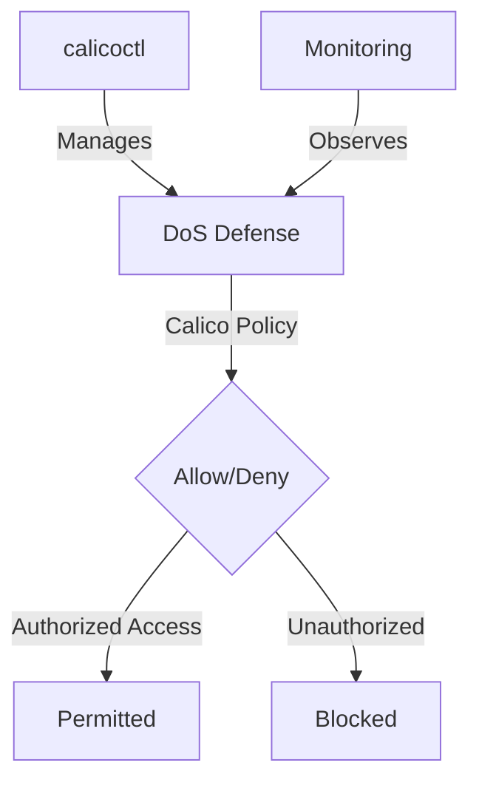

# Common Mistakes to Avoid with Calico DoS Defense Policies

Author: [nawazdhandala](https://github.com/nawazdhandala)

Tags: Calico, Kubernetes, Network Policy, DoS Defense, Security

Description: Avoid Mistakes Calico network policies for DoS defense to protect cluster workloads from denial of service attacks.

---

## Introduction

DoS Defense with Calico Policies is an important security consideration for production Calico deployments. The `projectcalico.org/v3` API provides the tools needed to avoid mistakes DoS Defense effectively, combining Calico's network policy with proper access controls and monitoring.

This guide covers avoid mistakes DoS Defense in Calico with practical configurations and operational best practices.

## Prerequisites

- Kubernetes cluster with Calico v3.26+
- `calicoctl` and `kubectl` installed
- Understanding of Calico's monitoring and security architecture

## Core Configuration

```yaml
apiVersion: projectcalico.org/v3
kind: HostEndpoint
metadata:
  name: web-node-eth0
  labels:
    apply-dos-mitigation: 'true'
spec:
  interfaceName: eth0
  node: web-node-1
  expectedIPs: ['10.0.0.10']
---
# Block known bad actors

apiVersion: projectcalico.org/v3
kind: GlobalNetworkSet
metadata:
  name: dos-block-list
  labels:
    dos-deny-list: 'true'
spec:
  nets:
    - 198.51.100.0/24  # Known attack source
    - 203.0.113.0/24
---
apiVersion: projectcalico.org/v3
kind: GlobalNetworkPolicy
metadata:
  name: dos-mitigation
spec:
  selector: apply-dos-mitigation == 'true'
  doNotTrack: true
  applyOnForward: true
  types:
    - Ingress
  ingress:
    - action: Deny
      source:
        selector: dos-deny-list == 'true'
```

## Implementation

```bash
# Apply DoS defense policies
calicoctl apply -f dos-defense.yaml

# Verify the host endpoint and deny-list resources
calicoctl get hostendpoint
calicoctl get globalnetworkset
calicoctl get globalnetworkpolicy

# Monitor Felix metrics if Prometheus metrics are enabled
curl -s http://node-ip:9091/metrics | grep felix_active_local_policies
```

## eBPF Dataplane (Calico with eBPF dataplane)

```bash
# Enable eBPF dataplane when Calico is installed with the Tigera Operator
kubectl patch installation.operator.tigera.io default --type merge -p '{"spec":{"calicoNetwork":{"linuxDataplane":"BPF"}}}'
```

## Architecture



## Conclusion

Avoid Mistakes DoS Defense in Calico requires a combination of proper policy configuration, regular monitoring, and proactive testing. Use the patterns in this guide as a foundation and adapt them to your specific security requirements. Always validate changes in staging before production and maintain comprehensive logging for security visibility.
