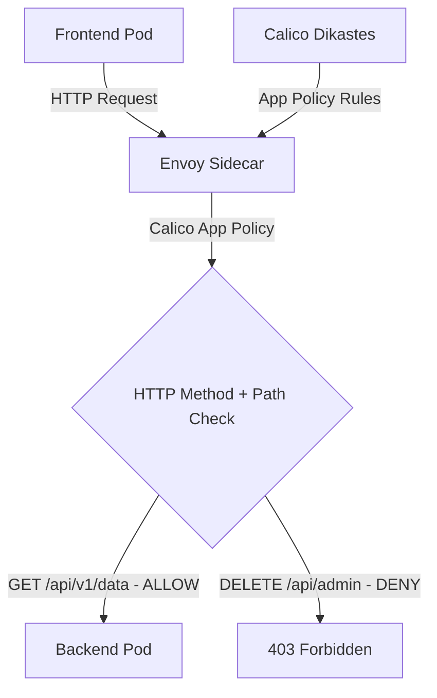

# Common Mistakes to Avoid with Calico and Istio HTTP Method Policies

Author: [nawazdhandala](https://github.com/nawazdhandala)

Tags: Calico, Kubernetes, Network Policy, Istio, HTTP Methods, Security

Description: Avoid Mistakes Calico HTTP method-based network policies using Istio to control access by HTTP verb (GET, POST, DELETE, etc.).

---

## Introduction

HTTP Method Policies with Calico and Istio combines Calico's network-layer enforcement with Istio's application-layer visibility. This powerful combination lets you write policies that reference HTTP attributes - methods, paths, headers - in addition to network-level properties like IP addresses and ports.

Calico's `projectcalico.org/v3` ApplicationPolicy (available with Istio integration) allows you to write rules that are evaluated by Istio's Envoy sidecar proxies rather than at the network layer. This enables fine-grained control like "allow GET requests to /api/health but deny POST requests to /api/admin."

This guide covers avoid mistakes HTTP Method Policies using Calico and Istio together.

## Prerequisites

- Kubernetes cluster with Calico v3.26+ and Istio installed
- Calico-Istio integration configured (Dikastes sidecar)
- `calicoctl` and `kubectl` installed
- Workloads with Istio sidecar injection enabled

## Core Configuration

```yaml
apiVersion: projectcalico.org/v3
kind: NetworkPolicy
metadata:
  name: avoid-mistakes-http-method-policies
  namespace: production
spec:
  order: 100
  selector: app == 'backend-api'
  ingress:
    - action: Allow
      source:
        selector: app == 'frontend'
      http:
        methods:
          - GET
          - POST
        paths:
          - exact: /api/v1/data
          - prefix: /api/v1/public
    - action: Deny
      source:
        selector: app == 'frontend'
      http:
        methods:
          - DELETE
          - PUT
        paths:
          - prefix: /api/v1/admin
  types:
    - Ingress
```

## Istio + Calico Setup

```bash
# Verify Calico-Istio integration
kubectl get pods -n istio-system | grep calico
kubectl get pods -n calico-system | grep dikastes

# Enable sidecar injection for namespace
kubectl label namespace production istio-injection=enabled
```

## Test Application-Layer Policy

```bash
# Test allowed method
kubectl exec -n production frontend-pod -- curl -X GET http://backend-api:8080/api/v1/data
echo "GET /api/v1/data (should pass): $?"

# Test denied method/path
kubectl exec -n production frontend-pod -- curl -X DELETE http://backend-api:8080/api/v1/admin
echo "DELETE /api/v1/admin (should be denied): $?"
```

## Architecture



## Conclusion

HTTP Method Policies with Calico and Istio with Calico and Istio provides the most fine-grained network security available in Kubernetes, combining network-layer enforcement with application-layer policy evaluation. By filtering on HTTP methods, paths, and headers, you can implement access controls that are impossible with pure network-layer policies. Ensure your Calico-Istio integration is properly configured and test both allowed and denied request patterns to verify your application-layer policies are working correctly.
