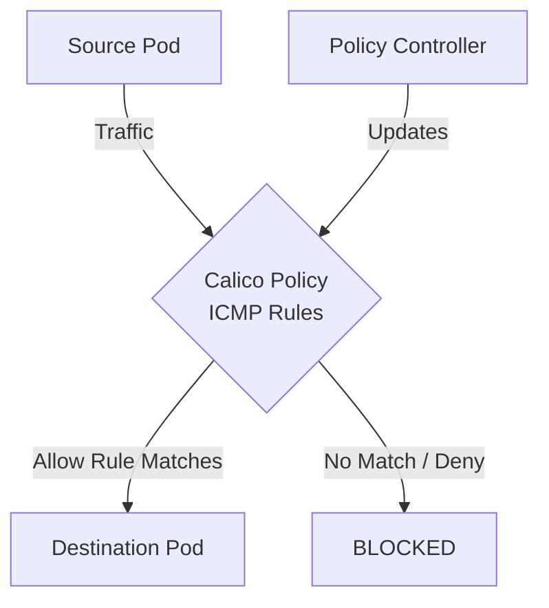

# Common Mistakes to Avoid with ICMP and Ping Rules

Author: [nawazdhandala](https://github.com/nawazdhandala)

Tags: Calico, Kubernetes, Network Policy, ICMP, Security, Network

Description: Avoid the most common pitfalls when implementing ICMP and Ping Rules in Calico.

---

## Introduction

ICMP and Ping Rules in Calico provides fine-grained network security controls using the `projectcalico.org/v3` API. This guide covers how to avoid mistakes ICMP Rules effectively.

Calico's extensible policy model supports ICMP Rules through its `GlobalNetworkPolicy` and `NetworkPolicy` resources, giving you cluster-wide and namespace-scoped control over traffic that matches your ICMP Rules criteria.

This guide provides practical techniques for avoid mistakes ICMP Rules in your Kubernetes cluster, following security best practices and production-tested patterns.

## Prerequisites

- Kubernetes cluster with Calico v3.26+
- `calicoctl` and `kubectl` installed
- Basic understanding of Calico network policy concepts

## Mistake 1: Missing DNS Egress Allow

Always pair any egress deny with a DNS allow rule:

```yaml
egress:
  - action: Allow
    protocol: UDP
    destination:
      ports: [53]
  - action: Allow
    protocol: TCP
    destination:
      ports: [53]
```

## Mistake 2: Wrong Policy Order

```bash
# Check policy order - lower order = higher priority
calicoctl get networkpolicies -n production -o wide | sort -k4 -n
```

## Mistake 3: Selector Typos

```bash
# Verify selector matches intended pods
kubectl get pods -n production -l "your-label-key=your-label-value"
```

## Mistake 4: Missing Bidirectional Rules

Both ingress on destination AND egress on source must be permitted:

```yaml
# Source side - egress
egress:
  - action: Allow
    destination:
      selector: app == 'backend'

# Destination side - ingress  
ingress:
  - action: Allow
    source:
      selector: app == 'frontend'
```

## Architecture



## Conclusion

Avoid Mistakes ICMP Rules policies in Calico requires attention to policy ordering, selector accuracy, and bidirectional rule coverage. Follow the patterns in this guide to ensure your ICMP Rules policies are correctly configured, tested, and monitored. Always validate in staging before applying to production, and maintain comprehensive logging for visibility into policy decisions.
