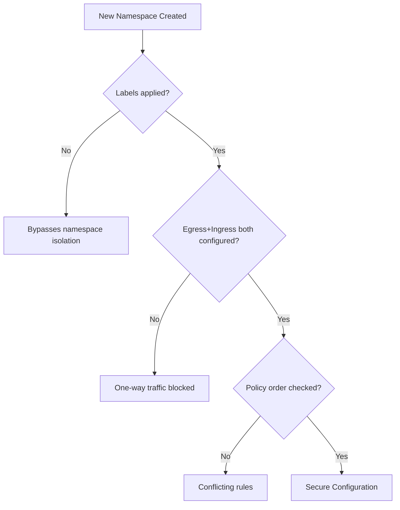

# Common Mistakes to Avoid with Calico Namespace-Based Network Policies

Author: [nawazdhandala](https://github.com/nawazdhandala)

Tags: Calico, Kubernetes, Network Policy, Namespace, Best Practices

Description: Avoid the most common pitfalls when implementing Calico namespace-based network policies that cause security gaps or unexpected traffic blocks.

---

## Introduction

Namespace-based Calico policies fail in distinctive ways because they depend on namespace labels — metadata that is easy to forget, easy to mistype, and easy to change accidentally. The failures can go in either direction: too permissive (namespaces that should be isolated can communicate) or too restrictive (allowed cross-namespace traffic is blocked).

Understanding the common failure modes and how to avoid them will save you hours of debugging and prevent security incidents caused by misconfigured namespace isolation.

## Prerequisites

- Kubernetes cluster with Calico v3.26+
- `calicoctl` and `kubectl` installed

## Mistake 1: Forgetting to Label New Namespaces

The most common mistake: you set up namespace isolation perfectly, then a new namespace is created without the required labels, and it bypasses all your isolation policies.

```bash
# BAD - creating a namespace without labels
kubectl create namespace new-service

# GOOD - always add required labels when creating namespaces
kubectl create namespace new-service
kubectl label namespace new-service environment=production team=platform calico-policy=enabled
```

## Mistake 2: Using kubernetes.io/metadata.name Instead of Custom Labels

The `kubernetes.io/metadata.name` label is automatically set by Kubernetes and equals the namespace name. Using it in policies creates brittle rules tied to specific namespace names rather than semantic attributes.

```yaml
# Brittle - tied to exact namespace name
namespaceSelector: kubernetes.io/metadata.name == 'monitoring'

# Better - semantic label that survives namespace renames
namespaceSelector: team == 'observability' && purpose == 'monitoring'
```

## Mistake 3: Missing Egress Rules for Cross-Namespace Calls

When a pod in namespace A calls a service in namespace B, you need BOTH an egress rule in namespace A AND an ingress rule in namespace B. Missing either one blocks the traffic.

```yaml
# Egress from namespace A
apiVersion: projectcalico.org/v3
kind: NetworkPolicy
metadata:
  name: allow-egress-to-b
  namespace: namespace-a
spec:
  order: 100
  selector: all()
  egress:
    - action: Allow
      destination:
        namespaceSelector: kubernetes.io/metadata.name == 'namespace-b'
  types:
    - Egress
```

## Mistake 4: Not Testing Both Directions

A allow rule for A->B does not automatically allow B->A. Always test both directions explicitly.

```bash
# Test A->B
kubectl exec -n namespace-a test-pod -- curl http://service.namespace-b.svc.cluster.local
# Test B->A (should be blocked if not explicitly allowed)
kubectl exec -n namespace-b test-pod -- curl http://service.namespace-a.svc.cluster.local
```

## Mistake 5: Conflicting Namespace Policies

If you have both a namespace-scoped NetworkPolicy and a GlobalNetworkPolicy with conflicting rules, the one with the lower `order` wins.

```bash
# Check for conflicts
calicoctl get globalnetworkpolicies -o wide
calicoctl get networkpolicies --all-namespaces -o wide
# Sort by order and check for gaps/overlaps
```

## Common Mistakes



## Conclusion

Namespace-based Calico policy mistakes typically fall into three categories: missing labels on namespaces, incomplete bidirectional rules, and policy ordering conflicts. Build namespace labeling into your namespace creation process (use Helm hooks or admission webhooks), always configure both ingress and egress rules for cross-namespace traffic, and regularly audit your policy ordering to prevent conflicts. A namespace creation checklist that includes labeling will prevent the majority of these issues.
