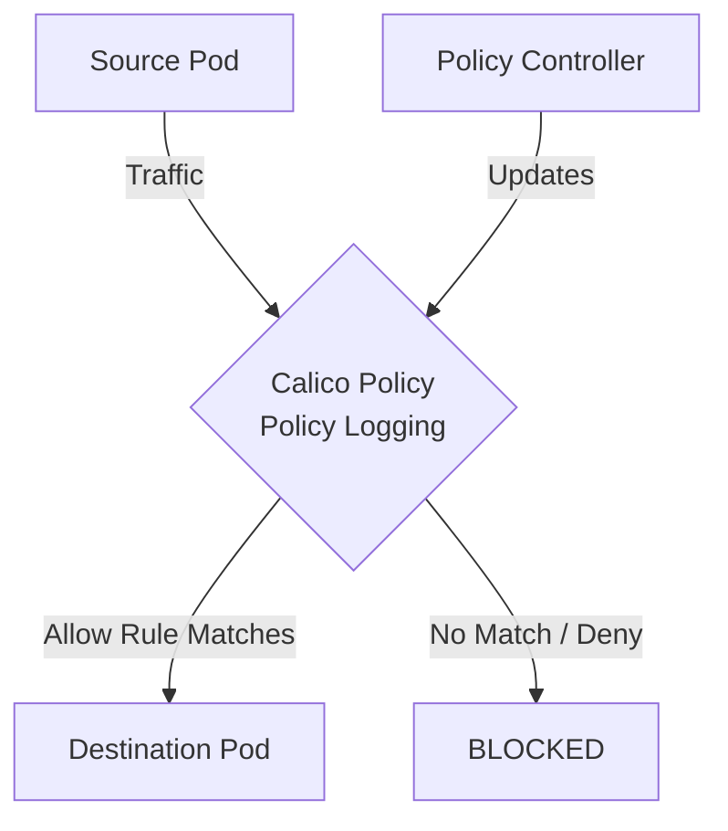

# Common Mistakes to Avoid with Calico Policy Log Rules

Author: [nawazdhandala](https://github.com/nawazdhandala)

Tags: Calico, Kubernetes, Network Policy, Logging, Audit, Security

Description: Avoid the most common pitfalls when implementing Calico Policy Log Rules in Calico.

---

## Introduction

Calico network policies provide fine-grained network security controls using the `projectcalico.org/v3` API, and Policy Log Rules add diagnostic visibility into traffic that matches policy rules. This guide covers how to avoid mistakes when using Policy Logging effectively.

Calico's extensible policy model supports Policy Logging through its `GlobalNetworkPolicy` and `NetworkPolicy` resources, giving you cluster-wide and namespace-scoped visibility into traffic that matches your Policy Logging criteria. A `Log` action records the matching traffic and then policy evaluation continues with the next rule.

This guide provides practical techniques for avoiding mistakes with Policy Logging in your Kubernetes cluster, following security best practices and production-tested patterns.

## Prerequisites

- Kubernetes cluster with Calico v3.26+
- `calicoctl` and `kubectl` installed
- Basic understanding of Calico network policy concepts

## Mistake 1: Missing DNS Egress Allow

Always pair any egress deny with a DNS allow rule:

```yaml
egress:
  - action: Allow
    protocol: UDP
    destination:
      ports: [53]
  - action: Allow
    protocol: TCP
    destination:
      ports: [53]
```

## Mistake 2: Wrong Policy Order

```bash
# Check policy order - lower order = higher priority

calicoctl get networkpolicies -n production -o wide | sort -k2 -n
```

## Mistake 3: Selector Typos

```bash
# Verify selector matches intended pods
kubectl get pods -n production -l "your-label-key=your-label-value"
```

## Mistake 4: Missing Bidirectional Rules

When policies select both sides of a connection, both ingress on the destination AND egress on the source must be permitted:

```yaml
# Source side - egress
egress:
  - action: Allow
    destination:
      selector: app == 'backend'

# Destination side - ingress  
ingress:
  - action: Allow
    source:
      selector: app == 'frontend'
```

## Architecture



## Conclusion

Avoid Mistakes Policy Logging policies in Calico requires attention to policy ordering, selector accuracy, and bidirectional rule coverage. Follow the patterns in this guide to ensure your Policy Logging policies are correctly configured, tested, and monitored. Always validate in staging before applying to production, and maintain comprehensive logging for visibility into policy decisions.
