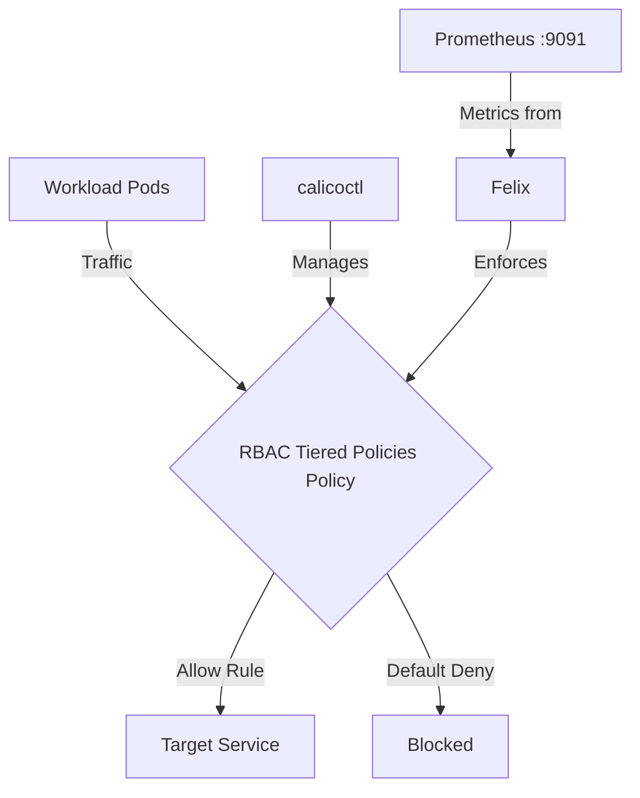

# Common Mistakes to Avoid with RBAC for Calico Tiered Policies

Author: [nawazdhandala](https://github.com/nawazdhandala)

Tags: Calico, Kubernetes, Network Policy, RBAC, Policy Tiers, Security

Description: Avoid the most common pitfalls when implementing RBAC for Tiered Policies in Calico.

---

## Introduction

RBAC for Tiered Policies is an advanced Calico feature that provides fine-grained access control for tiered network security policies using the `projectcalico.org/v3` API. This guide covers how to avoid mistakes with RBAC for Tiered Policies in your Kubernetes cluster.

Calico's `projectcalico.org/v3` API provides rich support for Tiered Policies through its `Tier`, `GlobalNetworkPolicy`, `NetworkPolicy`, and related resources. Proper configuration of Kubernetes RBAC for those tiers and policies is essential for maintaining a secure, well-controlled network fabric.

This guide provides production-tested patterns for avoiding mistakes with RBAC for Tiered Policies, including YAML examples, CLI commands, and troubleshooting techniques.

## Prerequisites

- Kubernetes cluster with Calico v3.26+
- `calicoctl` and `kubectl` installed  
- Basic understanding of Calico network policy concepts
- Calico API server, or native `projectcalico.org/v3` CRDs with Calico's admission webhook enabled for tier RBAC enforcement

## Core Configuration

The following YAML demonstrates the key policy pattern for Tiered Policies:

```yaml
apiVersion: projectcalico.org/v3
kind: Tier
metadata:
  name: net-sec
spec:
  order: 100
  defaultAction: Deny
---
apiVersion: projectcalico.org/v3
kind: NetworkPolicy
metadata:
  name: avoid-mistakes-rbac-tiered-policies
  namespace: production
spec:
  tier: net-sec
  order: 100
  selector: all()
  ingress:
    - action: Allow
      source:
        selector: app == 'authorized-source'
      destination:
        ports: [8080, 443]
  egress:
    - action: Allow
      protocol: UDP
      destination:
        ports: [53]
    - action: Allow
      destination:
        selector: app == 'authorized-destination'
  types:
    - Ingress
    - Egress
```

Apply the RBAC that grants a user access to the tier separately with `kubectl`, because Kubernetes `Role`, `ClusterRole`, `RoleBinding`, and `ClusterRoleBinding` resources are Kubernetes RBAC resources, not Calico policy resources:

```yaml
kind: ClusterRole
apiVersion: rbac.authorization.k8s.io/v1
metadata:
  name: get-net-sec-tier
rules:
  - apiGroups: ["projectcalico.org"]
    resources: ["tiers"]
    resourceNames: ["net-sec"]
    verbs: ["get"]
---
kind: ClusterRole
apiVersion: rbac.authorization.k8s.io/v1
metadata:
  name: manage-net-sec-networkpolicies
rules:
  - apiGroups: ["projectcalico.org"]
    resources: ["tier.networkpolicies"]
    resourceNames: ["net-sec.*"]
    verbs: ["get", "list", "watch", "create", "update", "patch", "delete"]
---
kind: ClusterRoleBinding
apiVersion: rbac.authorization.k8s.io/v1
metadata:
  name: user-can-get-net-sec-tier
subjects:
  - kind: User
    name: "<USER>"
    apiGroup: rbac.authorization.k8s.io
roleRef:
  kind: ClusterRole
  name: get-net-sec-tier
  apiGroup: rbac.authorization.k8s.io
---
kind: RoleBinding
apiVersion: rbac.authorization.k8s.io/v1
metadata:
  name: user-can-manage-net-sec-networkpolicies
  namespace: production
subjects:
  - kind: User
    name: "<USER>"
    apiGroup: rbac.authorization.k8s.io
roleRef:
  kind: ClusterRole
  name: manage-net-sec-networkpolicies
  apiGroup: rbac.authorization.k8s.io
```

## Implementation Steps

```bash
# 1. Apply the policy
kubectl apply -f rbac-tier-access.yaml

calicoctl validate -f avoid-mistakes-rbac-tiered-policies.yaml
calicoctl apply -f avoid-mistakes-rbac-tiered-policies.yaml

# 2. Verify it's active
calicoctl get networkpolicies -n production -o wide

# 3. Test connectivity
kubectl exec -n production test-pod -- curl -s --max-time 5 http://target:8080
echo "Exit code: $?"

# 4. Check Felix policy metrics (if Felix metrics are enabled)
curl -s http://localhost:9091/metrics | grep felix_active_local_policies
```

## Operational Commands

```bash
# List all relevant policies
calicoctl get networkpolicies --all-namespaces
calicoctl get globalnetworkpolicies

# View policy details
calicoctl get networkpolicy avoid-mistakes-rbac-tiered-policies -n production -o yaml

# Delete a policy if needed
calicoctl delete networkpolicy avoid-mistakes-rbac-tiered-policies -n production
```

## Architecture



## Common Issues

1. **Policy not applying**: Verify API version is `projectcalico.org/v3` and run `calicoctl validate -f avoid-mistakes-rbac-tiered-policies.yaml` first
2. **Selector not matching**: Use `kubectl get pods -l app=authorized-source` to verify Kubernetes label matches
3. **Order conflicts**: Run `calicoctl get tiers -o wide`, `calicoctl get networkpolicies -n production -o wide`, and `calicoctl get globalnetworkpolicies -o wide` to compare tier and policy order
4. **DNS failures**: Always ensure egress to port 53 is allowed when restricting egress

## Conclusion

Avoid Mistakes RBAC Tiered Policies in Calico requires careful attention to policy ordering, selector syntax, and bidirectional traffic rules. Use the patterns in this guide as a starting point, adapt them to your specific requirements, and always validate changes in a staging environment before applying to production. Consistent logging and monitoring will help you detect and resolve issues quickly when they occur.
