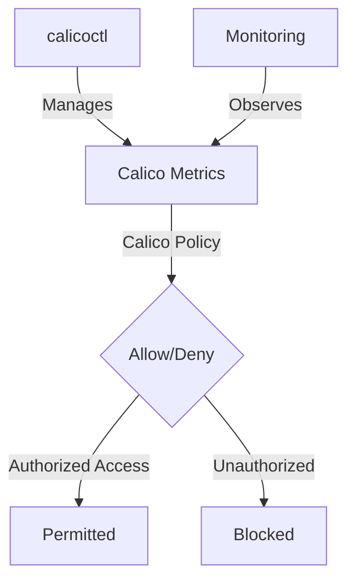

# Common Mistakes to Avoid When Securing Calico Metrics Endpoints

Author: [nawazdhandala](https://github.com/nawazdhandala)

Tags: Calico, Kubernetes, Metric, Security, Prometheus

Description: Avoid Mistakes security for Calico metrics endpoints to restrict access to authorized monitoring systems only.

---

## Introduction

Securing Calico Metrics Endpoints is an important security consideration for production Calico deployments. The `projectcalico.org/v3` API provides the tools needed to avoid mistakes Calico Metrics effectively, combining Calico's network policy with proper access controls and monitoring.

This guide covers avoid mistakes Calico Metrics in Calico with practical configurations and operational best practices.

## Prerequisites

- Kubernetes cluster with Calico v3.26+ and Felix Prometheus metrics enabled
- `calicoctl` and `kubectl` installed
- Calico HostEndpoint resources for the nodes exposing metrics, labeled `running-calico == "true"`
- Understanding of Calico's monitoring and security architecture

## Core Configuration

```yaml
# Restrict access to Calico Felix metrics (port 9091)

apiVersion: projectcalico.org/v3
kind: GlobalNetworkPolicy
metadata:
  name: secure-calico-metrics
spec:
  order: 500
  selector: running-calico == "true"
  ingress:
    - action: Allow
      protocol: TCP
      source:
        namespaceSelector: team == "observability"
      destination:
        ports: [9091]
    - action: Allow
      protocol: TCP
      source:
        selector: calico-prometheus-access == "true"
      destination:
        ports: [9091]
    - action: Deny
      protocol: TCP
      destination:
        ports: [9091]
  types:
    - Ingress
```

## Implementation Steps

```bash
# Apply metrics security policy
calicoctl apply -f secure-calico-metrics.yaml

# Verify only authorized access works
kubectl exec -n monitoring prometheus-pod -- curl -s http://<calico-node-ip>:9091/metrics | head -5
echo "Prometheus access (should work): $?"

# Verify unauthorized access is blocked
kubectl exec -n default test-pod -- curl -s --max-time 5 http://<calico-node-ip>:9091/metrics
echo "Unauthorized access (should timeout): $?"
```

## Verify Metrics Security

```bash
# Confirm the GlobalNetworkPolicy is installed
calicoctl get globalnetworkpolicy secure-calico-metrics -o yaml

# Check that authorized Prometheus pods carry the access label
kubectl get pods -n monitoring -l calico-prometheus-access=true
```

## Architecture



## Conclusion

Avoid Mistakes Calico Metrics in Calico requires a combination of proper policy configuration, regular monitoring, and proactive testing. Use the patterns in this guide as a foundation and adapt them to your specific security requirements. Always validate changes in staging before production and maintain comprehensive logging for security visibility.
