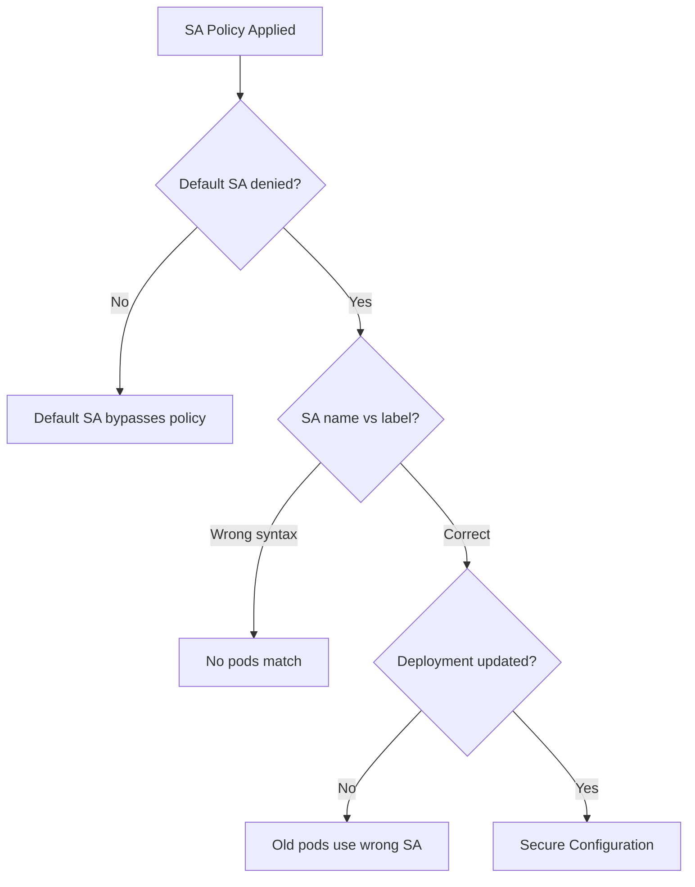

# Common Mistakes to Avoid with Calico Service Account Network Policies

Author: [nawazdhandala](https://github.com/nawazdhandala)

Tags: Calico, Kubernetes, Network Policy, Service Accounts, Best Practices

Description: Avoid the most common mistakes when using Calico service account-based network policies that cause silent security gaps or unexpected traffic blocks.

---

## Introduction

Service account-based Calico policies are more secure than label-based policies, but they come with their own set of failure modes. The most dangerous mistakes create the appearance of security while leaving gaps - for example, believing your database is protected by SA policy while the default service account can still reach it.

## Prerequisites

- Kubernetes cluster with Calico v3.26+
- `calicoctl` and `kubectl` installed

## Mistake 1: Not Restricting the Default Service Account

Every pod that doesn't specify a service account runs as `default`. If your SA policy only allows `backend-sa`, but you forget to deny `default`, pods running as default can still reach your protected service.

```yaml
# MISSING: explicit deny for default SA
# Always add a catch-all deny after your allow rules:
spec:
  ingress:
    - action: Allow
      source:
        serviceAccountSelector: name == 'backend-sa'
    - action: Deny  # This catches default SA and all others
```

## Mistake 2: Confusing SA Labels with SA Name

Calico's `serviceAccountSelector` matches on service account metadata labels, not the service account name. To match by name, you must use `name == 'my-sa'` which uses the special `name` key.

```yaml
# Wrong - tries to match a label called 'serviceaccount'
serviceAccountSelector: serviceaccount == 'backend-sa'

# Correct - matches service account name
serviceAccountSelector: name == 'backend-sa'
```

## Mistake 3: Cross-Namespace SA References Without Namespace Selector

A service account named `backend-sa` in namespace A and namespace B are different service accounts. Without a namespace selector, your policy may accidentally allow the wrong SA.

```yaml
# More precise - combine SA and namespace selectors
spec:
  ingress:
    - action: Allow
      source:
        serviceAccountSelector: name == 'backend-sa'
        namespaceSelector: environment == 'production'
```

## Mistake 4: Not Updating Deployment Templates

Adding a service account to a running pod via `kubectl patch pod` only affects that pod instance. New pods from the Deployment will still use the old service account unless you update the Deployment template.

```bash
# Always update the Deployment spec, not just the running pod
kubectl patch deployment backend -n production --type=merge -p '{
  "spec": {"template": {"spec": {"serviceAccountName": "backend-sa"}}}
}'
kubectl rollout status deployment/backend -n production
```

## Mistake 5: Forgetting SA Rotation Impact

If a service account is deleted and recreated (common in GitOps workflows), the new SA is technically a different identity. Ensure your Deployment templates reference the SA by name and that the SA is created before the Deployment.

## Common Mistakes Summary



## Conclusion

Service account policy mistakes usually fall into four categories: not denying the default service account, syntax errors in SA selectors, missing namespace scope, and not updating Deployment templates. Always include an explicit Deny rule after your allow rules, use `name == 'sa-name'` syntax, combine with namespace selectors for precision, and always update Deployment specs rather than running pods directly.
