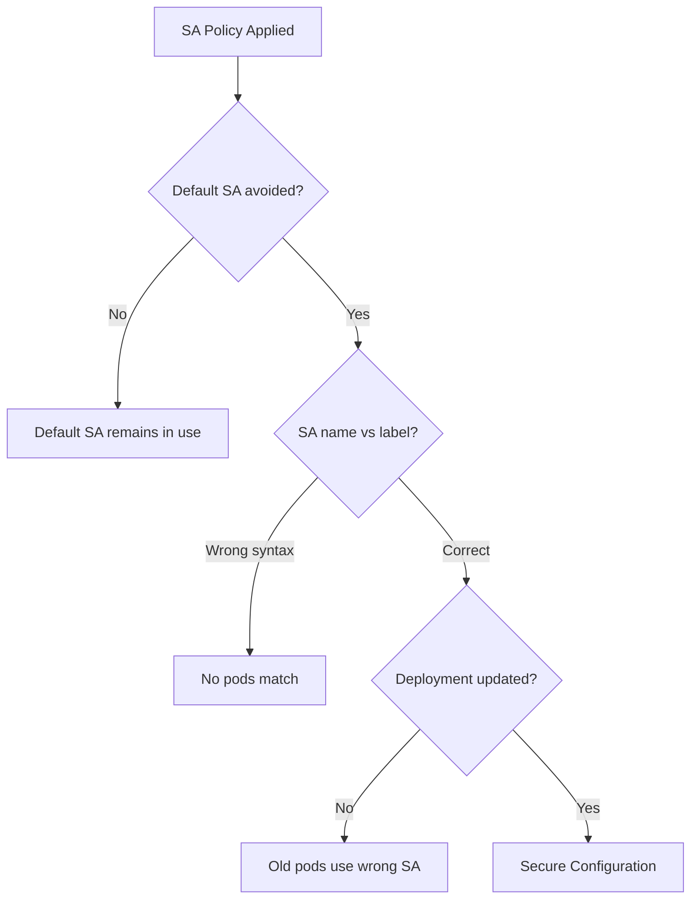

# Common Mistakes to Avoid with Calico Service Account Network Policies

Author: [nawazdhandala](https://github.com/nawazdhandala)

Tags: Calico, Kubernetes, Network Policy, Service Account, Best Practice

Description: Avoid the most common mistakes when using Calico service account-based network policies that cause silent security gaps or unexpected traffic blocks.

---

## Introduction

Service account-based Calico policies can be harder to bypass than pod label-based policies, but they come with their own set of failure modes. The most dangerous mistakes create the appearance of security while leaving gaps - for example, believing your database is protected by SA policy while workloads still run under the default service account.

## Prerequisites

- Kubernetes cluster with Calico v3.26+
- `calicoctl` and `kubectl` installed

## Mistake 1: Not Restricting the Default Service Account

Every pod that doesn't specify a service account runs as `default`. If workloads accidentally run as `default`, they will not match policies that are intended to apply to or allow a dedicated service account. For Calico policies that select the protected pods, unmatched ingress is denied by default, but an explicit `Deny` can still be useful as a hard stop when other ordered policies or profiles might otherwise allow traffic.

```yaml
# Optional hard stop after your allow rules:
spec:
  selector: role == 'database'
  types:
    - Ingress
  ingress:
    - action: Allow
      source:
        serviceAccounts:
          names:
            - backend-sa
    - action: Deny  # This catches default SA and all other sources
```

## Mistake 2: Confusing SA Labels with SA Name

In Calico rule sources and destinations, `serviceAccounts.selector` matches service account metadata labels, not the service account name. To match by name in a rule, use `serviceAccounts.names`. For a top-level `serviceAccountSelector`, match the name with Calico's automatic `projectcalico.org/name` label.

```yaml
# Wrong - tries to match a label called 'serviceaccount'
source:
  serviceAccounts:
    selector: serviceaccount == 'backend-sa'

# Correct - matches service account name in a rule
source:
  serviceAccounts:
    names:
      - backend-sa

# Also valid - matches service account name in a top-level policy selector
serviceAccountSelector: projectcalico.org/name == 'backend-sa'
```

## Mistake 3: Cross-Namespace SA References Without Namespace Selector

A service account named `backend-sa` in namespace A and namespace B are different service accounts. Without a namespace selector, your policy may accidentally allow the wrong SA.

```yaml
# More precise - combine SA and namespace selectors
spec:
  ingress:
    - action: Allow
      source:
        serviceAccounts:
          names:
            - backend-sa
        namespaceSelector: projectcalico.org/name == 'production'
```

## Mistake 4: Not Updating Deployment Templates

Adding a service account to an existing pod via `kubectl patch pod` will be rejected because `spec.serviceAccountName` can only be set when the Pod is created. New pods from the Deployment will still use the old service account unless you update the Deployment template.

```bash
# Always update the Deployment spec, not just the running pod
kubectl patch deployment backend -n production --type=merge -p '{
  "spec": {"template": {"spec": {"serviceAccountName": "backend-sa"}}}
}'
kubectl rollout status deployment/backend -n production
```

## Mistake 5: Forgetting SA Rotation Impact

If a service account is deleted and recreated (common in GitOps workflows), any existing bound tokens for the deleted object are invalidated. Calico name-based policy will still match a recreated service account with the same name, but ensure your Deployment templates reference the SA by name and that the SA is created before Pods are created.

## Common Mistakes Summary


```mermaid
flowchart TD
    A[SA Policy Applied] --> B{Default SA avoided?}
    B -->|No| C[Default SA remains in use]
    B -->|Yes| D{SA name vs label?}
    D -->|Wrong syntax| E[No pods match]
    D -->|Correct| F{Deployment updated?}
    F -->|No| G[Old pods use wrong SA]
    F -->|Yes| H[Secure Configuration]
```

## Conclusion

Service account policy mistakes usually fall into four categories: relying on the default service account, syntax errors in SA selectors, missing namespace scope, and not updating Deployment templates. Use `serviceAccounts.names` for exact service account matches in rules, combine with namespace selectors for precision, add explicit `Deny` rules when you need a hard stop in ordered policy evaluation, and always update Deployment specs rather than running pods directly.
