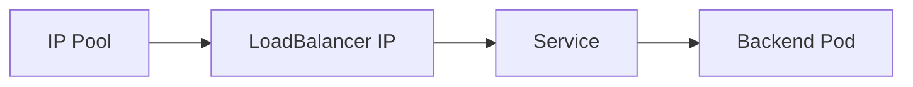

# How to Avoid Common Mistakes with Service Load Balancer Addresses with Calico

Author: [nawazdhandala](https://github.com/nawazdhandala)

Tags: Calico, Kubernetes, LoadBalancer, IPAM, Networking

Description: Avoid common mistakes in Calico LoadBalancer IP management including pool overlap and advertisement configuration errors.

---

## Introduction

Service Load Balancer Addresses with Calico enables important networking capabilities in Calico Kubernetes clusters. Proper configuration ensures reliable service connectivity and IP address management.

## Prerequisites

- Calico v3.30+ installed
- kubectl and calicoctl access
- Cluster-admin access

## Configuration

```bash
calicoctl get ippools -o yaml
calicoctl get bgpconfiguration -o yaml
kubectl get kubecontrollersconfiguration default -o yaml
```

## Example Configuration

```yaml
apiVersion: projectcalico.org/v3
kind: IPPool
metadata:
  name: loadbalancer-ip-pool
spec:
  cidr: 10.48.0.0/16
  natOutgoing: true
  disabled: false
  assignmentMode: Automatic
  allowedUses:
    - LoadBalancer
```

## Verify

```bash
kubectl get svc -A
calicoctl ipam check
```

## Architecture



## Conclusion

How to Avoid Common Mistakes with Service Load Balancer Addresses with Calico in Calico provides reliable IP addressing for Kubernetes LoadBalancer services. Follow the configuration and verification steps to ensure correct behavior.
