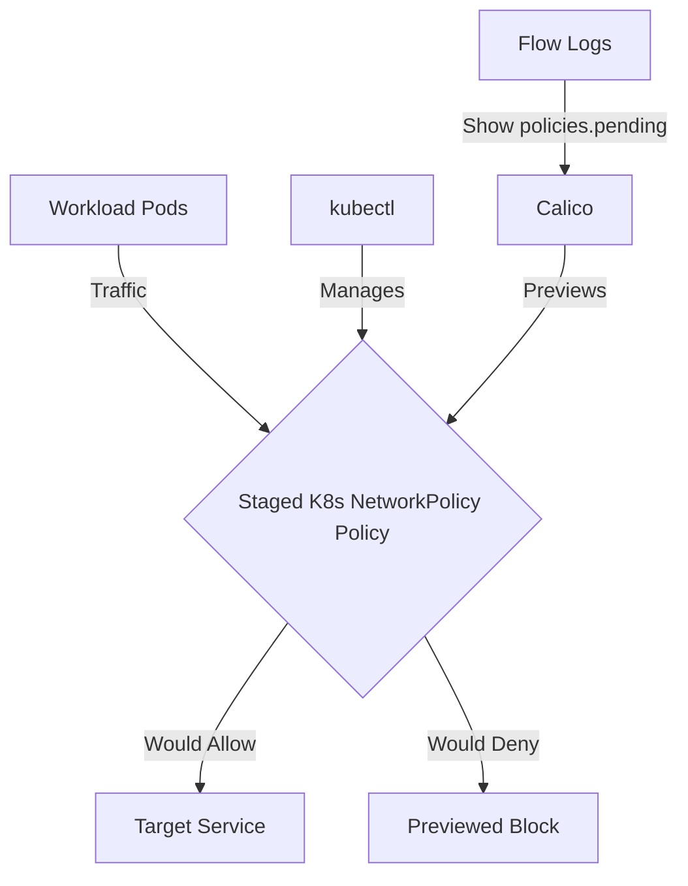

# Common Mistakes to Avoid with Staged Kubernetes NetworkPolicy in Calico

Author: [nawazdhandala](https://github.com/nawazdhandala)

Tags: Calico, Kubernetes, Network Policy, Staged Policies

Description: Avoid the most common pitfalls when implementing Staged Kubernetes NetworkPolicy in Calico.

---

## Introduction

Staged Kubernetes NetworkPolicy is an advanced Calico feature that lets you preview Kubernetes NetworkPolicy behavior using the `projectcalico.org/v3` API before enforcing it. This guide covers how to avoid mistakes Staged K8s NetworkPolicy effectively in your Kubernetes cluster.

Calico's `projectcalico.org/v3` API provides support for staged policies through its `StagedGlobalNetworkPolicy`, `StagedNetworkPolicy`, and `StagedKubernetesNetworkPolicy` resources. Proper configuration of Staged K8s NetworkPolicy is essential for maintaining a secure, well-controlled network fabric.

This guide provides production-tested patterns for avoid mistakes Staged K8s NetworkPolicy, including YAML examples, CLI commands, and troubleshooting techniques.

## Prerequisites

- Kubernetes cluster with Calico and the `StagedKubernetesNetworkPolicy` CRD installed
- `kubectl` installed
- Basic understanding of Calico network policy concepts
- Permissions to create and view `projectcalico.org/v3` staged policy resources

## Core Configuration

The following YAML demonstrates the key pattern for Staged K8s NetworkPolicy:

```yaml
apiVersion: projectcalico.org/v3
kind: StagedKubernetesNetworkPolicy
metadata:
  name: avoid-mistakes-staged-k8s-networkpolicy
  namespace: production
spec:
  podSelector:
    matchLabels:
      app: target
  ingress:
    - from:
        - podSelector:
            matchLabels:
              app: authorized-source
      ports:
        - protocol: TCP
          port: 8080
        - protocol: TCP
          port: 443
  egress:
    - to:
        - namespaceSelector:
            matchLabels:
              kubernetes.io/metadata.name: kube-system
          podSelector:
            matchLabels:
              k8s-app: kube-dns
      ports:
        - protocol: UDP
          port: 53
        - protocol: TCP
          port: 53
    - to:
        - podSelector:
            matchLabels:
              app: authorized-destination
  policyTypes:
    - Ingress
    - Egress
```

## Implementation Steps

```bash
# 1. Apply the policy

kubectl apply -f avoid-mistakes-staged-k8s-networkpolicy.yaml

# 2. Verify the staged policy exists
kubectl get stagedkubernetesnetworkpolicies.projectcalico.org -n production

# 3. Verify current connectivity; staged policies preview impact but do not enforce traffic
kubectl exec -n production test-pod -- curl -s --max-time 5 http://target:8080
echo "Exit code: $?"

# 4. Review the staged policy configuration; check Calico flow logs for policies.pending if flow logs are enabled
kubectl get stagedkubernetesnetworkpolicy.projectcalico.org avoid-mistakes-staged-k8s-networkpolicy -n production -o yaml
```

## Operational Commands

```bash
# List all relevant policies
kubectl get stagedkubernetesnetworkpolicies.projectcalico.org --all-namespaces
kubectl get stagednetworkpolicies.projectcalico.org --all-namespaces
kubectl get stagedglobalnetworkpolicies.projectcalico.org

# View policy details
kubectl get stagedkubernetesnetworkpolicy.projectcalico.org avoid-mistakes-staged-k8s-networkpolicy -n production -o yaml

# Delete a policy if needed
kubectl delete stagedkubernetesnetworkpolicy.projectcalico.org avoid-mistakes-staged-k8s-networkpolicy -n production
```

## Architecture



## Common Issues

1. **Policy not applying**: Verify API version is `projectcalico.org/v3`, kind is `StagedKubernetesNetworkPolicy`, and run `kubectl apply --dry-run=server -f avoid-mistakes-staged-k8s-networkpolicy.yaml` first
2. **Selector not matching**: Use `kubectl get pods -l your-selector` to verify label matches
3. **Unexpected preview results**: Remember Kubernetes NetworkPolicy rules are additive; review all enforced and staged policies that select the same pods
4. **DNS failures after enforcement**: Always ensure egress to TCP and UDP port 53 is allowed when restricting egress

## Conclusion

Avoid Mistakes Staged K8s NetworkPolicy in Calico requires careful attention to policyTypes, selector syntax, and bidirectional traffic rules. Use the patterns in this guide as a starting point, adapt them to your specific requirements, and always validate changes in a staging environment before applying to production. Consistent logging and monitoring will help you detect and resolve issues quickly when they occur.
