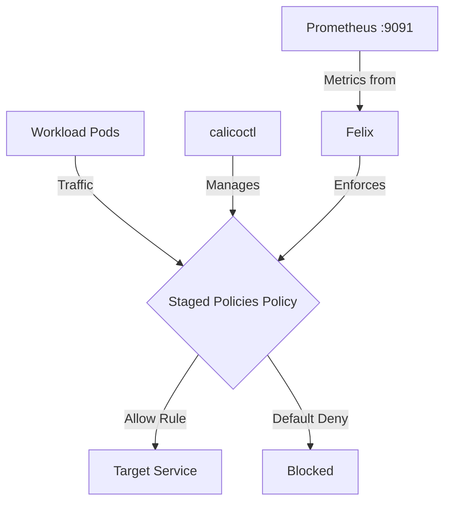

# Common Mistakes to Avoid with Staged Network Policies in Calico

Author: [nawazdhandala](https://github.com/nawazdhandala)

Tags: Calico, Kubernetes, Network Policy, Staged Policies, Security

Description: Avoid the most common pitfalls when implementing Staged Network Policies in Calico.

---

## Introduction

Staged Network Policies is an advanced Calico feature that provides fine-grained network security controls using the `projectcalico.org/v3` API. This guide covers how to avoid mistakes Staged Policies effectively in your Kubernetes cluster.

Calico's `projectcalico.org/v3` API provides rich support for Staged Policies through its `GlobalNetworkPolicy`, `NetworkPolicy`, and related resources. Proper configuration of Staged Policies is essential for maintaining a secure, well-controlled network fabric.

This guide provides production-tested patterns for avoid mistakes Staged Policies, including YAML examples, CLI commands, and troubleshooting techniques.

## Prerequisites

- Kubernetes cluster with Calico v3.26+
- `calicoctl` and `kubectl` installed  
- Basic understanding of Calico network policy concepts
- Calico v3.26+ for full Staged Policies feature support

## Core Configuration

The following YAML demonstrates the key pattern for Staged Policies:

```yaml
apiVersion: projectcalico.org/v3
kind: NetworkPolicy
metadata:
  name: avoid-mistakes-staged-policies
  namespace: production
spec:
  order: 100
  selector: all()
  ingress:
    - action: Allow
      source:
        selector: app == 'authorized-source'
      destination:
        ports: [8080, 443]
  egress:
    - action: Allow
      protocol: UDP
      destination:
        ports: [53]
    - action: Allow
      destination:
        selector: app == 'authorized-destination'
  types:
    - Ingress
    - Egress
```

## Implementation Steps

```bash
# 1. Apply the policy
calicoctl apply -f avoid-mistakes-staged-policies.yaml

# 2. Verify it's active
calicoctl get networkpolicies -n production -o wide

# 3. Test connectivity
kubectl exec -n production test-pod -- curl -s --max-time 5 http://target:8080
echo "Exit code: $?"

# 4. Check policy hit counters (if Felix metrics enabled)
curl -s http://localhost:9091/metrics | grep felix_denied
```

## Operational Commands

```bash
# List all relevant policies
calicoctl get networkpolicies --all-namespaces
calicoctl get globalnetworkpolicies

# View policy details
calicoctl get networkpolicy avoid-mistakes-policy -n production -o yaml

# Delete a policy if needed
calicoctl delete networkpolicy avoid-mistakes-policy -n production
```

## Architecture



## Common Issues

1. **Policy not applying**: Verify API version is `projectcalico.org/v3` and run `calicoctl apply --dry-run` first
2. **Selector not matching**: Use `kubectl get pods -l your-selector` to verify label matches
3. **Order conflicts**: Run `calicoctl get globalnetworkpolicies -o wide` and sort by order field
4. **DNS failures**: Always ensure egress to port 53 is allowed when restricting egress

## Conclusion

Avoid Mistakes Staged Policies in Calico requires careful attention to policy ordering, selector syntax, and bidirectional traffic rules. Use the patterns in this guide as a starting point, adapt them to your specific requirements, and always validate changes in a staging environment before applying to production. Consistent logging and monitoring will help you detect and resolve issues quickly when they occur.
