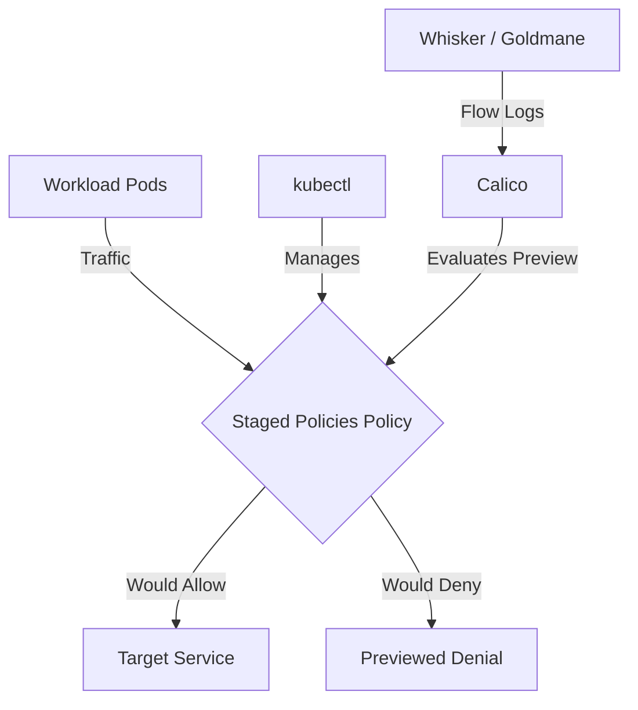

# Common Mistakes to Avoid with Staged Network Policies in Calico

Author: [nawazdhandala](https://github.com/nawazdhandala)

Tags: Calico, Kubernetes, Network Policy, Staged Policies, Security

Description: Avoid the most common pitfalls when implementing Staged Network Policies in Calico.

---

## Introduction

Staged Network Policies are an advanced Calico feature that lets you preview fine-grained network security controls using the `projectcalico.org/v3` API without changing actual traffic flow. This guide covers how to avoid mistakes with Staged Policies effectively in your Kubernetes cluster.

Calico's `projectcalico.org/v3` API provides rich support for Staged Policies through its `StagedGlobalNetworkPolicy`, `StagedNetworkPolicy`, `StagedKubernetesNetworkPolicy`, and related resources. Proper configuration of Staged Policies is essential for maintaining a secure, well-controlled network fabric.

This guide provides production-tested patterns for avoiding mistakes with Staged Policies, including YAML examples, CLI commands, and troubleshooting techniques.

## Prerequisites

- Kubernetes cluster with Calico staged policy custom resources installed
- `kubectl` installed
- Basic understanding of Calico network policy concepts
- Calico v3.30+ with Goldmane and Whisker enabled if you want to preview staged policy impact in flow logs

## Core Configuration

The following YAML demonstrates the key pattern for Staged Policies:

```yaml
apiVersion: projectcalico.org/v3
kind: StagedNetworkPolicy
metadata:
  name: avoid-mistakes-staged-policies
  namespace: production
spec:
  tier: default
  order: 100
  selector: all()
  ingress:
    - action: Allow
      protocol: TCP
      source:
        selector: app == 'authorized-source'
      destination:
        ports: [8080, 443]
  egress:
    - action: Allow
      protocol: UDP
      destination:
        ports: [53]
    - action: Allow
      destination:
        selector: app == 'authorized-destination'
  types:
    - Ingress
    - Egress
```

## Implementation Steps

```bash
# 1. Apply the policy

kubectl apply -f avoid-mistakes-staged-policies.yaml

# 2. Verify it's staged
kubectl get stagednetworkpolicies.projectcalico.org -n production -o wide

# 3. Generate traffic for staged policy preview
kubectl exec -n production test-pod -- curl -s --max-time 5 http://target:8080
echo "Exit code: $?"

# 4. View flow logs and inspect the policies.pending field in Calico Whisker
kubectl port-forward -n calico-system service/whisker 8081:8081
```

## Operational Commands

```bash
# List all relevant policies
kubectl get stagednetworkpolicies.projectcalico.org --all-namespaces
kubectl get stagedglobalnetworkpolicies.projectcalico.org

# View policy details
kubectl get stagednetworkpolicy.projectcalico.org avoid-mistakes-staged-policies -n production -o yaml

# Delete a policy if needed
kubectl delete stagednetworkpolicy.projectcalico.org avoid-mistakes-staged-policies -n production
```

## Architecture


```mermaid
flowchart TD
    A[Workload Pods] -->|Traffic| B{Staged Policies Policy}
    B -->|Would Allow| C[Target Service]
    B -->|Would Deny| D[Previewed Denial]
    E[kubectl] -->|Manages| B
    F[Calico] -->|Evaluates Preview| B
    G[Whisker / Goldmane] -->|Flow Logs| F
```

## Common Issues

1. **Policy not applying**: Verify API version is `projectcalico.org/v3` and run `kubectl apply --dry-run=server -f avoid-mistakes-staged-policies.yaml` first
2. **Selector not matching**: Use `kubectl get pods -l your-selector` to verify label matches
3. **Order conflicts**: Run `kubectl get stagedglobalnetworkpolicies.projectcalico.org -o wide` and `kubectl get stagednetworkpolicies.projectcalico.org --all-namespaces -o wide`, then compare the tier and order fields
4. **DNS failures**: Always ensure egress to TCP and UDP port 53 is allowed when converting a staged egress policy into an enforced policy

## Conclusion

Avoiding mistakes with Staged Policies in Calico requires careful attention to policy ordering, selector syntax, and bidirectional traffic rules. Use the patterns in this guide as a starting point, adapt them to your specific requirements, and always validate changes in a staging environment before creating the corresponding enforced policy in production. Consistent flow-log review and monitoring will help you detect and resolve issues quickly when they occur.
