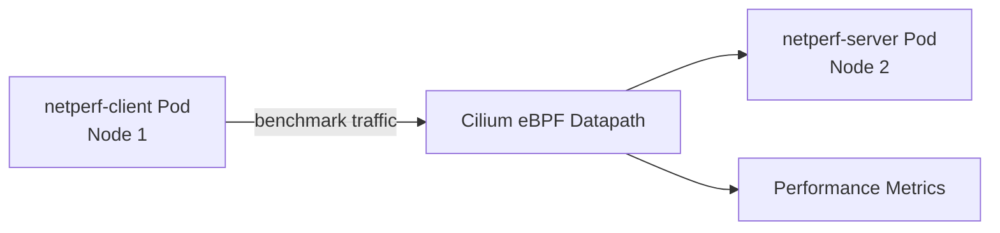

# How to Benchmark Cilium CNI Performance

Author: [nawazdhandala](https://github.com/nawazdhandala)

Tags: Cilium, Kubernetes, Performance, Benchmarking, eBPF, Networking

Description: Benchmark Cilium CNI performance using netperf and iperf3 to measure TCP throughput, request/response rates, and latency across different datapath configurations.

---

## Introduction

Benchmarking Cilium CNI performance helps operators understand the networking overhead in their cluster and compare different configuration options-tunneling versus native routing, encryption on versus off, kube-proxy replacement versus kube-proxy. These measurements guide infrastructure decisions and help identify performance regressions after upgrades.

Cilium's eBPF datapath is designed for high performance, and with kube-proxy replacement and XDP enabled, it can achieve near-native network speeds. Understanding the baseline performance of your specific configuration is the first step to optimization.

## Prerequisites

- Two Kubernetes nodes with Cilium installed
- `netperf` or `iperf3` available as container images
- Sufficient resources to run benchmark workloads

## Deploy Benchmark Pods

```bash
# Deploy server on a specific node
kubectl run netperf-server --image=networkstatic/netperf \
  --overrides='{"spec":{"nodeName":"<server-node>"}}' \
  -- netserver -D

# Deploy client on a different node
kubectl run netperf-client --image=networkstatic/netperf \
  --overrides='{"spec":{"nodeName":"<client-node>"}}' \
  -- sleep infinity
```

## Architecture



## TCP Throughput Benchmark (TCP_STREAM)

```bash
SERVER_IP=$(kubectl get pod netperf-server -o jsonpath='{.status.podIP}')

kubectl exec netperf-client -- netperf \
  -H $SERVER_IP \
  -t TCP_STREAM \
  -l 30 \
  -- -m 65536
```

Expected output: throughput in Mbps.

## Request/Response Rate (TCP_RR)

Measures latency and requests/second:

```bash
kubectl exec netperf-client -- netperf \
  -H $SERVER_IP \
  -t TCP_RR \
  -l 30 \
  -- -r 1,1
```

## iperf3 Bandwidth Test

```bash
kubectl run iperf-server --image=networkstatic/iperf3 -- iperf3 -s
kubectl wait --for=condition=Ready pod/iperf-server --timeout=60s

SERVER_IP=$(kubectl get pod iperf-server -o jsonpath='{.status.podIP}')
kubectl run iperf-client --image=networkstatic/iperf3 --rm -it --restart=Never -- \
  iperf3 -c "$SERVER_IP" -t 30 -P 4
```

## Compare Configurations

Run benchmarks with different Cilium configurations to compare:

| Configuration | Expected Throughput |
|---------------|---------------------|
| Tunneling (VXLAN) | ~80% of native |
| Native routing | ~95% of native |
| WireGuard encryption | ~70-80% of native |
| kube-proxy replacement | Improved latency |

## Record Results

```bash
kubectl exec netperf-client -- netperf -H $SERVER_IP -t TCP_STREAM -l 60 | \
  tee /tmp/cilium-benchmark-$(date +%Y%m%d).txt
```

## Conclusion

Benchmarking Cilium CNI provides objective performance data for your specific cluster configuration. Regular benchmark runs after upgrades and configuration changes help detect regressions and validate that optimizations are effective. Native routing with kube-proxy replacement delivers the best performance in most environments.
