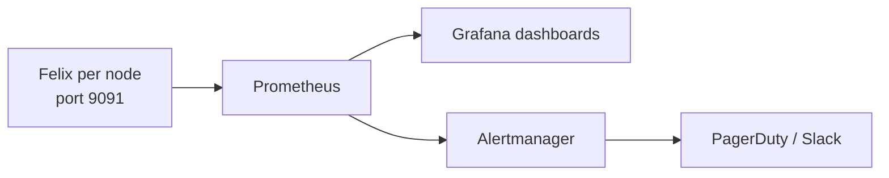

# How to Build Dashboards for the Calico Flow Logs API

Author: [nawazdhandala](https://github.com/nawazdhandala)

Tags: Calico, Kubernetes, Networking, Observability

Description: Build automated compliance and security dashboards using the Calico Flow Logs API to report on denied traffic trends, cross-namespace connections, and policy enforcement effectiveness.

---

## Introduction

Felix metrics dashboards automate reporting that would otherwise require manual metrics checks. Operational dashboards show dataplane failure rates, policy calculation latency, and node-level Felix health. These dashboards benefit from Prometheus labels for filtering by cluster, namespace, pod, and node.

## Key Commands

```bash
# Enable Felix metrics (if not already enabled)

kubectl patch felixconfiguration default \
  --type=merge \
  -p '{"spec":{"prometheusMetricsEnabled":true,"prometheusMetricsPort":9091}}'

# Test Felix metrics endpoint
CALICO_POD=$(kubectl get pods -n calico-system -l k8s-app=calico-node \
  -o jsonpath='{.items[0].metadata.name}')

kubectl exec -n calico-system "${CALICO_POD}" -c calico-node -- \
  wget -qO- http://localhost:9091/metrics | head -30

# Key Felix metrics to check:
kubectl exec -n calico-system "${CALICO_POD}" -c calico-node -- \
  wget -qO- http://localhost:9091/metrics | grep -E "^felix_int_dataplane_failures|^felix_calc_graph"
```

## ServiceMonitor for Felix

```yaml
apiVersion: v1
kind: Service
metadata:
  name: felix-metrics-svc
  namespace: calico-system
  labels:
    k8s-app: calico-node
spec:
  clusterIP: None
  selector:
    k8s-app: calico-node
  ports:
    - name: http-metrics
      port: 9091
      targetPort: 9091
---
apiVersion: monitoring.coreos.com/v1
kind: ServiceMonitor
metadata:
  name: calico-felix-metrics
  namespace: calico-system
spec:
  selector:
    matchLabels:
      k8s-app: calico-node
  endpoints:
    - port: http-metrics
      path: /metrics
      interval: 30s
```

## Architecture



## Conclusion

Felix metrics provide the deepest operational visibility into the Calico data plane. Enable the Prometheus endpoint via FelixConfiguration, configure a ServiceMonitor to scrape all calico-node pods, and build dashboards focused on dataplane failures and policy calculation latency. These two metric categories detect the most impactful Calico failure modes before they cause visible pod connectivity issues.
