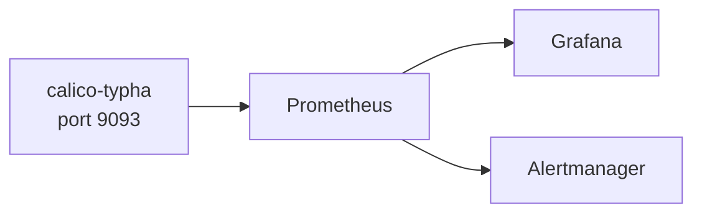

# How to Build Dashboards for Calico Typha Metrics

Author: [nawazdhandala](https://github.com/nawazdhandala)

Tags: Calico, Kubernetes, Networking, Observability

Description: Build Grafana dashboards for Calico typha Prometheus metrics to visualize distribution health.

---

## Introduction

Calico typha can expose Prometheus metrics that provide visibility into the policy distribution layer. In operator-managed Calico installations, enable typha metrics on port 9093 before scraping them. These metrics are essential for monitoring the health of Calico's control plane in large clusters.

## Enable Metrics Collection

```bash
# Test typha metrics endpoint
kubectl patch installation default --type=merge -p '{"spec": {"typhaMetricsPort": 9093}}'

POD=$(kubectl get pods -n calico-system -l k8s-app=calico-typha   -o jsonpath='{.items[0].metadata.name}')

kubectl exec -n calico-system "${POD}" --   wget -qO- http://localhost:9093/metrics | head -30
```

## ServiceMonitor

```yaml
apiVersion: v1
kind: Service
metadata:
  name: typha-metrics-svc
  namespace: calico-system
  labels:
    k8s-app: calico-typha
spec:
  clusterIP: None
  selector:
    k8s-app: calico-typha
  ports:
    - name: metrics
      port: 9093
      targetPort: 9093
---
apiVersion: monitoring.coreos.com/v1
kind: ServiceMonitor
metadata:
  name: calico-typha-metrics
  namespace: calico-system
spec:
  selector:
    matchLabels:
      k8s-app: calico-typha
  endpoints:
    - port: metrics
      path: /metrics
      interval: 30s
```

## Alert Rules

```yaml
apiVersion: monitoring.coreos.com/v1
kind: PrometheusRule
metadata:
  name: calico-typha-alerts
  namespace: calico-system
spec:
  groups:
    - name: calico.typha
      rules:
        - alert: CalicoTyphaMetricsDown
          expr: up{job="typha-metrics-svc"} == 0
          for: 5m
          annotations:
            summary: "Calico typha metrics endpoint is unreachable"
```

## Architecture



## Conclusion

Calico typha metrics provide visibility into the typha distribution layer. Enable metrics via ServiceMonitor, build dashboards focused on key typha health indicators, and alert on metrics endpoint availability and key performance thresholds. These metrics complement Felix per-node metrics to provide complete Calico observability.
