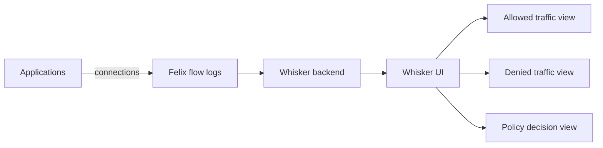

# How to Build Dashboards for Whisker in Calico

Author: [nawazdhandala](https://github.com/nawazdhandala)

Tags: Calico, Kubernetes, Networking, Observability

Description: Build custom network visibility dashboards using Whisker's built-in views and integrate Whisker flow data into Grafana for trend analysis and capacity planning.

---

## Introduction

Whisker provides a built-in visual dashboard that requires no configuration to display current traffic flows. For historical trend analysis and SLO dashboards, Whisker flow data can be exported to Prometheus or Elasticsearch for Grafana dashboard building. The combination of real-time Whisker views and historical Grafana dashboards provides complete network observability.

## Key Operations

```bash
# Verify Whisker is running
kubectl get pods -n calico-system | grep whisker

# Access Whisker UI
kubectl port-forward -n calico-system svc/whisker 8081:8081
# Open: http://localhost:8081

# Check Whisker logs for issues
kubectl logs -n calico-system -l app=whisker --tail=50

# Check flow log configuration (affects what Whisker shows)
kubectl get felixconfiguration default -o jsonpath='{.spec.flowLogsFlushInterval}'
```

## Architecture



## Common Whisker Queries

```plaintext
# In Whisker UI - common investigation patterns:

# Find all denied connections to a service:
# Filter: destination=<service-name>, action=Deny

# Find all traffic from a specific pod:
# Filter: source=<pod-name>

# Find recently started connections:
# Sort by: timestamp descending

# Find policy drop sources:
# Filter: action=Deny, group by: source namespace
```

## Conclusion

Whisker provides the fastest path to understanding Calico network policy behavior in a running cluster. The denied traffic view replaces hours of log analysis with seconds of UI interaction. Validate Whisker periodically by cross-checking its view against known application connection patterns - this ensures the observability pipeline is functioning correctly before you rely on it during an incident.
