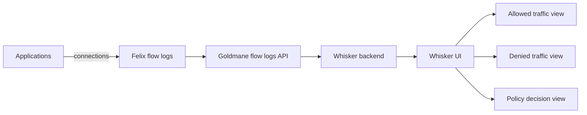

# How to Build Dashboards for Whisker in Calico

Author: [nawazdhandala](https://github.com/nawazdhandala)

Tags: Calico, Kubernetes, Networking, Observability

Description: Build custom network visibility dashboards using Whisker's built-in views and integrate Whisker flow data into Grafana for trend analysis and capacity planning.

---

## Introduction

Whisker provides a built-in visual dashboard that requires no configuration on new Calico Open Source 3.30+ installations to display current traffic flows. For historical trend analysis and SLO dashboards, aggregated flow data can be retrieved from the Goldmane flow logs API and fed into your own storage or metrics pipeline for Grafana dashboard building. The combination of real-time Whisker views and historical Grafana dashboards provides complete network observability.

## Key Operations

```bash
# Verify Whisker is running

kubectl get pods -n calico-system -l k8s-app=whisker

# Access Whisker UI
kubectl port-forward -n calico-system svc/whisker 8081:8081
# Open: http://localhost:8081

# Check Whisker logs for issues
kubectl logs -n calico-system -l k8s-app=whisker --tail=50

# Check that the flow logs API and Whisker custom resources exist
kubectl get goldmane default
kubectl get whisker default
```

## Architecture


```mermaid
flowchart LR
    A[Applications] -->|connections| B[Felix flow logs]
    B --> C[Goldmane flow logs API]
    C --> D[Whisker backend]
    D --> E[Whisker UI]
    E --> F[Allowed traffic view]
    E --> G[Denied traffic view]
    E --> H[Policy decision view]
```

## Common Whisker Queries

```plaintext
# In Whisker UI - common investigation patterns:

# Find all denied connections to a service:
# Filter: dest_name=<service-name>, action=deny

# Find all traffic from a specific pod:
# Filter: source_name=<pod-name>

# Find recently started connections:
# Sort by: start_time descending

# Find policy drop sources:
# Filter: action=deny, source_namespace=<namespace>
```

## Conclusion

Whisker provides the fastest path to understanding Calico network policy behavior in a running cluster. The denied traffic view replaces hours of log analysis with seconds of UI interaction. Validate Whisker periodically by cross-checking its view against known application connection patterns - this ensures the observability pipeline is functioning correctly before you rely on it during an incident.
