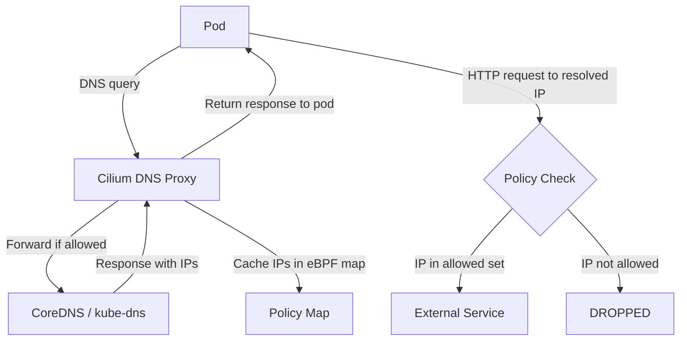

# How to Build DNS-Based Egress Policies in Cilium

Author: [nawazdhandala](https://github.com/nawazdhandala)

Tags: Cilium, Kubernetes, DNS, Egress, Network Policy, Security, EBPF

Description: Build precise DNS-based egress policies in Cilium that allow traffic to specific external domains while blocking all other outbound connections.

---

## Introduction

DNS-based egress policies in Cilium allow you to control outbound traffic by domain name rather than IP address, which is essential when destinations use dynamic IPs (CDNs, cloud services, SaaS APIs). Unlike traditional IP-based firewall rules, DNS-based policies remain accurate even as backend IPs rotate.

Cilium implements DNS policies through a DNS proxy that intercepts DNS queries and dynamically updates eBPF policy maps with the resolved IPs. This allows policy like "allow traffic to api.github.com" without hardcoding any IPs.

However, misconfigured DNS policies can break external access by blocking DNS itself or by not accounting for initial DNS resolution timing. This guide shows how to build DNS policies that are both restrictive and reliable.

## Prerequisites

- Cilium 1.10+ with DNS proxy enabled
- `kubectl` CLI
- Pods that make external API calls

## How Cilium DNS Policy Works



## Allow DNS Traffic First

Always allow DNS before adding egress restrictions:

```yaml
apiVersion: cilium.io/v2
kind: CiliumNetworkPolicy
metadata:
  name: allow-dns
  namespace: default
spec:
  endpointSelector:
    matchLabels:
      app: my-app
  egress:
    - toEndpoints:
        - matchLabels:
            io.kubernetes.pod.namespace: kube-system
            k8s-app: kube-dns
      toPorts:
        - ports:
            - port: "53"
              protocol: UDP
          rules:
            dns:
              - matchPattern: "*"
```

## Allow Specific External Domains

```yaml
apiVersion: cilium.io/v2
kind: CiliumNetworkPolicy
metadata:
  name: allow-github-api
  namespace: default
spec:
  endpointSelector:
    matchLabels:
      app: my-app
  egress:
    - toFQDNs:
        - matchName: "api.github.com"
        - matchName: "github.com"
      toPorts:
        - ports:
            - port: "443"
              protocol: TCP
```

## Apply and Verify

```bash
kubectl apply -f allow-dns.yaml
kubectl apply -f allow-github-api.yaml

# Verify from pod
kubectl exec -it <pod-name> -- curl -I https://api.github.com
```

## Check DNS Policy State

```bash
kubectl exec -n kube-system ds/cilium -- \
  cilium-dbg fqdn cache list
```

## Conclusion

Building DNS-based egress policies in Cilium requires allowing DNS traffic first, then restricting egress to specific FQDNs on appropriate ports. The DNS proxy caches resolved IPs in eBPF maps, enabling domain-name-based policies that remain accurate as IPs change. Always test DNS resolution before applying default-deny policies.
