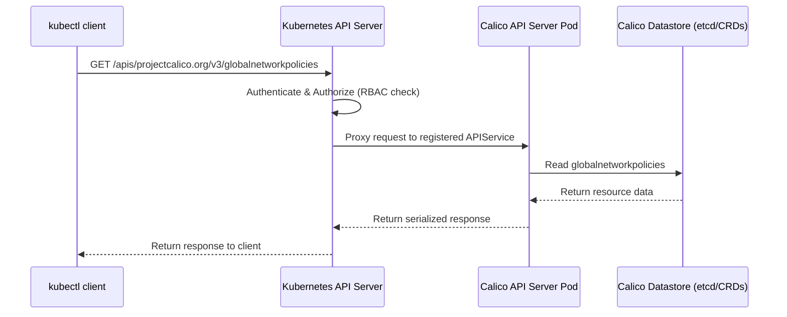

# How to Map Traffic Flows Through the Calico API Server

Author: [nawazdhandala](https://github.com/nawazdhandala)

Tags: Calico, API Server, Kubernetes, Networking, Traffic Flows, Architecture

Description: Understand how management traffic flows through the Calico API server and how to trace API requests from kubectl to the Calico datastore using practical diagnostic commands.

---

## Introduction

The Calico API server sits in the management plane, not the data plane. This means traffic flowing through it is management traffic — API requests from kubectl, CI pipelines, and admission webhooks — not pod-to-pod networking traffic. Understanding this distinction prevents a common misconception that the API server affects pod connectivity.

When an operator runs `kubectl get globalnetworkpolicies`, that request travels from the client through the Kubernetes API server, which proxies it to the Calico API server pod, which reads from the Calico datastore and returns the result. This entire chain is the management traffic path.

Mapping these traffic flows helps you understand latency sources, debug authentication failures, and design network policies that protect the Calico API server without accidentally blocking its required connections.

## Prerequisites

- Kubernetes cluster with Calico API server deployed
- `kubectl` and `calicoctl` CLI configured
- Basic understanding of Kubernetes aggregated API servers

## Step 1: Understand the Management Traffic Flow

The flow for a `kubectl get globalnetworkpolicies` command passes through multiple components.



## Step 2: Trace the APIService Routing Configuration

Verify how the Kubernetes API server knows to route projectcalico.org requests to the Calico API server.

```bash
# View the APIService registration that defines the routing rule
kubectl get apiservice v3.projectcalico.org -o yaml

# The caBundle field contains the TLS certificate used to authenticate the Calico API server
# The service field points to the calico-apiserver Service in calico-apiserver namespace
kubectl get apiservice v3.projectcalico.org \
  -o jsonpath='{.spec.service}' | jq .

# Verify the Service and Endpoints are healthy
kubectl get service -n calico-apiserver
kubectl get endpoints -n calico-apiserver
```

## Step 3: Map Network Policy Requirements for the API Server

The Calico API server needs specific network access to function. Map these requirements before writing network policies.

```bash
# Check what ports the Calico API server listens on
kubectl get pods -n calico-apiserver -o yaml | \
  grep -A 5 "ports:"

# The API server typically listens on port 5443 (HTTPS)
# The Kubernetes API server proxies requests to this port

# Verify the API server can reach the Kubernetes API (for auth)
kubectl logs -n calico-apiserver \
  -l app=calico-apiserver --tail=20 | grep -i "auth\|connect"
```

## Step 4: Validate Admission Webhook Traffic Path

When admission webhooks are configured for Calico resources, there is an additional traffic path from the Kubernetes API server to the Calico admission controller.

```bash
# Check if any admission webhooks are configured for Calico resources
kubectl get validatingwebhookconfigurations | grep -i calico
kubectl get mutatingwebhookconfigurations | grep -i calico

# If webhooks exist, verify they can reach their service endpoint
kubectl describe validatingwebhookconfigurations | grep -A 5 "Service:"
```

## Step 5: Test the Full Traffic Path End-to-End

Confirm each segment of the traffic path works correctly.

```bash
# Test 1: kubectl can reach Kubernetes API server
kubectl version --short

# Test 2: Kubernetes API server can proxy to Calico API server
kubectl api-versions | grep projectcalico

# Test 3: Calico API server can read from datastore
kubectl get globalnetworkpolicies.projectcalico.org --all-namespaces

# Test 4: Write path works end-to-end
kubectl apply -f - <<EOF
apiVersion: projectcalico.org/v3
kind: GlobalNetworkPolicy
metadata:
  name: traffic-path-test
spec:
  order: 999
  selector: traffic-test == 'true'
  ingress:
  - action: Pass
EOF

# Verify the write was persisted
kubectl get globalnetworkpolicies.projectcalico.org traffic-path-test

# Clean up
kubectl delete globalnetworkpolicies.projectcalico.org traffic-path-test
```

## Best Practices

- Keep the calico-apiserver Service IP stable — changes require updating the APIService registration
- Monitor APIService availability as the primary signal for API server health
- Ensure network policies protecting the calico-apiserver namespace allow ingress from the Kubernetes API server
- Use `kubectl get apiservice v3.projectcalico.org` as your first diagnostic step when `kubectl get` on Calico resources fails

## Conclusion

The Calico API server handles management traffic only — it is not in the path for pod networking. Traffic flows from kubectl through the Kubernetes API server (authentication, authorization, routing) to the Calico API server pod, then to the datastore. Mapping this path helps you design correct network policies, debug authentication failures, and quickly locate bottlenecks in the management plane.
