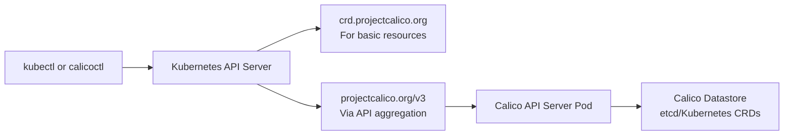

# How to Understand the Calico API Server

Author: [nawazdhandala](https://github.com/nawazdhandala)

Tags: Calico, Kubernetes, API Server, CNI, Calicoctl

Description: A comprehensive guide to Calico's API server - what it does, how it differs from the Kubernetes API server, and how it enables kubectl-native Calico resource management.

---

## Introduction

Calico provides its own API server (separate from the Kubernetes API server) that exposes Calico resources through the Kubernetes API aggregation layer. This enables `kubectl` to manage Calico resources - policies, BGP configurations, IP pools - using the same interface you use for Kubernetes resources, without needing `calicoctl`.

Understanding the Calico API server requires understanding the relationship between Kubernetes CRDs, the Kubernetes API aggregation layer, and Calico's own resource types. This post covers all three and explains when the Calico API server is present and what it enables.

## Prerequisites

- Understanding of Kubernetes API server and aggregation layer
- Familiarity with Calico CRDs (`crd.projectcalico.org`)
- Basic `kubectl` and `calicoctl` experience

## Two Ways to Manage Calico Resources

Without the Calico API server, Calico resources are managed as Kubernetes CRDs using the `crd.projectcalico.org` API group:

```bash
# Without Calico API server - uses CRD API group
kubectl get networkpolicies.crd.projectcalico.org --all-namespaces
kubectl apply -f policy.yaml  # Uses crd.projectcalico.org/v1 schema
```

With the Calico API server, resources are also accessible via the `projectcalico.org/v3` API group through API aggregation:

```bash
# With Calico API server - uses v3 API group (preferred)
kubectl get networkpolicies.projectcalico.org --all-namespaces
calicoctl get networkpolicies --all-namespaces
```

The `projectcalico.org/v3` API provides the full Calico resource schema with better validation, more expressive selectors, and additional resource types not available as CRDs.

## The Kubernetes API Aggregation Layer

Kubernetes allows external API servers to register additional API groups via the API aggregation layer. Calico's API server registers:
- `projectcalico.org/v3` - the full Calico API group
- Resources: `NetworkPolicy`, `GlobalNetworkPolicy`, `IPPool`, `BGPConfiguration`, `BGPPeer`, `WorkloadEndpoint`, `HostEndpoint`, and more



## When Is the Calico API Server Present?

The Calico API server is available in:
- **Calico Enterprise**: Deployed as part of the Enterprise installation
- **Calico Open Source with API server**: Can be deployed separately with `calicoctl install apiserver`
- **Calico Cloud**: Included automatically

Without the API server:
- `calicoctl` uses direct datastore access
- `kubectl get networkpolicies.projectcalico.org` fails
- Only `crd.projectcalico.org/v1` resources are accessible via `kubectl`

## Checking API Server Availability

```bash
# Check if the Calico API server is running
kubectl get pods -n calico-system -l k8s-app=calico-apiserver
# Expected: calico-apiserver pods in Running state

# Verify API registration
kubectl get apiservices | grep calico
# Expected: v3.projectcalico.org shows as Available

# Test API access
kubectl get networkpolicies.projectcalico.org --all-namespaces
# If this works, API server is available and functioning
```

## Calico API Server Benefits

With the Calico API server enabled:

1. **Unified `kubectl` workflow**: Manage all Calico resources with standard `kubectl` commands
2. **RBAC integration**: Use Kubernetes RBAC to control who can create/modify Calico resources
3. **Kubernetes API validation**: Full admission webhook support for Calico resources
4. **Audit logging**: Calico resource changes appear in the Kubernetes audit log
5. **GitOps compatibility**: Tools that use `kubectl apply` work natively with Calico resources

## Resource Differences: CRD vs. API Server

| Aspect | crd.projectcalico.org/v1 | projectcalico.org/v3 |
|---|---|---|
| Available without API server | Yes | No |
| Full Calico feature set | Limited | Yes |
| RBAC support | Kubernetes standard | Enhanced |
| Validation | Basic CRD validation | Full admission validation |
| `kubectl` compatible | Yes | Yes (with API server) |

## Best Practices

- Enable the Calico API server in production to get full resource validation and audit logging
- Use `projectcalico.org/v3` API group in manifests when the API server is available
- Use `crd.projectcalico.org/v1` only for compatibility in environments where the API server is not deployed
- Monitor the Calico API server pod health - if it crashes, `kubectl get` for Calico resources will fail but policy enforcement continues

## Conclusion

The Calico API server extends Kubernetes' API aggregation layer to expose Calico resources through the `projectcalico.org/v3` API group. This enables unified `kubectl` management, Kubernetes RBAC integration, admission webhook validation, and audit logging for Calico resources. While Calico functions without the API server (using CRDs directly), the API server significantly improves the operational experience and is recommended for all production deployments.
