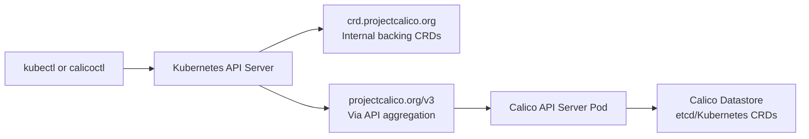

# How to Understand the Calico API Server

Author: [nawazdhandala](https://github.com/nawazdhandala)

Tags: Calico, Kubernetes, API Server, CNI, Calicoctl

Description: A comprehensive guide to Calico's API server - what it does, how it differs from the Kubernetes API server, and how it enables kubectl-native Calico resource management.

---

## Introduction

Calico can provide its own API server (separate from the Kubernetes API server) that exposes Calico resources through the Kubernetes API aggregation layer. This enables `kubectl` to manage Calico resources - policies, BGP configurations, IP pools - using the same interface you use for Kubernetes resources, without needing `calicoctl`.

Understanding the Calico API server requires understanding the relationship between Kubernetes CRDs, the Kubernetes API aggregation layer, and Calico's own resource types. This post covers all three and explains when the Calico API server is present and what it enables. Current Calico releases also support native `projectcalico.org/v3` CRDs, which can make the aggregated API server unnecessary for new installations.

## Prerequisites

- Understanding of Kubernetes API server and aggregation layer
- Familiarity with Calico CRDs (`crd.projectcalico.org`)
- Basic `kubectl` and `calicoctl` experience

## Two Ways to Manage Calico Resources

In older or API-server-backed Calico installations, the backing Kubernetes CRDs use the `crd.projectcalico.org` API group:

```bash
# Internal backing CRD API group

kubectl get networkpolicies.crd.projectcalico.org --all-namespaces
kubectl apply -f policy.yaml  # Uses crd.projectcalico.org/v1 schema
```

Calico documentation cautions against managing `crd.projectcalico.org` resources directly because they are internal data representations. With the Calico API server, resources are accessible via the `projectcalico.org/v3` API group through API aggregation:

```bash
# With Calico API server - uses v3 API group (preferred)
kubectl get networkpolicies.projectcalico.org --all-namespaces
calicoctl get networkpolicy --all-namespaces
```

The `projectcalico.org/v3` API provides the full Calico resource schema with Calico validation and defaulting. In newer Calico releases, native `projectcalico.org/v3` CRDs can also expose this API group directly without the aggregated API server.

## The Kubernetes API Aggregation Layer

Kubernetes allows external API servers to register additional API groups via the API aggregation layer. Calico's API server registers:
- `projectcalico.org/v3` - the full Calico API group
- Resources: `NetworkPolicy`, `GlobalNetworkPolicy`, `IPPool`, `BGPConfiguration`, `BGPPeer`, `WorkloadEndpoint`, `HostEndpoint`, and more


```mermaid
graph LR
    User[kubectl or calicoctl] --> K8sAPI[Kubernetes API Server]
    K8sAPI --> CRD[crd.projectcalico.org\nInternal backing CRDs]
    K8sAPI --> CalicoAPI[projectcalico.org/v3\nVia API aggregation]
    CalicoAPI --> CalicoAPIServer[Calico API Server Pod]
    CalicoAPIServer --> Datastore[Calico Datastore\netcd/Kubernetes CRDs]
```

## When Is the Calico API Server Present?

The Calico API server is available in:
- **Calico Enterprise**: Deployed as part of the Enterprise installation
- **Calico Open Source with API server**: Operator-based installations include the API server component by default, and non-operator installations can deploy the `apiserver.yaml` manifest
- **Calico Cloud**: Included automatically

Without the aggregated API server:
- `calicoctl` can manage `projectcalico.org/v3` API resources and still provides some administrative commands
- `kubectl get networkpolicies.projectcalico.org` fails unless native `projectcalico.org/v3` CRDs are installed
- Older API-server-backed installations expose only the internal `crd.projectcalico.org/v1` resources via `kubectl`

## Checking API Server Availability

```bash
# Check if the Calico API server is running
kubectl get pods -n calico-apiserver
# Expected: calico-apiserver pods in Running state

# Verify API registration
kubectl get apiservice v3.projectcalico.org
# Expected: v3.projectcalico.org shows as Available

# Test API access
kubectl get networkpolicies.projectcalico.org --all-namespaces
# If this works, the projectcalico.org/v3 API is available through the API server or native v3 CRDs
```

## Calico API Server Benefits

With the Calico API server enabled:

1. **Unified `kubectl` workflow**: Manage all Calico resources with standard `kubectl` commands
2. **RBAC integration**: Use Kubernetes RBAC to control who can create/modify Calico resources
3. **Server-side validation and defaulting**: The API server provides Calico validation and defaulting without requiring `calicoctl`
4. **Audit logging**: Calico resource changes appear in the Kubernetes audit log
5. **GitOps compatibility**: Tools that use `kubectl apply` work natively with Calico resources

Resource Differences: CRD vs. API Server

| Aspect | crd.projectcalico.org/v1 | projectcalico.org/v3 |
|---|---|---|
| Role | Internal backing representation | Public Calico API |
| Available without aggregated API server | Yes in older CRD-backed installs | Yes only with native v3 CRDs |
| Recommended for manifests | No | Yes |
| Validation and defaulting | Not the intended management interface | Provided by calicoctl, the API server, or native v3 CRD/admission mechanisms |
| `kubectl` compatible | Technically yes, but not recommended for direct edits | Yes with the API server or native v3 CRDs |

## Best Practices

- For new installations, evaluate native `projectcalico.org/v3` CRDs because the aggregated `calico-apiserver` is deprecated and will be removed in a future release
- Use `projectcalico.org/v3` API group in manifests when the API server or native v3 CRDs are available
- Avoid editing `crd.projectcalico.org/v1` resources directly except for compatibility scenarios where Calico documentation specifically instructs it
- Monitor the Calico API server pod health in clusters that still use it - if it crashes, `kubectl get` for aggregated Calico resources will fail but policy enforcement continues

## Conclusion

The Calico API server extends Kubernetes' API aggregation layer to expose Calico resources through the `projectcalico.org/v3` API group. This enables unified `kubectl` management, Kubernetes RBAC integration, server-side validation and defaulting, and audit logging for Calico resources. While existing clusters may still use the aggregated API server, current Calico documentation marks it as deprecated and recommends native `projectcalico.org/v3` CRDs for new installations.
