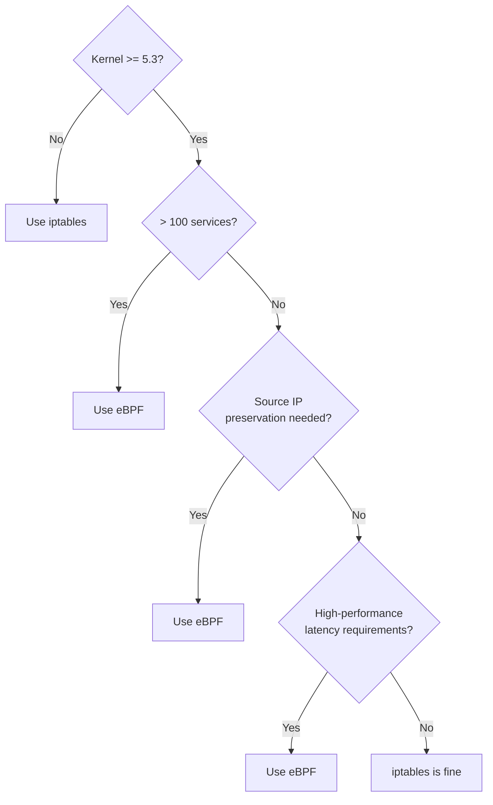

# How to Choose the Calico Data Path for Production

Author: [nawazdhandala](https://github.com/nawazdhandala)

Tags: Calico, Kubernetes, Data Path, CNI, Production, Iptables, EBPF, VPP, Decision Framework

Description: A decision framework for selecting between Calico's iptables, eBPF, and VPP dataplane options for production Kubernetes deployments.

---

## Introduction

Calico's dataplane selection is one of the most consequential decisions you will make for your cluster's networking performance. The standard Linux (iptables), eBPF, and VPP dataplanes have different performance characteristics, operational requirements, and feature availability. The wrong choice leads to either unnecessary operational complexity or missed performance opportunities.

This post provides a structured decision framework for choosing the right dataplane for your production environment, with clear criteria for each option.

## Prerequisites

- Linux kernel version on production nodes confirmed
- Workload performance requirements documented (latency targets, throughput requirements)
- Windows node requirements assessed
- Team operational expertise assessed

## Dataplane Option 1: Standard Linux (iptables)

**Use when**:
- Linux kernel version < 5.3
- Windows nodes are present in the cluster
- Team has limited Linux networking expertise beyond iptables
- Cluster has fewer than 100 services and 1,000 pods
- CNI portability is a requirement

**Characteristics**:
- Enforces policy via netfilter chains in the FORWARD hook
- Service routing via kube-proxy (iptables NAT)
- Connection tracking via kernel conntrack table
- Debug tools: `iptables -L`, `conntrack -L`

iptables mode is production-ready, well-understood, and has extensive debugging tooling. Its limitation is linear rule traversal that degrades at large service and pod counts.

## Dataplane Option 2: eBPF

**Use when**:
- Linux kernel 5.3+ (5.8+ for full feature support)
- Cluster has more than 100 services
- Source IP preservation for external traffic is required
- High-performance latency-sensitive workloads
- No Windows nodes (eBPF is Linux-only)

**Characteristics**:
- Enforces policy via eBPF programs at TC hooks on each veth
- Replaces kube-proxy entirely for service routing
- Connection tracking via eBPF maps
- Debug tools: `bpftool prog show`, `bpftool map dump`, Felix metrics

## Dataplane Option 3: VPP (Vector Packet Processing)

**Use when**:
- Extreme throughput requirements (10+ Gbps per node)
- Dedicated network hardware (DPDK-compatible NICs)
- Specialized networking use cases (telco, high-frequency trading infrastructure)

VPP (available via Calico VPP) is a high-performance userspace networking framework. It bypasses the kernel entirely for packet processing and provides dramatically higher throughput than either iptables or eBPF mode. However, it requires dedicated hardware, specialized operational knowledge, and is typically used only in telco and HPC environments.

**Note**: VPP is not part of Calico Open Source - it requires the Calico VPP integration maintained separately.

## Production Dataplane Checklist

Before finalizing your dataplane choice, verify:

| Requirement | iptables | eBPF | VPP |
|---|---|---|---|
| Kernel version check | Any | 5.3+ | DPDK NIC |
| kube-proxy disabled | No | Yes (required) | Yes |
| Windows nodes supported | Yes | No | No |
| Source IP for NodePort | `externalTrafficPolicy: Local` | Native (DSR) | Native |
| Team debugging experience | High | Medium | Low (specialist) |

## Migration Considerations

If you are currently running iptables and want to move to eBPF:
1. Validate kernel version on all nodes
2. Test eBPF in a lab with the same workloads
3. Disable kube-proxy
4. Enable eBPF via the Installation resource
5. Monitor for 24 hours before declaring success

The migration is reversible: re-enable kube-proxy and switch the Installation resource back to standard Linux mode.

## Best Practices

- Choose the dataplane at cluster creation and document the decision and rationale in your runbook
- Do not change dataplanes in production without a full lab validation cycle first
- For eBPF, ensure node image updates include the required kernel version before migration
- Monitor Felix's `felix_int_dataplane_addr_msg_batch_size` metric - large batches indicate the dataplane is falling behind

## Conclusion

The production dataplane choice comes down to kernel version, cluster scale, source IP requirements, and team expertise. iptables is appropriate for smaller clusters and mixed OS environments. eBPF is the right choice for modern, large-scale Linux clusters where performance and source IP preservation matter. VPP is a specialist option for extreme throughput requirements. Making this decision explicitly and validating it in a lab before production rollout ensures the chosen dataplane performs correctly at your required scale.
