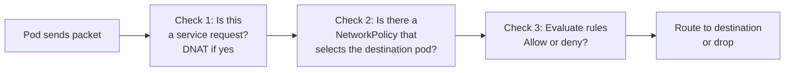

# How to Explain the Calico Data Path to Your Team

Author: [nawazdhandala](https://github.com/nawazdhandala)

Tags: Calico, Kubernetes, Data Path, CNI, Team Communication, Iptables, EBPF, Packet Processing

Description: A practical guide for explaining how packets flow through Calico's dataplane to engineering teams, using analogies and live demonstrations to make packet processing intuitive.

---

## Introduction

Explaining the Calico data path to a team is challenging because it involves Linux kernel internals (netfilter, TC hooks) that most application developers have never encountered. The key is to abstract at the right level - explaining what happens to packets without requiring kernel expertise - while giving enough detail that the team can use the knowledge for debugging.

This post provides a three-level explanation framework: executive summary, practical mental model, and hands-on investigation. Tailor the depth to your audience.

## Prerequisites

- A running Calico cluster for live demonstrations
- `kubectl` access for pod management
- Optionally, node-level access for iptables/bpftool inspection

## Level 1: Executive Summary (5 minutes)

For any audience, start with this:

> "When a packet leaves a pod, it passes through a checkpoint. Calico's checkpoint looks at who is sending the packet and where it's going, and decides to allow or drop it based on your network policies. This happens for every packet, on every node, in kernel space - so it's fast and doesn't need an external service to function."

Key points:
1. Enforcement is per-packet, per-pod, in kernel space
2. It uses your NetworkPolicy as the checkpoint rulebook
3. It happens on the receiving node, not the sending node (for ingress)

## Level 2: Practical Mental Model (15 minutes)

For SREs and developers who debug connectivity issues, introduce the checkpoint metaphor with more detail:

**iptables mode - the sequential checkpoint**:



> "The packet goes through a series of checks, like airport security. First check: is this going to a service? (redirect to the actual pod IP). Second check: does this pod have a security policy? Third check: does the policy allow this specific packet?"

**eBPF mode - the instant lookup**:

> "In eBPF mode, the first check (service routing) and the policy check are collapsed into a single lookup in a hash table. Instead of scanning through rules sequentially, the kernel looks up the destination in a table and gets the answer instantly."

## Level 3: Hands-On Investigation (30 minutes)

For platform engineers who need to debug the data path:

**Identifying which pod interface to inspect**:
```bash
# Get the veth interface name for a pod
POD_IFACE=$(kubectl exec my-pod -- ip route show | grep default | awk '{print $NF}')
echo "Pod's interface: $POD_IFACE"

# On the node, find the corresponding host-side veth
ip link | grep "cali"
```

**Tracing a packet through iptables chains**:
```bash
# List Calico's policy chains for a specific pod interface
sudo iptables -L cali-tw-<pod-iface> -n -v --line-numbers
# cali-tw = "calico traffic-to-workload" (ingress policy)

sudo iptables -L cali-fw-<pod-iface> -n -v --line-numbers
# cali-fw = "calico from-workload" (egress policy)
```

**Using iptables logging for debugging**:
```bash
# Temporarily add logging to see which rule matches
sudo iptables -I cali-tw-<iface> 1 -j LOG --log-prefix "CALICO-DEBUG: "
sudo journalctl -f | grep "CALICO-DEBUG"
# Remember to remove after debugging
sudo iptables -D cali-tw-<iface> 1
```

## Common Questions

**Q: Where exactly does the policy check happen?**
A: On the node where the destination pod runs. The check happens when the packet arrives at the host-side of the pod's veth pair.

**Q: What happens if Felix crashes?**
A: Existing iptables/eBPF rules stay in place. Traffic based on the last-known policy continues. New policy changes won't be applied until Felix restarts.

**Q: Why is eBPF faster?**
A: iptables checks rules sequentially (10,000 services = 10,000 rule checks for some packets). eBPF uses hash maps - any lookup is O(1) regardless of the number of services or pods.

## Best Practices

- Keep the explanation level matched to the audience - executives don't need to know about netfilter chains
- Use the packet trace hands-on exercise at the end of team training so participants leave with a concrete skill
- Prepare a one-page "data path cheat sheet" with the key debugging commands for each dataplane mode

## Conclusion

Explaining the Calico data path effectively requires three levels: a simple "checkpoint" mental model for any audience, a sequential/instant lookup comparison for those who debug connectivity, and hands-on iptables chain inspection for platform engineers. The checkpoint metaphor makes packet processing intuitive without requiring kernel expertise.
